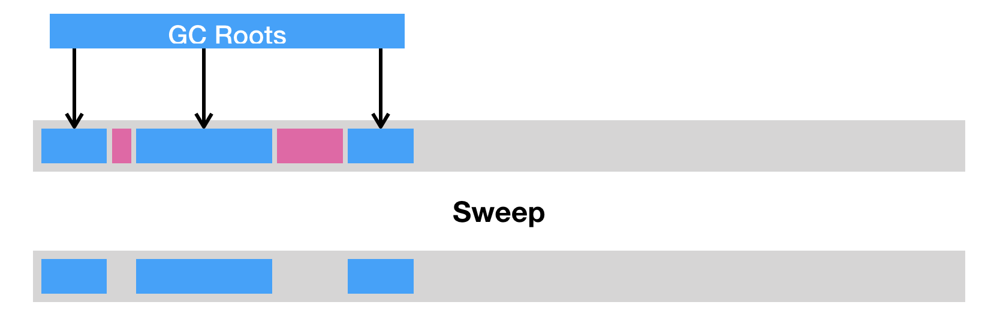
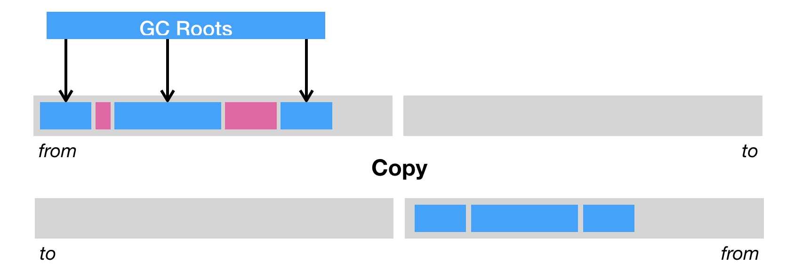

# 垃圾回收(上)
### 引用计数法与可达性分析

在 Java 虚拟机的语境下，垃圾指的是死亡的对象所占据的堆空间。如何辨别一个对象是存是亡？

#### 引用计数法（reference counting）

为每个对象添加一个引用计数器，用来统计指向该对象的引用个数。一旦某个对象的引用计数器为 0 ，则说明该对象已经死亡，便可以被回收了。
  
缺点：
1. 需要额外的空间来存储计数器，繁琐的更新操作
2. 无法处理循环引用对象，假设对象 a 与 b 相互引用，除此之外没有其他引用指向 a 或者 b。在这种情况下，a 和 b 实际上已经死了，但由于它们的引用计数器皆不为 0，在引用计数法的心中，这两个对象还活着。

#### 可达性分析算法

这个算法的实质在于将一系列 GC Roots 作为初始的存活对象合集（live set），然后从该集合出发，探索所有能够被该集合引用到的对象，并将其加入到该集合中，这个过程也称为标记(mark)。最终，未被探索到的对象便是死亡的，可以被回收。

>这个算法的基本思路就是通过一系列称为“GC Roots”的根对象作为起始节点集，从这些节点开始，根据引用关系向下搜索，搜索过程所走过的路径称为“引用链”（Reference Chain），如果某个对象到GC Roots间没有任何引用链相连，或者用图论的话来说就是从GC Roots到这个对象不可达时，则证明此对象是不可能再被使用的。
>《深入理解Java虚拟机》

GC Roots 包括(但不限于)如下几种：
* Java 方法栈桢中的局部变量；
* 已加载类的静态变量；
* JNI handles；
* 已启动且未停止的 Java 线程。

### 垃圾回收的三种方式

#### 清除

把死亡对象所占据的内存标记为空闲内存，并记录在一个空闲列表(free list)之中。当需要新建对象时，内存管理模块便会从该空闲列表中寻找空闲内存，并划分给新建的对象。

缺点：
1. 会造成内存碎片，由于 Java 虚拟机的堆中对象必须是连续分布的，因此可能会出现总空闲内存足够，但是无法分配的极端情况。
2. 分配效率较低。如果是一块连续的内存空间，可以通过指针加法(pointer bumping)来做分配。而对于空闲列表，Java 虚拟机需要逐个访问列表中的项，来查找能够放入新建对象的空闲内存。

#### 压缩

把存活的对象聚集到内存区域的起始位置，从而留下一段连续的内存空间。

这种做法能够解决内存碎片化的问题，但代价是压缩算法的性能开销。

#### 复制

把内存区域分为两等分，分别用两个指针 from 和 to 来维护，并且只是用 from 指针指向的内存区域来分配内存。当发生垃圾回收时，便把存活的对象复制到 to 指针指向的内存区域中，并且交换 from 指针和 to 指针的内容。

这种回收方式同样能解决内存碎片化的问题，缺点就是堆空间效率极其低下。

现代垃圾回收器往往会综合上述几种回收方式，综合它们优点的同时规避它们的缺点。

