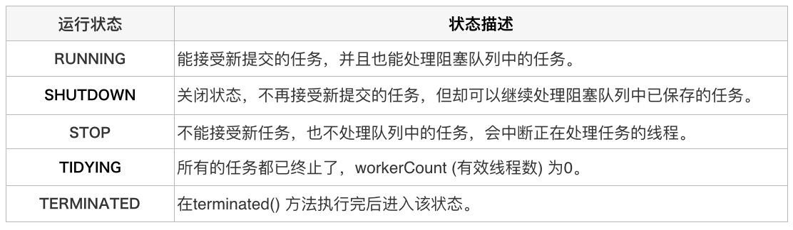

# Java 线程池实现原理

### 一、前言

#### 1.1 线程池是什么

线程池(Thread Pool)是一种基于池化思想管理线程的工具。

> 线程过多会带来额外的开销，其中包括创建销毁的开销、调度线程的开销等等，同时也降低了计算机的整体性能。线程池维护多个线程，等待监督管理者分配可并发执行的任务。这种做法，一方面避免了处理任务时创建销毁线程开销的代码，另一个方面避免了线程数量膨胀导致的过分调度问题，保证了对内核的充分利用。

线程池的好处：
* **降低资源消耗**：可重复利用已创建的线程，降低线程创建和销毁造成的损耗。
* **提高响应速度**：任务到达时，无需等待线程创建即可立即执行。
* **提高线程的可管理性**：使用线程池统一分配、调优和监控。
* **提供更多更强大的功能**：如任务延期执行或定期执行。

#### 1.2 线程池解决的问题时什么

线程池解决的核心问题就是资源管理问题。在并发环境下，系统不能够确定在任意时刻中，有多少任务需要执行，有多少资源需要投入。这种不确定性将带来以下若干问题：

1. 频繁申请/销毁资源和调度资源，将带来额外的消耗，可能会非常巨大。
2. 对资源无限申请缺少抑制手段，易引发系统资源耗尽的风险。
3. 系统无法合理管理内部的资源分布，会降低系统的稳定性。

> 为解决资源分配这个问题，线程池采用了“池化”（Pooling）思想。池化，顾名思义，是为了最大化收益并最小化风险，而将资源统一在一起管理的一种思想。

在计算机领域中的表现为：统一管理IT资源，包括服务器、存储、和网络资源等等。通过共享资源，使用户在低投入中获益。除去线程池，还有其他比较典型的几种使用策略包括：

1. 内存池(Memory Pooling)：预先申请内存，提升申请内存速度，减少内存碎片。
2. 连接池(Connection Pooling)：预先申请数据库连接，提升申请连接的速度，降低系统的开销。
3. 实例池(Object Pooling)：循环使用对象，减少资源在初始化和释放时的昂贵损耗。

### 二、线程池核心设计与实现

Java 中的 **ThreadPoolExecutor** 类。

#### 2.1 总体设计


> 顶层接口 Executor 提供了一种思路：将任务提交和任务执行进行解耦。用户无需关注如何创建线程，如何调度线程来执行任务，用户只需提供 Runnable 对象，将任务的运行逻辑提交到执行器(Executor)中，由 Executor 框架完成线程的调配和任务的执行部分。

> ExecutorService接口增加了一些能力：（1）扩充执行任务的能力，补充可以为一个或一批异步任务生成Future的方法；（2）提供了管控线程池的方法，比如停止线程池的运行。

> AbstractExecutorService则是上层的抽象类，将执行任务的流程串联了起来，保证下层的实现只需关注一个执行任务的方法即可。

> 最下层的实现类ThreadPoolExecutor实现最复杂的运行部分，ThreadPoolExecutor将会一方面维护自身的生命周期，另一方面同时管理线程和任务，使两者良好的结合从而执行并行任务。


线程池的运行主要分为两部分：任务管理、线程管理。
任务管理充当生产者的角色，当任务提交后，线程池会判断该任务后续的流转：
1. 直接申请线程执行该任务
2. 缓冲到队列中等待线程执行
3. 拒绝该任务

线程管理部分是消费者，它们被统一维护在线程池内，根据任务请求进行线程的分配，当线程执行完任务后则会继续获取新的任务去执行，最终当线程获取不到任务时，线程会被回收。

#### 2.2 生命周期管理

线程池中用一个变量维护两个值：运行状态(runState)和线程数量(workerCount)。

```Java
private final AtomicInteger ctl = new AtomicInteger(ctlOf(RUNNING, 0));
```

`ctl` 这个 AtomicInteger 类型，是对线程池的运行状态和线程池中有效线程的数量进行控制的一个字段，它同时包含两部分的信息：线程池的运行状态(runState)和线程池有效的数量(workerCounter)，高3位保存 runState，低29位保存workerCount，两个变量之间互不干扰。

> 用一个变量去存储两个值，可避免在做相关决策时，出现不一致的情况，不必为了维护两者的一致，而占用锁资源。通过阅读线程池源代码也可以发现，经常出现要同时判断线程池运行状态和线程数量的情况。线程池也提供了若干方法去供用户获得线程池当前的运行状态、线程个数。这里都使用的是位运算的方式，相比于基本运算，速度也会快很多。

关于内部封装的获取生命周期状态、获取线程池线程数量的计算方法如以下代码所示：

```Java
private static int runStateOf(int c)     { return c & ~CAPACITY; } //计算当前运行状态
private static int workerCountOf(int c)  { return c & CAPACITY; }  //计算当前线程数量
private static int ctlOf(int rs, int wc) { return rs | wc; }   //通过状态和线程数生成ctl
```

ThreadPoolExecutor 的运行状态有5种：



其生命周期转换如下：


