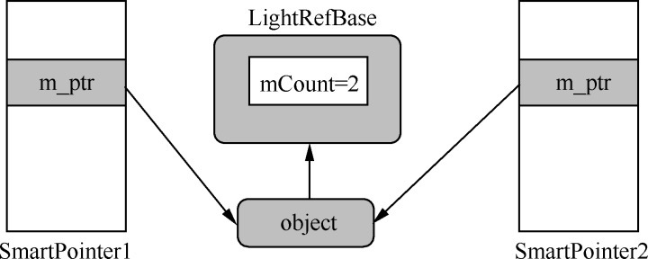
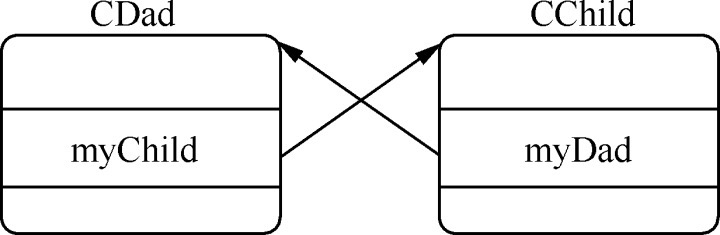
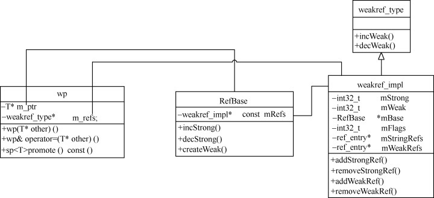
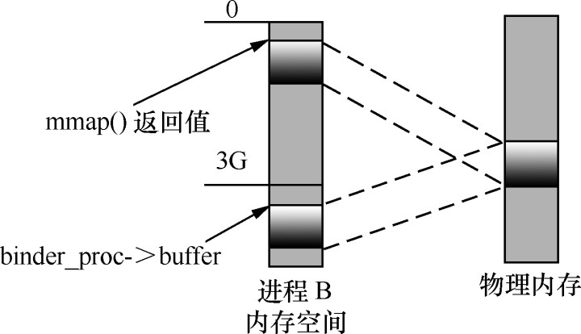
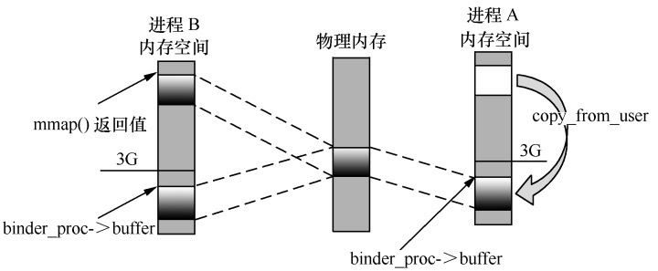
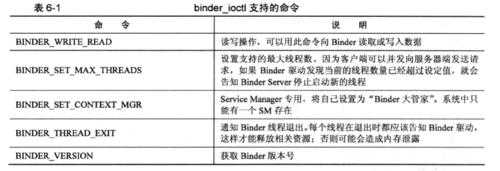
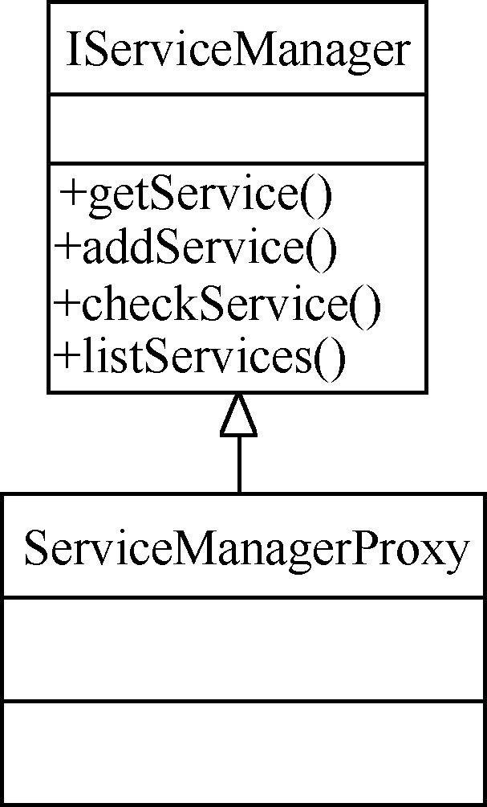
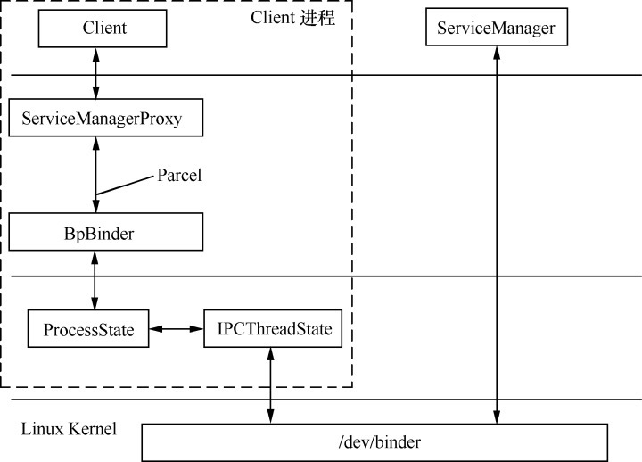
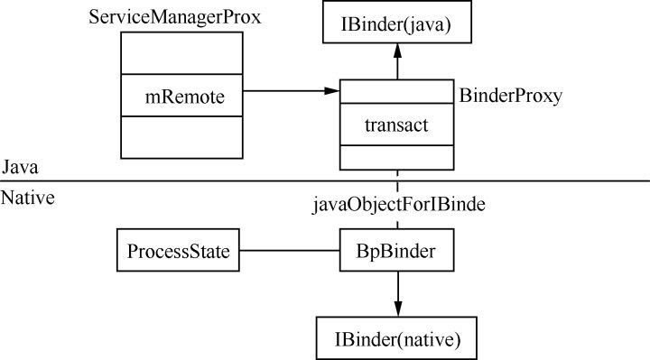

# 进程间通信——Binder

**Service Manager 在 Binder 通行过程中的唯一标志都是0。**


 

## 1. 智能指针

### 1.1 智能指针的设计理念

C/C++ 项目中常见的指针问题：

* 指针没有初始化
* new 了对象后没有及时 delete
* 野指针

智能指针设计，SmartPointer 类：

* SmartPointer 是个类，有一个指针变量指向 object
```C++
class SmartPointer{
        private:
        void *m_ptr;  // 指向 object
};
```

* SmartPointer 是一个模板类

```C++
template<typename T>
class SmartPointer {
private:
    T *m_ptr;   // 指向 object
};
```

* SmartPointer 构造函数应将 m_ptr 置空

```C++
template<typename T>
class SmartPointer {
private:
    inline SmartPointer() : m_ptr(0)

    T *m_ptr;   // 指向 object
};
```

* 引用计数，一个计数器记录该内对对象”被需要“的个数即可，当这个计数器递减到零时，说明该内存对象可以被回收了。


#### 计数器应由 object 自身持有


```C++
template<class T>
class LightRefBase{
public:
    inline LightRefBase():mCount(0){}
    inline void incStrong() const {
        // 增加引用计数
        android_atomic_inc(&mCount);
    }
    inline void desStrong() const{
        if(android_atomic_dec(&mCount) == 1) {
            // 减小引用计数
            delete static_cast<const T*>(this)  // 删除内存对象
        }
    }
protected:
    inline ~LightRefBase(){}
private:
    mutable volatile int32_t mCount;    // 引用计数值
};
```

**LightRefBase** 类主要提供两个方法，即 incStrong 和 decStrong，分别用于增加和减少引用计数值，当没有引用内存对象，还需要自动释放自己。

当一个智能指针应用了 object 时，其父类中的 incStrong 就会被调用，这意味着 SmartPointer 必须要重载它的 ”=“ 运算符。

```C++
template<typename T>
SmartPointer<T> &SmartPointer<T>::operate = (T * other) {
    if(other!=null) {
        m_ptr = other;
        other->incStrong();
    }
    return *this;
}
```

当 SmartPointer 析构时，也应及时调用 decStrong 来释放引用

```C++
template<typename T>
wp<T>::~wp() {
    if(m_ptr) m_ptr->decStrong();
}
```



### 1.2 强指针 sp

**sp:StrongPointer**

```C++
template<typename T>
class sp {
public:
    inline sp() : m_ptr(nullptr) { }
    
    sp(T* other);   // 常用构造函数

    // 其他构造函数
    sp(const sp<T>& other);
    sp(sp<T>&& other) noexcept;
    
    ~sp();  // 析构函数

    // Accessors

    inline T&       operator* () const     { return *m_ptr; }
    inline T*       operator-> () const    { return m_ptr;  }
    inline T*       get() const            { return m_ptr; }
    inline explicit operator bool () const { return m_ptr != nullptr; }

private:
    template<typename Y> friend class sp;
    template<typename Y> friend class wp;
    void set_pointer(T* ptr);
    static inline void check_not_on_stack(const void* ptr);
    T* m_ptr;
};
```

它和之前 SmartPointer 类实现上基本是一致的，比如等号运算符：

```C++
template <typename T>
sp<T>& sp<T>::operator=(T* other) {
    T* oldPtr(*const_cast<T* volatile*>(&m_ptr));
    if (other) {
        check_not_on_stack(other);
        other->incStrong(this);
    }
    if (oldPtr) oldPtr->decStrong(this);
    if (oldPtr != *const_cast<T* volatile*>(&m_ptr)) sp_report_race();
    m_ptr = other;
    return *this;
}
```

### 1.3 弱指针

为了解决对象间相互引用时对象不能释放的问题。



CDad 使用强指针来引用 CChild，而 CChild 只使用弱引用来指向父类。

当强引用数为 0 时，不论弱引用是否为 0 都可以 delete 自己。

**弱指针必须先升级为强指针，才能访问它指向的目标对象。**

```C++
template <typename T>
class wp
{
public:
    typedef typename RefBase::weakref_type weakref_type;

    inline wp() : m_ptr(nullptr), m_refs(nullptr) { }
    
    // 构造函数
    wp(T* other);

    wp(const wp<T>& other);

    ~wp();

    // Assignment
    wp& operator = (const wp<T>& other);
    wp& operator = (const sp<T>& other);
    
    void set_object_and_refs(T* other, weakref_type* refs);

    // promotion to sp，升级为强指针
    sp<T> promote() const;


    // Accessors

    inline  weakref_type* get_refs() const { return m_refs; }

    inline  T* unsafe_get() const { return m_ptr; }

    private:
    template<typename Y> friend class sp;
    template<typename Y> friend class wp;

    T*              m_ptr;
    weakref_type*   m_refs;
};
```

和 sp 相比，wp 在类的定义上有如下重要区别：

* 除了指向目标对象的 m_ptr 外，wp 另外一个 m_refs 指针，类型为 weakref_type
* 没有重载 ->,* 等运算符
* 有一个 prmote 方法来将 wp 提升为 sp
* 目标对象的父类不是 LigthRefBase，而是 RefBase

构造函数

```C++
template<typename T>
wp<T>::wp(T* other)
    : m_ptr(other)
{
    m_refs = other ? m_refs = other->createWeak(this) : nullptr;
}
```

wp 并没有直接增加目标对象的引用计数值，而是调用了 createWeak 方法

**RefBase 类**

```C++
class RefBase
{
public:
            void            incStrong(const void* id) const;    // 增加强引用计数值
            void            decStrong(const void* id) const;    // 减少强引用计数值
            ...

    // 嵌套类，wp 中用到的就是这个类
    class weakref_type
    {
    public:
        RefBase*            refBase() const;

        void                incWeak(const void* id);
        void                decWeak(const void* id);
        ... 
    };

            weakref_type*   createWeak(const void* id) const;   // 生成一个 weakref_type
            
            weakref_type*   getWeakRefs() const;

protected:
                            RefBase();  // 构造函数
    virtual                 ~RefBase();
    
    // 用于修改 object 的生命周期
    enum {
        OBJECT_LIFETIME_STRONG  = 0x0000,
        OBJECT_LIFETIME_WEAK    = 0x0001,
        OBJECT_LIFETIME_MASK    = 0x0001
    };
    

private:
        ...
        weakref_impl* const mRefs;
};
```

RefBase 嵌套了一个重要的类 weakref_type，也就是 m_refs 指针所属的类型。

RefBase 中还有一个 mRefs 成员变量，它是 weakref_type 的实现类。

```C++
class RefBase::weakref_impl : public RefBase::weakref_type
{
public:
    std::atomic<int32_t>    mStrong;    //  强引用计数器
    std::atomic<int32_t>    mWeak;  // 弱引用计数器
    RefBase* const          mBase;
    std::atomic<int32_t>    mFlags;

#if !DEBUG_REFS

    explicit weakref_impl(RefBase* base)
        : mStrong(INITIAL_STRONG_VALUE)
        , mWeak(0)
        , mBase(base)
        , mFlags(OBJECT_LIFETIME_STRONG)
    {
    }

    void addStrongRef(const void* /*id*/) { }
    void removeStrongRef(const void* /*id*/) { }

#else

    weakref_impl(RefBase* base)
        : mStrong(INITIAL_STRONG_VALUE)
        , mWeak(0)
        , mBase(base)
        , mFlags(OBJECT_LIFETIME_STRONG)
        , mStrongRefs(NULL)
        , mWeakRefs(NULL)
        , mTrackEnabled(!!DEBUG_REFS_ENABLED_BY_DEFAULT)
        , mRetain(false)
    {
    }

    ~weakref_impl()
    ...
#endif
};
```

**createWeak 函数**

```C++
RefBase::weakref_type* RefBase::createWeak(const void* id) const
{
    mRefs->incWeak(id); // 增加弱引用计数
    return mRefs;   // 直接返回 weakref_type 对象
}
```
这个函数先增加了 mRefs （也就是 weakref_impl 类型的成员变量）中弱引用计数值，然后返回这个 mRefs。



在 createWeak 中，mRefs 通过 incWeak 增加了计数器的弱引用

```C++
void RefBase::weakref_type::incWeak(const void* id)
{
    weakref_impl* const impl = static_cast<weakref_impl*>(this);
    impl->addWeakRef(id);
    const int32_t c __unused = impl->mWeak.fetch_add(1,
            std::memory_order_relaxed);
    ALOG_ASSERT(c >= 0, "incWeak called on %p after last weak ref", this);
}
```

当 wp 构造完成后，RefBase 所持有的 weakref_type 计数器中的 mWeak 就为 1，后面如果有新的 wp 执行这个对象，mWeak 还会持续增加。

```C++
void RefBase::incStrong(const void* id) const
{
    weakref_impl* const refs = mRefs;
    refs->incWeak(id);  // 增加弱引用计数值

    refs->addStrongRef(id);
    const int32_t c = refs->mStrong.fetch_add(1, std::memory_order_relaxed);    // 增加强引用计数值
    ALOG_ASSERT(c > 0, "incStrong() called on %p after last strong ref", refs);
#if PRINT_REFS
    ALOGD("incStrong of %p from %p: cnt=%d\n", this, id, c);
#endif
    if (c != INITIAL_STRONG_VALUE)  {   // 判断是不是第一次
        return;     // 不是第一次，直接返回
    }

    int32_t old __unused = refs->mStrong.fetch_sub(INITIAL_STRONG_VALUE, std::memory_order_relaxed);
    // A decStrong() must still happen after us.
    ALOG_ASSERT(old > INITIAL_STRONG_VALUE, "0x%x too small", old);
    refs->mBase->onFirstRef();
}
```

同时增加弱引用和强引用计数值，还要判断目标对象是不是第一次被引用，其中 c 变量是”增加之前的值“，如果等于 INITIAL_STRONG_VALUE 就说明是第一次，一方面要回调 onFirstRef 通知对象自己被引用,另一方面要对 mStrong 值做下小调整。

```C++
void RefBase::decStrong(const void* id) const
{
    weakref_impl* const refs = mRefs;
    refs->removeStrongRef(id);
    const int32_t c = refs->mStrong.fetch_sub(1, std::memory_order_release);    // 减少强引用计数
#if PRINT_REFS
    ALOGD("decStrong of %p from %p: cnt=%d\n", this, id, c);
#endif
    LOG_ALWAYS_FATAL_IF(BAD_STRONG(c), "decStrong() called on %p too many times",
            refs);
    if (c == 1) {   // 减少后强引用计数值已经降为 0
        std::atomic_thread_fence(std::memory_order_acquire);
        refs->mBase->onLastStrongRef(id);   // 通知事件
        int32_t flags = refs->mFlags.load(std::memory_order_relaxed);
        if ((flags&OBJECT_LIFETIME_MASK) == OBJECT_LIFETIME_STRONG) {
            delete this;    // 删除对象
            // The destructor does not delete refs in this case.
        }
    }
    
    refs->decWeak(id);  // 减少弱引用计数
}
```

首先减少 mStrong 计数器，如果减少减到 0 （即 c==1 ）,就需要回调 onLastStrongRef 通知这一事件，接着执行删除操作

特别注意，减少强引用计数值同时还要减少弱引用计数值，即最后的 decWeak(id)

```C++
void RefBase::weakref_type::decWeak(const void* id)
{
    weakref_impl* const impl = static_cast<weakref_impl*>(this);
    impl->removeWeakRef(id);
    const int32_t c = impl->mWeak.fetch_sub(1, std::memory_order_release);  // 减少弱引用计数值
    LOG_ALWAYS_FATAL_IF(BAD_WEAK(c), "decWeak called on %p too many times",
            this);
    if (c != 1) return;
    atomic_thread_fence(std::memory_order_acquire);

    int32_t flags = impl->mFlags.load(std::memory_order_relaxed);
    if ((flags&OBJECT_LIFETIME_MASK) == OBJECT_LIFETIME_STRONG) {
        // This is the regular lifetime case. The object is destroyed
        // when the last strong reference goes away. Since weakref_impl
        // outlives the object, it is not destroyed in the dtor, and
        // we'll have to do it here.
        if (impl->mStrong.load(std::memory_order_relaxed)
                == INITIAL_STRONG_VALUE) {
            // Decrementing a weak count to zero when object never had a strong
            // reference.  We assume it acquired a weak reference early, e.g.
            // in the constructor, and will eventually be properly destroyed,
            // usually via incrementing and decrementing the strong count.
            // Thus we no longer do anything here.  We log this case, since it
            // seems to be extremely rare, and should not normally occur. We
            // used to deallocate mBase here, so this may now indicate a leak.
            ALOGW("RefBase: Object at %p lost last weak reference "
                    "before it had a strong reference", impl->mBase);
        } else {
            // ALOGV("Freeing refs %p of old RefBase %p\n", this, impl->mBase);
            delete impl;
        }
    } else {
        // This is the OBJECT_LIFETIME_WEAK case. The last weak-reference
        // is gone, we can destroy the object.
        impl->mBase->onLastWeakRef(id);
        delete impl->mBase;
    }
}
```
先减小 mWeak 计数值，若果发现不为 0 （即 c!=1）就直接返回，否则就是弱引用计数值也为0，此时要根据 LIFETIME 标志分别处理。

当(flags&OBJECT_LIFETIME_MASK) == OBJECT_LIFETIME_STRONGS 时，即释放受强引用控制，（在 incStrong 函数，同时增加了强、弱引用计数器，而增加弱引用时是不会同时增加强引用的，这说明弱引用的值一定会大于等于强引用值），当程序走到这里，弱引用计数值一定为 0，而强引用值有两种情况：

* 强引用值为 INITIAL_STRONG_VALUE，说明这个目标没有被强引用过，也就是没有办法靠强指针来释放目标，所以需要 delete impl->mBase
* 有强引用的情况下，此时要 delete impl，而目标对象会由强引用 decStrong 来释放

析构函数

```C++

RefBase::~RefBase()
{
    int32_t flags = mRefs->mFlags.load(std::memory_order_relaxed);
    // Life-time of this object is extended to WEAK, in
    // which case weakref_impl doesn't out-live the object and we
    // can free it now.
    if ((flags & OBJECT_LIFETIME_MASK) == OBJECT_LIFETIME_WEAK) {
        // It's possible that the weak count is not 0 if the object
        // re-acquired a weak reference in its destructor
        if (mRefs->mWeak.load(std::memory_order_relaxed) == 0) {
            delete mRefs;
        }
    } else if (mRefs->mStrong.load(std::memory_order_relaxed) == INITIAL_STRONG_VALUE) {
        // We never acquired a strong reference on this object.
#if DEBUG_REFBASE_DESTRUCTION
        // Treating this as fatal is prone to causing boot loops. For debugging, it's
        // better to treat as non-fatal.
        ALOGD("RefBase: Explicit destruction, weak count = %d (in %p)", mRefs->mWeak.load(), this);

#if CALLSTACK_ENABLED
        CallStack::logStack(LOG_TAG);
#endif
#else
        LOG_ALWAYS_FATAL("RefBase: Explicit destruction, weak count = %d", mRefs->mWeak.load());
#endif
    }
    // For debugging purposes, clear mRefs.  Ineffective against outstanding wp's.
    const_cast<weakref_impl*&>(mRefs) = nullptr;
}
```

在这种情况下，RefBase 既然是由 decStrong 删除的，而从上面 decStrong 的执行顺序上来看 mWeak 的值还不为 0 ，因而并不会被执行。

**小结：**

* 智能指针分为强指针 sp 和弱指针 wp 两种
* 通常情况下目标对象的父类是 RefBase——这个基类提供了一个 weakref_impl 类型的引用计数器，可以同时进行强弱引用的控制（内部由 mStrong 和 mWeak 提供计数）
* 当 incStrong 增加强引用，也会增加弱引用
* 当 incWeak 时只增加弱引用计数
* 使用者可以通过 extendObjectLifetime 设置引用计数器的规则，不同规则下对删除目标对象的时机判断是不一样的
* 使用者可以根据程序需求来选择合适的智能指针类型和计数规则

## 2. 进程间的数据传递载体——Parcel

Parcel 接口分类

##### 1. Parcel 设置相关

* dataSize()：获取当前已经存储的数据大小
* setDataCapacity(int size)：设置 Parcel 的空间大小，存储的数据不能大于这个值
* setDataPosition(int position)：改变 Parcel 中的读写位置，必须介于 0 和 dataSize() 之间
* dataAvail()：当前 Parcel 的存储能力
* dataPosition()：数据的当前位置值
* dataSize()：当前 Parcel 所包含的数据大小

##### 2. Primitives

原始类型数据的读写操作。

* writeByte(byte)
* readByte()
* writeDouble(double)
* readDouble()

读写操作是配套的，用哪种方式写入数据就要用相应的方式正确读取。

##### 3. Primitive Arrays

* writeBooleanArray(boolean[])
* readBooleanArray(boolean[])
* writeByteArray(byte[])

···

##### 4. Parcelables

遵循 Parcelable 协议的对象可以通过 Parcel 来存取（bundle 就是继承自 Parcelable）

* writeParcelable(Parcelable, int)
* readParcelable(ClassLoader)：读取并返回一个新的 Parcelable 对象
* writeParcelableArray(T[], int)
* readParcelableArray(ClassLoader)：读取并返回一个 Parcelable 对象数组

##### 5. Bundles

Bundle 继承自 Parcelable，是一种特殊的 type-safe 的容器，采用键值对的方式存储数据，并在一定程度上优化了读取效率。

* writeBundle(Bundle)
* readBundle()：读取并返回一个新的 Bundle 对象
* readBundle(ClassLoader)：读取并返回一个新的 Bundle 对象, ClassLoader 用于 Bundle 获取对应的 Parcelable 对象。

##### 6. Active Objects

通常存入的 Parcel 的是对象的内容，而 Active Objects 写入的则是它们的特殊标志引用。

所以从 Parcel 中读取这些对象时，并不是重新创建的对象实例，而是原来那个被写入的实例。

1. **Binder**，利用 Parcel 将 Binder 对象写入，读取时就能得到原始的 Binder 对象,或者是它的特殊代理实现(最终操作的还是原始的 Binder 对象)。

```Java
writeStrongBinder(IBinder)
writeStrongInterface(IInterface)
readStrongBinder()
...
```

2. FileDescriptor,文件描述符

```Java
writeFileDescriptor(FileDescriptor)
readFileDescriptor()
```

##### 7. Untyped Containers

它是用于读写标准的任意类型的 java 容器

```Java
writeArray(Object[])
readArray(ClassLoader)
writeList(List)
readList(List, ClassLoader)
```

**Parcel 内部实现**

可以通过 `Parcel.obtain()` 来获取一个 Parcel 对象。

```Java
    /**
     * Retrieve a new Parcel object from the pool.
     */
    public static Parcel obtain() {
        final Parcel[] pool = sOwnedPool;
        synchronized (pool) {
            Parcel p;
            for (int i=0; i<POOL_SIZE; i++) {
                p = pool[i];
                if (p != null) {
                    pool[i] = null;
                    if (DEBUG_RECYCLE) {
                        p.mStack = new RuntimeException();
                    }
                    p.mReadWriteHelper = ReadWriteHelper.DEFAULT;
                    return p;
                }
            }
        }
        return new Parcel(0);
    }
```

构造函数

```Java
    private Parcel(long nativePtr) {
        if (DEBUG_RECYCLE) {
            mStack = new RuntimeException();
        }
        //Log.i(TAG, "Initializing obj=0x" + Integer.toHexString(obj), mStack);
        init(nativePtr);
    }

    private void init(long nativePtr) {
        if (nativePtr != 0) {
            mNativePtr = nativePtr;
            mOwnsNativeParcelObject = false;
        } else {
            mNativePtr = nativeCreate();    // 为本地层代码准备的指针
            mOwnsNativeParcelObject = true;
        }
    }
```

Parcel 的 JNI 实现 `frameworks/base/core/jni/android_os_Parcel.cpp`, Parce.java 只是一个简单的中介，最终所有类型的读写操作都是通过本地代码实现的

```C++
static jlong android_os_Parcel_create(JNIEnv* env, jclass clazz)
{
    Parcel* parcel = new Parcel();
    return reinterpret_cast<jlong>(parcel);
}
```

所有上面的 mNativePtr 变量实际上是本地层一个 Parcel(C++) 对象。

Parcel(cpp) 类的构造过程

```C++
Parcel::Parcel()
{
    LOG_ALLOC("Parcel %p: constructing", this);
    initState();
}
```

```C++
void Parcel::initState()
{
    LOG_ALLOC("Parcel %p: initState", this);
    mError = NO_ERROR;
    mData = nullptr;
    mDataSize = 0;
    mDataCapacity = 0;
    mDataPos = 0;
    ALOGV("initState Setting data size of %p to %zu", this, mDataSize);
    ALOGV("initState Setting data pos of %p to %zu", this, mDataPos);
    mSession = nullptr;
    mObjects = nullptr;
    mObjectsSize = 0;
    mObjectsCapacity = 0;
    ... // 其他成员变量
}
```

Parcel 对象的初始化过程只是简单给各个变量赋了初始值，没有内存分配动作，Parcel 遵循“动态扩展”的内存申请原则，只有在需要事才会申请内存以避免资源浪费。

几个重要的变量：

`frameworks/native/libs/binder/include/binder/Parcel.h`

```C++
    status_t            mError; // 错误码
    uint8_t*            mData;  // Parcel 中存储的数据，它是一个 unit8_t 类型的指针
    size_t              mDataSize;  // Parcel 中已经存储的数据大小
    size_t              mDataCapacity;  // 最大存储能力
    mutable size_t      mDataPos;   // 数据指针
```

`writeString` 实现：

ServiceManagerProxy 的 getService() 方法中对 Parcel 的操作

```Java
Parcel data = Parcel.obtain();
...
data.writeInterfaceToken(IServiceManager.descriptor);
data.writeString(name)
```

* 获取一个 Parcel 对象，它最终创建了一个本地 Parcel 实例，并做了全面的初始化操作。
* writeInterfaceToken 用于写入 IBinder 接口标志，参数类型是 String 类型。
* 通过 writeString 在 Parcel 中写入需要向 ServiceManager 查询的 Service 名称。

```C++
// Write RPC headers.  (previously just the interface token)
status_t Parcel::writeInterfaceToken(const String16& interface)
{
    return writeInterfaceToken(interface.string(), interface.size());
}

status_t Parcel::writeInterfaceToken(const char16_t* str, size_t len) {
    if (CC_LIKELY(!isForRpc())) {
        const IPCThreadState* threadState = IPCThreadState::self();
        writeInt32(threadState->getStrictModePolicy() | STRICT_MODE_PENALTY_GATHER);
        updateWorkSourceRequestHeaderPosition();
        writeInt32(threadState->shouldPropagateWorkSource() ? threadState->getCallingWorkSourceUid()
                                                            : IPCThreadState::kUnsetWorkSource);
        writeInt32(kHeader);
    }

    // currently the interface identification token is just its name as a string
    return writeString16(str, len);
}
```
等价于

`writeInterfaceToken->writeInt32(policy value)+writeString16(interface)`

```C++
status_t Parcel::writeInt32(int32_t val)
{
    return writeAligned(val);
}
```

它将 val 值按照对齐方式写入 Parcel 的存储空间中，也就是将数据写入 mDataPos 起始的 mData 中（还会判断存储能力是否满足要求，是否要申请新的内存等）。

```C++
status_t Parcel::writeString16(const String16& str)
{
    return writeString16(str.string(), str.size());
}

status_t Parcel::writeString16(const char16_t* str, size_t len)
{
    if (str == nullptr) return writeInt32(-1);

    // NOTE: Keep this logic in sync with android_os_Parcel.cpp
    status_t err = writeInt32(len);     // 先写入数据长度
    if (err == NO_ERROR) {
        len *= sizeof(char16_t);    // 长度*单位大小=所占空间
        uint8_t* data = (uint8_t*)writeInplace(len+sizeof(char16_t));
        if (data) {
            memcpy(data, str, len);     // 将数据复制到 data 所指向的位置中
            *reinterpret_cast<char16_t*>(data+len) = 0;
            return NO_ERROR;
        }
        err = mError;
    }
    return err;
}
```

* 填写数据的长度，占据4个字节
* 计算出数据所占据的空间大小
* 将数据复制到相应的位置中——writeInplace 就是用来计算复制数据的目标地址

```C++
void* Parcel::writeInplace(size_t len)
{
    if (len > INT32_MAX) {
        // don't accept size_t values which may have come from an
        // inadvertent conversion from a negative int.
        return nullptr;
    }
    
    // 计算当以4对齐时，容纳len大小的数据需要多少空间
    const size_t padded = pad_size(len);

    // check for integer overflow
    // 如果溢出直接返回
    if (mDataPos+padded < mDataPos) {
        return nullptr;
    }

    if ((mDataPos+padded) <= mDataCapacity) {
restart_write:
        //printf("Writing %ld bytes, padded to %ld\n", len, padded);
        uint8_t* const data = mData+mDataPos;

        // Need to pad at end?
        if (padded != len) {
#if BYTE_ORDER == BIG_ENDIAN
            static const uint32_t mask[4] = {
                0x00000000, 0xffffff00, 0xffff0000, 0xff000000
            };
#endif
#if BYTE_ORDER == LITTLE_ENDIAN
            static const uint32_t mask[4] = {
                0x00000000, 0x00ffffff, 0x0000ffff, 0x000000ff
            };
#endif
            //printf("Applying pad mask: %p to %p\n", (void*)mask[padded-len],
            //    *reinterpret_cast<void**>(data+padded-4));
            *reinterpret_cast<uint32_t*>(data+padded-4) &= mask[padded-len];
        }

        finishWrite(padded);
        return data;
    }
    
    // 如果执行到这来，说明数据大小已经超过了 Parcel 的存储能力，需要扩大容量
    status_t err = growData(padded);
    if (err == NO_ERROR) goto restart_write;    // 重新开始业务
    return nullptr;
}
```

* 如果空间足够，直接进行尾部填充操作，否则需要申请更多的存储空间（growData），然后返回 restart_write 继续执行。
* 最后调用 finishWrite 来调整 mDataPos 指针，并返回 data 位置以供调用者写入正在的数据内容。

writeInplace 用于确认即将写入的数据的起始和结束位置，并做好 padding 工作，因为有了需要写入的地址（即 data 指针），所以可以直接 memcpy 操作。

`memcpy(data, str, len)`

综上，写入一个String（writeString16）的步骤：

* writeInt32(len)
* memcpy
* padding

```C++
// ServiceManagerProxy 的 getService 可以拆解为
writeInterfaceToken=writeInt32(policy value)+writeString16(interface)
writeString16(interface)=writeInt32(len)+写入数据本身+填充
```

读取方法也必须遵循同样的数据操作顺序。

// todo

## 3. Binder 驱动与协议

Binder Driver 会将自己注册成一个 misc device，并向上层提供一个 /dev/binder 节点，Binder 节点并不对应真实的硬件设备。Binder 驱动运行于内核态，可以提供 open()、ioctl()、mmap()等常用的文件操作。

Binder 驱动还需要填写 file_operations 结构体

```C++
const struct file_operations binder_fops = {
	.owner = THIS_MODULE,
	.poll = binder_poll,
	.unlocked_ioctl = binder_ioctl,
	.compat_ioctl = compat_ptr_ioctl,
	.mmap = binder_mmap,
	.open = binder_open,
	.flush = binder_flush,
	.release = binder_release,
};
```

Binder 所使用的设备驱动入口函数：

`device_initcall(binder_init);`

### 3.1 打开 Binder 驱动——binder_open

```C
static int binder_open(struct inode *nodp, struct file *filp)
{
	struct binder_proc *proc, *itr;
	struct binder_device *binder_dev;
	struct binderfs_info *info;
	struct dentry *binder_binderfs_dir_entry_proc = NULL;
	bool existing_pid = false;

	binder_debug(BINDER_DEBUG_OPEN_CLOSE, "%s: %d:%d\n", __func__,
		     current->group_leader->pid, current->pid);

	proc = kzalloc(sizeof(*proc), GFP_KERNEL);
	if (proc == NULL)
		return -ENOMEM;
		
	// Binder 驱动会在/proc 系统目录下生成各种管理信息，上面代码中的 binder_pro 就是管理数据的记录体（每个进程都有独立记录）
	spin_lock_init(&proc->inner_lock);
	spin_lock_init(&proc->outer_lock);
	// 对新生成的 proc 对象进行各种初始化操作
	get_task_struct(current->group_leader);
	proc->tsk = current->group_leader;
	proc->cred = get_cred(filp->f_cred);
	INIT_LIST_HEAD(&proc->todo);   // todo 链表
	init_waitqueue_head(&proc->freeze_wait);   // wait 链表
	if (binder_supported_policy(current->policy)) {
		proc->default_priority.sched_policy = current->policy;
		proc->default_priority.prio = current->normal_prio;
	} else {
		proc->default_priority.sched_policy = SCHED_NORMAL;
		proc->default_priority.prio = NICE_TO_PRIO(0);
	}

	/* binderfs stashes devices in i_private */
	if (is_binderfs_device(nodp)) {
		binder_dev = nodp->i_private;
		info = nodp->i_sb->s_fs_info;
		binder_binderfs_dir_entry_proc = info->proc_log_dir;
	} else {
		binder_dev = container_of(filp->private_data,
					  struct binder_device, miscdev);
	}
	refcount_inc(&binder_dev->ref);
	proc->context = &binder_dev->context;
	binder_alloc_init(&proc->alloc);

	binder_stats_created(BINDER_STAT_PROC);
	proc->pid = current->group_leader->pid;
	INIT_LIST_HEAD(&proc->delivered_death);
	INIT_LIST_HEAD(&proc->waiting_threads);
	filp->private_data = proc;

	mutex_lock(&binder_procs_lock);    // 获取锁
	hlist_for_each_entry(itr, &binder_procs, proc_node) {
		if (itr->pid == proc->pid) {
			existing_pid = true;
			break;
		}
	}
	hlist_add_head(&proc->proc_node, &binder_procs);   // 将 proc 加入到 binder_process 的队列头部
	mutex_unlock(&binder_procs_lock);

	if (binder_debugfs_dir_entry_proc && !existing_pid) {
		char strbuf[11];

		snprintf(strbuf, sizeof(strbuf), "%u", proc->pid);
		/*
		 * proc debug entries are shared between contexts.
		 * Only create for the first PID to avoid debugfs log spamming
		 * The printing code will anyway print all contexts for a given
		 * PID so this is not a problem.
		 */
		proc->debugfs_entry = debugfs_create_file(strbuf, 0444,
			binder_debugfs_dir_entry_proc,
			(void *)(unsigned long)proc->pid,
			&proc_fops);
	}

	if (binder_binderfs_dir_entry_proc && !existing_pid) {
		char strbuf[11];
		struct dentry *binderfs_entry;

		snprintf(strbuf, sizeof(strbuf), "%u", proc->pid);
		/*
		 * Similar to debugfs, the process specific log file is shared
		 * between contexts. Only create for the first PID.
		 * This is ok since same as debugfs, the log file will contain
		 * information on all contexts of a given PID.
		 */
		binderfs_entry = binderfs_create_file(binder_binderfs_dir_entry_proc,
			strbuf, &proc_fops, (void *)(unsigned long)proc->pid);
		if (!IS_ERR(binderfs_entry)) {
			proc->binderfs_entry = binderfs_entry;
		} else {
			int error;

			error = PTR_ERR(binderfs_entry);
			pr_warn("Unable to create file %s in binderfs (error %d)\n",
				strbuf, error);
		}
	}

	return 0;
}
```

Binder 驱动为用户创建了一个它自己的 binder_proc 实体，之后用户对 Binder 设备的操作都将以这个对象为基础。

### 3.2 binder_mmap

对 Binder 驱动来说,上层用户调用的 mmap() 最终就对应了 binder_mmap()。

**Binder 中采用 mmap 的目的是什么呢？**

mmap() 可以把设备指定的内存块直接映射到应用程序的内存空间中，但是 Binder 本身并不是一个硬件设备,而是基于内存的"伪硬件",那么它又映射了什么内存块到应用程序中呢?

假如有两个进程 A 和 B，其中进程 B 通过 open() 和 mmap() 后与 Binder 驱动建立了联系



* 对于应用程序而言,它通过 mmap() 返回值得到一个内存地址（虚拟地址），这个地址通过虚拟内存转换（分段、分页）后最终指向物理内存的某个位置。
* 对于Binder驱动而言，它也有一个指针(binder_proc->buffer)指向某个虚拟内存地址。而经过虚拟内存转换后，它和应用程序中指向的物理内存处于同一个位置。

这是Binder和应用程序就拥有了若干公用的物理内存块，换句话说，它们对各自内存地址的操作，实际上是在同一块内存中执行的。

那么这么做有什么意义呢？

把进程 A 加进来：



左边部分没有任何变化，即进程 B 和 Binder 共用若干物理内存。

右半部分 Binder 驱动通过 copy_from_user()，把进程 A 中某段数据复制到其 binder_proc->buffer 所指向的内存空间中。因为 binder_proc->buffer 在物理内存中的位置和进程 B 是共享的，因而进程 B 可以直接访问到这段数据，也就是说，Binder 驱动只用了一次复制,就实现了进程 A 和 B 间的数据共享。

```C
static int binder_mmap(struct file *filp, struct vm_area_struct *vma)
{
	struct binder_proc *proc = filp->private_data;     // 取出这一进程对应的 binder_proc 对象

	if (proc->tsk != current->group_leader)
		return -EINVAL;

	binder_debug(BINDER_DEBUG_OPEN_CLOSE,
		     "%s: %d %lx-%lx (%ld K) vma %lx pagep %lx\n",
		     __func__, proc->pid, vma->vm_start, vma->vm_end,
		     (vma->vm_end - vma->vm_start) / SZ_1K, vma->vm_flags,
		     (unsigned long)pgprot_val(vma->vm_page_prot));

   // vma 中的标志是否禁止了 mmap 
	if (vma->vm_flags & FORBIDDEN_MMAP_FLAGS) {
		pr_err("%s: %d %lx-%lx %s failed %d\n", __func__,
		       proc->pid, vma->vm_start, vma->vm_end, "bad vm_flags", -EPERM);
		return -EPERM;
	}
	vma->vm_flags |= VM_DONTCOPY | VM_MIXEDMAP;
	vma->vm_flags &= ~VM_MAYWRITE;

	vma->vm_ops = &binder_vm_ops;
	vma->vm_private_data = proc;

	return binder_alloc_mmap_handler(&proc->alloc, vma);
}
```

几个主要的变量：

* vm_area_strut *vma  
    描述了一块供应用程序使用的虚拟内存，其中 vm->vm_stat 和 vma->vm_end 分别是这块连续的虚拟内存的起止点
    
* vm_strct *area  
    vma 是应用程序中对虚拟内存的描述，相应的 area 变量就是 Binder 驱动中对虚拟内存的描述。
    
* binder_proc *proc  
    Binder 驱动为应用进程分配的一个数据结构，用于存储和该进程有关的所有信息，如内存分配、线程管理等。

`common/drivers/android/binder_alloc.c`

```C
int binder_alloc_mmap_handler(struct binder_alloc *alloc,
			      struct vm_area_struct *vma)
{
	int ret;
	const char *failure_string;
	struct binder_buffer *buffer;

	mutex_lock(&binder_alloc_mmap_lock);
	if (alloc->buffer_size) {  // 是否已经做过映射
		ret = -EBUSY;
		failure_string = "already mapped";
		goto err_already_mapped;
	}
	// 当应用程序申请的内存大小超过 4M，只满足4M请求
	alloc->buffer_size = min_t(unsigned long, vma->vm_end - vma->vm_start,
				   SZ_4M);
	mutex_unlock(&binder_alloc_mmap_lock);

	alloc->buffer = (void __user *)vma->vm_start;

    // 分配pages数组的空间 
	alloc->pages = kcalloc(alloc->buffer_size / PAGE_SIZE,
			       sizeof(alloc->pages[0]),
			       GFP_KERNEL);
	if (alloc->pages == NULL) {
		ret = -ENOMEM;
		failure_string = "alloc page array";
		goto err_alloc_pages_failed;
	}

	buffer = kzalloc(sizeof(*buffer), GFP_KERNEL);
	if (!buffer) {
		ret = -ENOMEM;
		failure_string = "alloc buffer struct";
		goto err_alloc_buf_struct_failed;
	}

	buffer->user_data = alloc->buffer;
	list_add(&buffer->entry, &alloc->buffers);
	buffer->free = 1;
	binder_insert_free_buffer(alloc, buffer);
	alloc->free_async_space = alloc->buffer_size / 2;
	binder_alloc_set_vma(alloc, vma);
	mmgrab(alloc->vma_vm_mm);

	return 0;

err_alloc_buf_struct_failed:
	kfree(alloc->pages);
	alloc->pages = NULL;
err_alloc_pages_failed:
	alloc->buffer = NULL;
	mutex_lock(&binder_alloc_mmap_lock);
	alloc->buffer_size = 0;
err_already_mapped:
	mutex_unlock(&binder_alloc_mmap_lock);
	binder_alloc_debug(BINDER_DEBUG_USER_ERROR,
			   "%s: %d %lx-%lx %s failed %d\n", __func__,
			   alloc->pid, vma->vm_start, vma->vm_end,
			   failure_string, ret);
	return ret;
}
```

在 mmap 中 Binder 驱动实际上只为进程分配了一夜物理内存。虽然它最大支持 4MB 空间的 mmap，但因为这时候没有数据传输，显然没有必要一下子分配那么大的空间。

而且试想一下，如果每个进程都要一次性分配 4MB，那么 25 个进程都要消耗 100MB 以上的内存，这对于一般的嵌入式设备来说是不现实的。

成功分配了一页物理内存后，还需要将这一页内存与应用程序的虚拟内存联系起来，以正真实现共享。

### 3.2 binder_ioctl

这是 Binder 接口函数中工作量最大的一个,它承担了 Binder 驱动的大部分业务,Binder 驱动不提供 read() 和 write() 等常规文件操作，binder_ioctl 可以完全替代它们。



**小结**

Binder 驱动并没有脱离 Linux 的典型驱动模型，提供了多个文件操作接口。

其中 binder_ioctl 实现了应用进程与 Binder 驱动之间的命交互，可以说承载了 Binder 驱动中的大部分业务。

## 4. “DNS” 服务器——ServiceManager[Binder Server]

ServiceManager(以下简称SM)的功能可以类别互联网的“DNS”服务器，“IP地址”为0。

### 4.1 ServiceManager 的启动

init 程序解析 init.rc 时启动：

```C
service servicemanager /system/bin/servicemanager
    class core animation
    user system
    group system readproc
    critical
    onrestart restart healthd
    onrestart restart zygote
    onrestart restart audioserver
    onrestart restart media
    onrestart restart surfaceflinger
    onrestart restart inputflinger
    onrestart restart drm
    onrestart restart cameraserver
    writepid /dev/cpuset/system-background/tasks
```

一旦 servicemanager 发送问题重启后，其他系统服务 zygote, media, surfaceflinger 和 drm 也会被重新加载。

### 4.2 ServiceManager 的构建

```C
int main(int argc, char** argv)
{
    struct binder_state *bs;
    union selinux_callback cb;
    char *driver;

    if (argc > 1) {
        driver = argv[1];
    } else {
        driver = "/dev/binder";
    }

    // 打开 Binder 设备
    bs = binder_open(driver, 128*1024);
    if (!bs) {
#ifdef VENDORSERVICEMANAGER
        ALOGW("failed to open binder driver %s\n", driver);
        while (true) {
            sleep(UINT_MAX);
        }
#else
        ALOGE("failed to open binder driver %s\n", driver);
#endif
        return -1;
    }
    
    // 将自己设置为 Binder 大管家，整个 Android 系统
    // 只允许一个 ServiceManager 存在,后面还有人调用这个函数就会失败
    if (binder_become_context_manager(bs)) {
        ALOGE("cannot become context manager (%s)\n", strerror(errno));
        return -1;
    }

    cb.func_audit = audit_callback;
    selinux_set_callback(SELINUX_CB_AUDIT, cb);
    cb.func_log = selinux_log_callback;
    selinux_set_callback(SELINUX_CB_LOG, cb);

#ifdef VENDORSERVICEMANAGER
    sehandle = selinux_android_vendor_service_context_handle();
#else
    sehandle = selinux_android_service_context_handle();
#endif
    selinux_status_open(true);

    if (sehandle == NULL) {
        ALOGE("SELinux: Failed to acquire sehandle. Aborting.\n");
        abort();
    }

    if (getcon(&service_manager_context) != 0) {
        ALOGE("SELinux: Failed to acquire service_manager context. Aborting.\n");
        abort();
    }

    // 进入循环，等待客户的请求
    binder_loop(bs, svcmgr_handler);

    return 0;
}
```
main 函数主要做了以下几件事：

* 打开 Binder 设备，做好初始化
* 将自己设置为 Binder 大管家
* 进入主循环

初始化：

```C
struct binder_state *binder_open(const char* driver, size_t mapsize)
{
    struct binder_state *bs;    // 这个结构体记录了 SM 中有关 Binder 的所有信息,如 fd, map 的大小等
    struct binder_version vers;

    bs = malloc(sizeof(*bs));
    if (!bs) {
        errno = ENOMEM;
        return NULL;
    }

    bs->fd = open(driver, O_RDWR | O_CLOEXEC);  // 打开 Binder 驱动节点
    if (bs->fd < 0) {
        fprintf(stderr,"binder: cannot open %s (%s)\n",
                driver, strerror(errno));
        goto fail_open;
    }

    if ((ioctl(bs->fd, BINDER_VERSION, &vers) == -1) ||
        (vers.protocol_version != BINDER_CURRENT_PROTOCOL_VERSION)) {
        fprintf(stderr,
                "binder: kernel driver version (%d) differs from user space version (%d)\n",
                vers.protocol_version, BINDER_CURRENT_PROTOCOL_VERSION);
        goto fail_open;
    }

    bs->mapsize = mapsize;
    // mmap
    bs->mapped = mmap(NULL, mapsize, PROT_READ, MAP_PRIVATE, bs->fd, 0);
    if (bs->mapped == MAP_FAILED) {
        fprintf(stderr,"binder: cannot map device (%s)\n",
                strerror(errno));
        goto fail_map;
    }

    return bs;

fail_map:
    close(bs->fd);
fail_open:
    free(bs);
    return NULL;
}
```

根据上面代码的参数设置可知：

* 由 Binder 驱动决定被映射到进程空间的内存起始地址
* 映射区块大小为 128k
* 映射区只读
* 映射区改变是私有的，不需要保存文件
* 从文件的起始地址开始映射

将 servicemanager 注册为 Binder 机制的"大管家"

```C
int binder_become_context_manager(struct binder_state *bs)
{
    return ioctl(bs->fd, BINDER_SET_CONTEXT_MGR, 0);
}
```

在驱动小节所讲的，只要想 Binder Driver 发送 BIDNER_SET_CONTEXT_MGR 的 ioctl 命令即可。

所有工作就绪，SM 开始等待客户端请求，`binder_loop()` 入手看看 SM 如何处理请求：

```C
void binder_loop(struct binder_state *bs, binder_handler func)
{
    int res;
    struct binder_write_read bwr;   // 这是执行 BINDER_WRITE_READ 命名所需的数据格式
    uint32_t readbuf[32];   // 一次读取容量

    bwr.write_size = 0;
    bwr.write_consumed = 0;
    bwr.write_buffer = 0;

    readbuf[0] = BC_ENTER_LOOPER;
    binder_write(bs, readbuf, sizeof(uint32_t));

    for (;;) {
        bwr.read_size = sizeof(readbuf);
        bwr.read_consumed = 0;
        // 读取的消息存储到 readbuf 中
        bwr.read_buffer = (uintptr_t) readbuf;

        // 读取消息
        res = ioctl(bs->fd, BINDER_WRITE_READ, &bwr);

        if (res < 0) {
            ALOGE("binder_loop: ioctl failed (%s)\n", strerror(errno));
            break;
        }
        
        // 处理消息
        res = binder_parse(bs, 0, (uintptr_t) readbuf, bwr.read_consumed, func);
        if (res == 0) {
            ALOGE("binder_loop: unexpected reply?!\n");
            break;
        }
        if (res < 0) {
            ALOGE("binder_loop: io error %d %s\n", res, strerror(errno));
            break;
        }
    }
}
```

循环需要做什么？

和典型的基于事件驱动的程序循环框架类似

* 从消息队列中读取数据
* 如果消息是“退出命名”，则马上结束循环；如果消息为空，则继续读取或者等待一段时间后再读取；如果消息不为空且不是退出命令，则根据具体情况进行处理。

SM 遵循以下几个步骤

* 从 Binder 驱动读取消息  
    通过发送 BINDER_WRITE_READ 命令实现既可读又可写

* 处理消息  
    调用 binder_parse 来解析消息
    
* 不断循环，而且永远不会主动退出

再看 `binder_parse` 方法处理：

```C
int binder_parse(struct binder_state *bs, struct binder_io *bio,
                 uintptr_t ptr, size_t size, binder_handler func)
{
    int r = 1;
    uintptr_t end = ptr + (uintptr_t) size;

    while (ptr < end) {
        uint32_t cmd = *(uint32_t *) ptr;
        ptr += sizeof(uint32_t);
#if TRACE
        fprintf(stderr,"%s:\n", cmd_name(cmd));
#endif
        switch(cmd) {
        case BR_NOOP:
            break;
        case BR_TRANSACTION_COMPLETE:
            break;
        case BR_INCREFS:
        case BR_ACQUIRE:
        case BR_RELEASE:
        case BR_DECREFS:
#if TRACE
            fprintf(stderr,"  %p, %p\n", (void *)ptr, (void *)(ptr + sizeof(void *)));
#endif
            ptr += sizeof(struct binder_ptr_cookie);
            break;
        case BR_TRANSACTION: {
            struct binder_transaction_data *txn = (struct binder_transaction_data *) ptr;
            if ((end - ptr) < sizeof(*txn)) {
                ALOGE("parse: txn too small!\n");
                return -1;
            }
            binder_dump_txn(txn);
            if (func) {
                unsigned rdata[256/4];
                struct binder_io msg;
                struct binder_io reply;
                int res;

                bio_init(&reply, rdata, sizeof(rdata), 4);
                bio_init_from_txn(&msg, txn);
                res = func(bs, txn, &msg, &reply);  // 具体处理消息
                if (txn->flags & TF_ONE_WAY) {
                    binder_free_buffer(bs, txn->data.ptr.buffer);
                } else {
                    binder_send_reply(bs, &reply, txn->data.ptr.buffer, res);   // 回应消息处理结果
                }
            }
            ptr += sizeof(*txn);
            break;
        }
        case BR_REPLY: {
            struct binder_transaction_data *txn = (struct binder_transaction_data *) ptr;
            if ((end - ptr) < sizeof(*txn)) {
                ALOGE("parse: reply too small!\n");
                return -1;
            }
            binder_dump_txn(txn);
            if (bio) {
                bio_init_from_txn(bio, txn);
                bio = 0;
            } else {
                /* todo FREE BUFFER */
            }
            ptr += sizeof(*txn);
            r = 0;
            break;
        }
        case BR_DEAD_BINDER: {
            struct binder_death *death = (struct binder_death *)(uintptr_t) *(binder_uintptr_t *)ptr;
            ptr += sizeof(binder_uintptr_t);
            death->func(bs, death->ptr);
            break;
        }
        case BR_FAILED_REPLY:
            r = -1;
            break;
        case BR_DEAD_REPLY:
            r = -1;
            break;
        default:
            ALOGE("parse: OOPS %d\n", cmd);
            return -1;
        }
    }

    return r;
}
```

* 首先计算数据的终点（end），然后进入 while 循环（直到所有数据处理完成）。数据头部是 cmd，代表程序接下来要处理的具体命令。

和在 Binder 驱动中的情况一下，要重点关注 BR_TRANSACTION 和 BR_REPLAY

#### 1. BR_TRANSACTION

对 BR_TRANSACTION 命令的处理主要由 func 来完成，然后将结果返回给 Binder 驱动。

ServiceManager 提供的服务至少包括以下几种：

* 注册  
    当一个 Binder Server 创建后，它们要将自己的[名称，Binder 句柄]对应关系告知SM进行备案。
    
* 查询  
    即应用程序可以向SM发起查询请求，以获知某个 Binder Server 所对应的句柄。
    
* 其他信息查询  
    比如SM版本号、当前状态等。
    
```C
int svcmgr_handler(struct binder_state *bs,
                   struct binder_transaction_data *txn,
                   struct binder_io *msg,
                   struct binder_io *reply)
{
    struct svcinfo *si;
    uint16_t *s;
    size_t len;
    uint32_t handle;
    uint32_t strict_policy;
    int allow_isolated;

    //ALOGI("target=%p code=%d pid=%d uid=%d\n",
    //      (void*) txn->target.ptr, txn->code, txn->sender_pid, txn->sender_euid);

    if (txn->target.ptr != BINDER_SERVICE_MANAGER)  // SM 的 handle 为 0
        return -1;

    if (txn->code == PING_TRANSACTION)
        return 0;

    // Equivalent to Parcel::enforceInterface(), reading the RPC
    // header with the strict mode policy mask and the interface name.
    // Note that we ignore the strict_policy and don't propagate it
    // further (since we do no outbound RPCs anyway).
    strict_policy = bio_get_uint32(msg);
    s = bio_get_string16(msg, &len);
    if (s == NULL) {
        return -1;
    }

    if ((len != (sizeof(svcmgr_id) / 2)) ||
        memcmp(svcmgr_id, s, sizeof(svcmgr_id))) {
        fprintf(stderr,"invalid id %s\n", str8(s, len));
        return -1;
    }

    if (sehandle && selinux_status_updated() > 0) {
        struct selabel_handle *tmp_sehandle = selinux_android_service_context_handle();
        if (tmp_sehandle) {
            selabel_close(sehandle);
            sehandle = tmp_sehandle;
        }
    }

    switch(txn->code) {
    case SVC_MGR_GET_SERVICE:
    case SVC_MGR_CHECK_SERVICE:
        s = bio_get_string16(msg, &len);
        if (s == NULL) {
            return -1;
        }
        // 这个函数执行查找操作，SM中维护一个全局的 svclist 变量，用于保存所有 Server 的注册信息
        handle = do_find_service(s, len, txn->sender_euid, txn->sender_pid);
        if (!handle)
            break;
        // 保存查询结果，以返回给客端
        bio_put_ref(reply, handle);
        return 0;

    case SVC_MGR_ADD_SERVICE:
        s = bio_get_string16(msg, &len);
        if (s == NULL) {
            return -1;
        }
        handle = bio_get_ref(msg);
        allow_isolated = bio_get_uint32(msg) ? 1 : 0;
        
        // 这个函数具体执行添加操作
        if (do_add_service(bs, s, len, handle, txn->sender_euid,
            allow_isolated, txn->sender_pid))
            return -1;
        break;

    case SVC_MGR_LIST_SERVICES: {
        uint32_t n = bio_get_uint32(msg);

        if (!svc_can_list(txn->sender_pid, txn->sender_euid)) {
            ALOGE("list_service() uid=%d - PERMISSION DENIED\n",
                    txn->sender_euid);
            return -1;
        }
        si = svclist; // 所有 Server 信息都保存于此 
        while ((n-- > 0) && si)
            si = si->next;
        if (si) {
            bio_put_string16(reply, si->name);  // 保存结果
            return 0;
        }
        return -1;
    }
    default:
        ALOGE("unknown code %d\n", txn->code);
        return -1;
    }

    bio_put_uint32(reply, 0);
    return 0;
}
```


* 查询的过程很简单，主要是调用 do_find_service 来遍历内部列表，并返回目标 Server 对象，最后将结果存入 reply 中。
* 注册 Binder Server：首先在 SM 所维护的列表中查找是否已经有对应的节点存在，否则需要创建一个新的节点来记录这个 Server。然后将这个 Server 中所带的信息写入列表的相应节点中，以备后期查询。

Service Manager 内部维护着一个 svclist 列表，用于存储所有 Server 相关信息（以 svcinfo 为数据结构），查询和注册都是基于这个表展开的。

函数 svcmgr_handle 处理完成后，binder_parser 会进一步通过 binder_send_reply 来将执行结果回复给底层 Binder 驱动，进而传递给客户端，

然后 binder_parse 会进入下一轮 while 循环，直到 ptr<end 为false，说明 Service Manager 上一次从驱动层读取的消息都处理完毕，因而它还会继续向 Binder Driver 发送 BINDER_WRITE_READ 以查询有没有新的消息。如果有的话就处理，否则进入休眠等待。


#### 2. BR_REPLY

```C
case BR_REPLY: {
    struct binder_transaction_data *txn = (struct binder_transaction_data *) ptr;
    if ((end - ptr) < sizeof(*txn)) {
        ALOGE("parse: reply too small!\n");
        return -1;
    }
    binder_dump_txn(txn);
    if (bio) {
        bio_init_from_txn(bio, txn);
        bio = 0;
    } else {
        /* todo FREE BUFFER */
    }
    ptr += sizeof(*txn);
    r = 0;
    break;
}
```

SM 对 BR_REPLAY 并没有实质性的工作，因为 SM 是为别人服务的，并没有向其他 Binder Server 主动发起请求的情况。

### 4.3 获取 ServiceManager 服务——设计思考

如果要访问SM(Binder Server)的服务，流程应该是怎么样的呢？

无非就是以下几步：

* 打开 Binder 设备；
* 执行 mmap ；
* 通过 Binder 驱动向 SM 发送请求（SM 的 handle 为 0）
* 获得结果

不过还有一些细节需要商榷：

* 向 SM 发起请求的 Binder Client 可能是 Android 的 APK 应用程序，所以 SM 必须要提供 Java 层接口。
* 如果每个 Binder Client 都要亲力亲为地执行以上几个步骤获取 SM 服务，会浪费不少时间，所以会提供更好的封装来使整个 SM 调用过程更精简实用。
* 如果应用程序代码中每次实用 SM 服务（或者其他 Binder Server 服务），都需要打开一次 Binder 驱动，执行 mmap，结果就是消耗系统资源会越来越多，直到崩溃。一个有效地解决办法是每个进程只允许打开一次 Binder 设备，且只做一次内存映射——所有需要使用 Binder 驱动的线程共享这一资源。

那如果让我们设计一个符合上述要求的 Binder Client,应该怎么做呢?

#### 1. ProcessState 和 IPCThreadState

首先想到的是要创建一个类来专门管理每个应用进程的 Binder 操作——更为重要的是，执行 Binder 驱动的一系列命令对上层用户必须是“透明的”。

这个类是 **ProcessState**

> 另外 binder_proc 中有 threads 红黑树用于管理该进程中所有线程的 IPC 业务，进程中每一个线程都应该有与 Binder 驱动自动沟通的权利——而且基于 Binder 的 IPC 是阻塞的，这样能保证个别 thread 在做进程间通信时不会卡死整个应用程序。

与 Binder 驱动进行实际命令通信是 IPCThreadState

#### 2. Proxy

(1)ServiceManagerProxy(SM的代理)，所能提供的服务和服务端的 SM 必须是一致的，如 getService，addService 等。

```Java
public interface IServiceManager {
    public IBinder getService(String name) throws RemoteException;
    public IBinder checkService(String name) throws RemoteException;
    public void addService(String name, IBinder server, boolean allowIsolated) throws RemoteException;
    public String[] listServices() throws RemoteException;
}
```
显然，ServiceManagerProxy 需要继承自 IServiceManager



（2）接口实现。以 getService 为例，要取得 ServiceManager 的这个服务，至少有两部分工作。

* 与 Binder 建立关系  
    因为进程中已经有 ProcessState 和 IPCThreadState 这两个与 Binder 驱动通信的类，所以 Java 层代码使用 Binder 驱动实际上是基于它们完成的，称为 BpBinder。
    
* 向 Binder 发送命令，从而获得 SM 提供的服务。

一张图来概括 Binder 机制




### 4.4 ServiceManagerProxy

```Java
// ServiceManager.getService(name);

public static IBinder getService(String name) {
    try {
        IBinder service = sCache.get(name);     // 查询缓存
        if (service != null) {
            return service;     // 从缓存中找到结果，直接返回
        } else {
            return Binder.allowBlocking(getIServiceManager().getService(name));     // 向 SM 发起查询
        }
    } catch (RemoteException e) {
        Log.e(TAG, "error in getService", e);
    }
    return null;
}
```

sCache 用于记录 getService 的历史查询加过，以加快查询速度，如果不存在则调用 `getIServiceManager().getService` 发起一条查询请求。

```Java
private static IServiceManager getIServiceManager() {
    if (sServiceManager != null) {
        return sServiceManager;
    }

    // Find the service manager
    sServiceManager = ServiceManagerNative
            .asInterface(Binder.allowBlocking(BinderInternal.getContextObject()));
    return sServiceManager;
}
```
* 首先判断 sServiceManager 是否为空,以防止多次重复操作。
* 如果是第一次使用SM，则调用 ServiceManagerNative.asInterface(BinderInternal.getContextObject()) 来获取一个 IServiceManager。

```Java
// ServiceManagerNative.java
static public IServiceManager asInterface(IBinder obj)
{
    if (obj == null) {
        return null;
    }
    IServiceManager in =
        (IServiceManager)obj.queryLocalInterface(descriptor);
    if (in != null) {
        return in;
    }
    
    return new ServiceManagerProxy(obj);
}
```

这个函数负责将一个 Binder 对象转换为 IServiceManager，并在必要的时候创建 ServiceManagerProxy。

这里的 IBider 对象(obj) 是通过 BinderInternal.getContextObject() 得到的，它是与底层 Binder 沟通的工具。

* queryLocalInterface  
    查询本地是否已经有 IServiceManager 存在

* 如果没有查询到，则新建一个 ServiceManagerProxy。

作为 SM 的代理，可想而知 ServiceManagerProxy 必定要与 Binder 驱动通信的，因而它的构造函数中传入了 IBinder 对象。

```Java
public ServiceManagerProxy(IBinder remote) {
    mRemote = remote;
}
```

```Java
// getService
public IBinder getService(String name) throws RemoteException {
    Parcel data = Parcel.obtain();
    Parcel reply = Parcel.obtain();
    data.writeInterfaceToken(IServiceManager.descriptor);
    data.writeString(name);
    mRemote.transact(GET_SERVICE_TRANSACTION, data, reply, 0);  // 利用 IBinder 对象执行命令
    IBinder binder = reply.readStrongBinder();
    reply.recycle();
    data.recycle();
    return binder;
}
```

这个函数实现分为 3 个部分：

* 准备数据  
    通过 Parcel 打包数据
    
* IBinder.transact  
    利用 IBinder 的 transact 将请求发送出去，而不用理会 Binder 驱动的 open，mmap 以及一大堆具体的 Binder 协议中的命令。所以这个 IBinder 一定会在内部使用 ProcessState 和 IPCThreadState 来与 Binder 驱动进行通信。
    
* 获取结果  
    上面 transact 后，就可以直接获取到结果了。如果用 socket，就知道这是一种阻塞式的函数调用。因为涉及到进程间通信，结果并不是马上能获取到，所以 Binder 驱动一定先要将调用者线程挂起，直到有了结果才能把它唤醒。这样的好处就是调用者可以向进程内函数调用一样去编写程序，不用考虑很多 IPC 的细节。
    
### 4.5 IBinder 和 BpBinder

在创建 ServiceManagerProxy 时，传入了一个 IBinder 对象，然后借助它的 transact 方法，可以方便地与 Binder 驱动进行通信。

Binder 提供的功能可以统一在 IBinder 中表示，至少有如下接口方法：

```Java
// IBinder.java
public interface IBinder {
    public IInterface queryLocalInterface(String descriptor);

    public boolean transact(int code, Parcel data, Parcel reply, int flags)
        throws RemoteException;
}
···
``` 

此外，还应该有获取 IBinder 对象的一个类，即 BinderInternal：

```Java
    public static final native IBinder getContextObject();
```

这个方法是 native 方法，因为和 Binder 驱动打交道，最终都得通过 JNI 调用本地代码来实现。

JNI 层的 BinderInter：

```C++
// frameworks/base/core/jni/android_util_Binder.cpp

static jobject android_os_BinderInternal_getContextObject(JNIEnv* env, jobject clazz)
{
    sp<IBinder> b = ProcessState::self()->getContextObject(NULL);
    return javaObjectForIBinder(env, b);
}
```

getContextObject 方法确实是通过 ProcessState 来实现的，然后把 ProcessState 中创建的对象转换为 Java 层的 IBinder 对象。

IBinder 只是一个接口，显然会有具体的实现类继承于它。在 Native 层，这就是 BpBinder（BpBinder.cpp）；而在 Java 层，则是 Binder.java 中的 BinderProxy。

事实上，ProcessState::self()->getContextObject(null) 返回的就是一个 BpBinder 对象。



BinderProxy 和 BpBinder 分别继承自 Java 和 Native 层的 IBinder 接口。其中 BpBinder 是由 ProcessState 创建的，而 BinderProxy 是由 JavaObjectForIBinder() 函数通过 JNI 的 newObjcet 创建的。

mRemote->transact 实现

```Java
final class BinderProxy implements IBinder {
        public boolean transact(int code, Parcel data, Parcel reply, int flags) throws RemoteException {
        Binder.checkParcel(this, code, data, "Unreasonably large binder buffer");

        if (mWarnOnBlocking && ((flags & FLAG_ONEWAY) == 0)) {
            // For now, avoid spamming the log by disabling after we've logged
            // about this interface at least once
            mWarnOnBlocking = false;
            Log.w(Binder.TAG, "Outgoing transactions from this process must be FLAG_ONEWAY",
                    new Throwable());
        }

        final boolean tracingEnabled = Binder.isTracingEnabled();
        if (tracingEnabled) {
            final Throwable tr = new Throwable();
            Binder.getTransactionTracker().addTrace(tr);
            StackTraceElement stackTraceElement = tr.getStackTrace()[1];
            Trace.traceBegin(Trace.TRACE_TAG_ALWAYS,
                    stackTraceElement.getClassName() + "." + stackTraceElement.getMethodName());
        }
        try {
            return transactNative(code, data, reply, flags);
        } finally {
            if (tracingEnabled) {
                Trace.traceEnd(Trace.TRACE_TAG_ALWAYS);
            }
        }
    }
}
```

`transactNatice` 方法

```C++
static jboolean android_os_BinderProxy_transact(JNIEnv* env, jobject obj,
        jint code, jobject dataObj, jobject replyObj, jint flags) // throws RemoteException
{
    if (dataObj == NULL) {
        jniThrowNullPointerException(env, NULL);
        return JNI_FALSE;
    }

    Parcel* data = parcelForJavaObject(env, dataObj);
    if (data == NULL) {
        return JNI_FALSE;
    }
    Parcel* reply = parcelForJavaObject(env, replyObj);
    if (reply == NULL && replyObj != NULL) {
        return JNI_FALSE;
    }

    IBinder* target = (IBinder*)
        env->GetLongField(obj, gBinderProxyOffsets.mObject);
    if (target == NULL) {
        jniThrowException(env, "java/lang/IllegalStateException", "Binder has been finalized!");
        return JNI_FALSE;
    }

    ALOGV("Java code calling transact on %p in Java object %p with code %" PRId32 "\n",
            target, obj, code);


    bool time_binder_calls;
    int64_t start_millis;
    if (kEnableBinderSample) {
        // Only log the binder call duration for things on the Java-level main thread.
        // But if we don't
        time_binder_calls = should_time_binder_calls();

        if (time_binder_calls) {
            start_millis = uptimeMillis();
        }
    }

    //printf("Transact from Java code to %p sending: ", target); data->print();
    // 处理用户请求
    status_t err = target->transact(code, *data, reply, flags);
    //if (reply) printf("Transact from Java code to %p received: ", target); reply->print();

    if (kEnableBinderSample) {
        if (time_binder_calls) {
            conditionally_log_binder_call(start_millis, target, code);
        }
    }

    if (err == NO_ERROR) {
        return JNI_TRUE;
    } else if (err == UNKNOWN_TRANSACTION) {
        return JNI_FALSE;
    }

    signalExceptionForError(env, obj, err, true /*canThrowRemoteException*/, data->dataSize());
    return JNI_FALSE;
}
```

传参中的 dataObj 和 replyObj 分别对应 BinderProxy.transact 中的第2、3个参数（即 Parcel data 和 Pracel reply），需要先把它们转成 native 中的 Parcel 实现。

最后通过 BpBinder.transact 来处理用户的 Binder 请求。

```C++
// frameworks/native/libs/binder/BpBinder.cpp

status_t BpBinder::transact(
    uint32_t code, const Parcel& data, Parcel* reply, uint32_t flags)
{
    // Once a binder has died, it will never come back to life.
    if (mAlive) {
        status_t status = IPCThreadState::self()->transact(
            mHandle, code, data, reply, flags);
        if (status == DEAD_OBJECT) mAlive = 0;
        return status;
    }

    return DEAD_OBJECT;
}
```

最终还是通过 IPCThreadState 以及 ProcessState 来实现。

### 4.6 ProcessState 和 IPCThreadState

ProcessState 的关键点在于

* 保证同一个进程中只有一个 ProcessState 实例存在，而且只有在 ProcessState 对象创建时才打开 Binder 设备以及做内存映射。
* 向上层提供 IPC 服务。
* 与 IPCThreadState 分工合作。

```C++
sp<ProcessState> ProcessState::self()
{
    Mutex::Autolock _l(gProcessMutex);
    if (gProcess != NULL) {
        return gProcess;
    }
    gProcess = new ProcessState("/dev/binder");
    return gProcess;
}
```
访问 ProcessState 需要使用 ProcessState::Self()，如果当前已经有实例（gProcess不为空）存在，就直接返回这个对象，否则新建一个 ProcessState。

```C++
ProcessState::ProcessState(const char *driver)
    : mDriverName(String8(driver))
    , mDriverFD(open_driver(driver))    // open_driver
    , mVMStart(MAP_FAILED)
    , mThreadCountLock(PTHREAD_MUTEX_INITIALIZER)
    , mThreadCountDecrement(PTHREAD_COND_INITIALIZER)
    , mExecutingThreadsCount(0)
    , mMaxThreads(DEFAULT_MAX_BINDER_THREADS)
    , mStarvationStartTimeMs(0)
    , mManagesContexts(false)
    , mBinderContextCheckFunc(NULL)
    , mBinderContextUserData(NULL)
    , mThreadPoolStarted(false)
    , mThreadPoolSeq(1)
{
    if (mDriverFD >= 0) {
        // mmap the binder, providing a chunk of virtual address space to receive transactions.
        // 开始执行 mmap,内存大小接近1M空间
        mVMStart = mmap(0, BINDER_VM_SIZE, PROT_READ, MAP_PRIVATE | MAP_NORESERVE, mDriverFD, 0);
        if (mVMStart == MAP_FAILED) {
            // *sigh*
            ALOGE("Using /dev/binder failed: unable to mmap transaction memory.\n");
            close(mDriverFD);
            mDriverFD = -1;
            mDriverName.clear();
        }
    }

    LOG_ALWAYS_FATAL_IF(mDriverFD < 0, "Binder driver could not be opened.  Terminating.");
}
```

构造函数先调用了 open_driver() 打开 /dev/binder 节点，Binder 驱动首先是打开 binder 节点，然后执行 mmap() 函数——映射内存块大小为 BINDER_VM_SIZE

前面提到在获取 IBinder 时使用了 BinderInternal 中的 getContextObject()，这个方法最终的实现就是在 ProcessState 中：

```C++
sp<IBinder> ProcessState::getContextObject(const sp<IBinder>& /*caller*/)
{
    return getStrongProxyForHandle(0);  // 传入0，代表Service Manager
}
```

```C++

sp<IBinder> ProcessState::getStrongProxyForHandle(int32_t handle)
{
    sp<IBinder> result;

    AutoMutex _l(mLock);

    // 查找一个Vector表 mHandlerToObject
    // 这里保存了这个进程已经建立的 Binder 相关信息
    handle_entry* e = lookupHandleLocked(handle);

    if (e != NULL) {
        // We need to create a new BpBinder if there isn't currently one, OR we
        // are unable to acquire a weak reference on this current one.  See comment
        // in getWeakProxyForHandle() for more info about this.
        IBinder* b = e->binder;
        if (b == NULL || !e->refs->attemptIncWeak(this)) {
            if (handle == 0) {
                // Special case for context manager...
                // The context manager is the only object for which we create
                // a BpBinder proxy without already holding a reference.
                // Perform a dummy transaction to ensure the context manager
                // is registered before we create the first local reference
                // to it (which will occur when creating the BpBinder).
                // If a local reference is created for the BpBinder when the
                // context manager is not present, the driver will fail to
                // provide a reference to the context manager, but the
                // driver API does not return status.
                //
                // Note that this is not race-free if the context manager
                // dies while this code runs.
                //
                // TODO: add a driver API to wait for context manager, or
                // stop special casing handle 0 for context manager and add
                // a driver API to get a handle to the context manager with
                // proper reference counting.

                Parcel data;
                status_t status = IPCThreadState::self()->transact(
                        0, IBinder::PING_TRANSACTION, data, NULL, 0);
                if (status == DEAD_OBJECT)
                   return NULL;
            }

            b = new BpBinder(handle); 
            e->binder = b;
            if (b) e->refs = b->getWeakRefs();
            result = b;
        } else {
            // This little bit of nastyness is to allow us to add a primary
            // reference to the remote proxy when this team doesn't have one
            // but another team is sending the handle to us.
            result.force_set(b);
            e->refs->decWeak(this);
        }
    }

    return result;
}
```

ProcessState 中有一个全局列表来记录所有与 Binder 对象相关的信息，而每一个表项是一个 handler_entry，包含如下数据：

```C++
    struct handle_entry {
        IBinder* binder;
        RefBase::weakref_type* refs;
    };
```

其中的 binder 属性实际上是一个 BpBinder，程序只有两种情况才会生成一个BpBinder

* 在列表中没有找到对象的 BpBinder
* 虽然从列表中查找到了对应的节点，但是没有办法顺利对整个 BpBinder 增加 weak reference。

BpBinder 是 Native 层的 Binder 代理，最后会由 JavaObjectForIBinder 转化为 Java 层的 BinderProxy 。

```C++
BpBinder::BpBinder(int32_t handle)
    : mHandle(handle)   //  如果是SM，handle 为 0
    , mAlive(1)
    , mObitsSent(0)
    , mObituaries(NULL)
{
    ALOGV("Creating BpBinder %p handle %d\n", this, mHandle);

    extendObjectLifetime(OBJECT_LIFETIME_WEAK);
    IPCThreadState::self()->incWeakHandle(handle);
}
```

BpBinder 所使用的引用计数基类是 RefBase，它同时支持强弱两种引用计数。

ProcessState::getContextObject 得到一个 BpBinder，并且其中的 mHandle 代表这个 Proxy 的主人（比如SM是0），之后传递给 Client 时才转换成 IBinder。

IPCThreadState 一样需要保持“单实例”，也需要通过 IPCThreadState::self()来访问，它是“线程中单实例”。

TLS(Thread Local Store)可以保证某个变量仅在自己线程内访问有效，而其他线程中得到的是这个变量的独立复本，互不干涉。

```C++
IPCThreadState* IPCThreadState::self()
{
    if (gHaveTLS) { // 这个变量初始值为false
restart:    // 当启用 TLS 后，重现回到这里
        const pthread_key_t k = gTLS;
        IPCThreadState* st = (IPCThreadState*)pthread_getspecific(k);
        if (st) return st;
        return new IPCThreadState;
    }

    if (gShutdown) {
        ALOGW("Calling IPCThreadState::self() during shutdown is dangerous, expect a crash.\n");
        return NULL;
    }

    pthread_mutex_lock(&gTLSMutex);
    if (!gHaveTLS) {
        int key_create_value = pthread_key_create(&gTLS, threadDestructor);
        if (key_create_value != 0) {
            pthread_mutex_unlock(&gTLSMutex);
            ALOGW("IPCThreadState::self() unable to create TLS key, expect a crash: %s\n",
                    strerror(key_create_value));
            return NULL;
        }
        gHaveTLS = true;
    }
    pthread_mutex_unlock(&gTLSMutex);
    goto restart;
}
```

* 第一次调用，gHaveTLS 为 false，因而不会进入第一个if判断中，也不会创建IPCThreadState
* 随后它会进入第二个if并启动 TLS，然后返回 resstart 处新建一个 IPCThradState
* 再被调用时，gHaveTLS为true，如果本线程已经创建过 IPCThreadState，那么 pthread_getspecific 就不为空，否则返回一个新建的 IPCThreadState。

保证“线程单实例”的目的：

```C++
IPCThreadState::IPCThreadState()
    : mProcess(ProcessState::self()),   // 整个进程只有一个
      mStrictModePolicy(0),
      mLastTransactionBinderFlags(0)
{
    pthread_setspecific(gTLS, this);
    clearCaller();
    mIn.setDataCapacity(256);   // mIn 是一个 Parcel，它是用于接收 Binder 发过来的数据，最大容量为 256
    mOut.setDataCapacity(256);  // mOut 也是一个 Parcel，它是用于存储要发给 Binder 的命令数据，最大容量为 256
```

IPCThreadState 负责与Binder驱动进行具体的命令交互（ProcessState只是负责打开Binder节点并做mmap），因而它的 transact 函数非常重要：

```C++
status_t IPCThreadState::transact(int32_t handle,
                                  uint32_t code, const Parcel& data,
                                  Parcel* reply, uint32_t flags)
{
    status_t err = data.errorCheck();

    flags |= TF_ACCEPT_FDS;

    IF_LOG_TRANSACTIONS() {
        TextOutput::Bundle _b(alog);
        alog << "BC_TRANSACTION thr " << (void*)pthread_self() << " / hand "
            << handle << " / code " << TypeCode(code) << ": "
            << indent << data << dedent << endl;
    }

    if (err == NO_ERROR) {
        LOG_ONEWAY(">>>> SEND from pid %d uid %d %s", getpid(), getuid(),
            (flags & TF_ONE_WAY) == 0 ? "READ REPLY" : "ONE WAY");
        // 整理数据，把它打包成 Binder 驱动协议规定的数据
        err = writeTransactionData(BC_TRANSACTION, flags, handle, code, data, NULL);
    }

    if (err != NO_ERROR) {
        if (reply) reply->setError(err);
        return (mLastError = err);
    }

    if ((flags & TF_ONE_WAY) == 0) {
        #if 0
        if (code == 4) { // relayout
            ALOGI(">>>>>> CALLING transaction 4");
        } else {
            ALOGI(">>>>>> CALLING transaction %d", code);
        }
        #endif
        if (reply) {
            err = waitForResponse(reply);
        } else {
            Parcel fakeReply;
            err = waitForResponse(&fakeReply);
        }
        #if 0
        if (code == 4) { // relayout
            ALOGI("<<<<<< RETURNING transaction 4");
        } else {
            ALOGI("<<<<<< RETURNING transaction %d", code);
        }
        #endif

        IF_LOG_TRANSACTIONS() {
            TextOutput::Bundle _b(alog);
            alog << "BR_REPLY thr " << (void*)pthread_self() << " / hand "
                << handle << ": ";
            if (reply) alog << indent << *reply << dedent << endl;
            else alog << "(none requested)" << endl;
        }
    } else {
        err = waitForResponse(NULL, NULL);
    }

    return err;
}
```

ServiceManager#getService 调用流程：

`getService@ServiceManagerProxy→transact@BinderProxy→transact@BpBinder→transact@IPCThreadState`


针对 getService，transact 函数中各参数值分别是：

* handle 是 0
* code 为 GET_SERVICE_TRANSACTION
* data
* flags 为 0


Transaction 共有4种 flag

* TF_ONE_WAY：它表示当前业务是异步的，不需要等待
* TF_ROOT_OBJECT：所包含的内容是根对象
* TF_STATUS_CODE：所包含的内容是 32-bit 状态值
* TF_ACCEPT_FDS=0x10：允许回复中包含文件描述符

```C++
status_t IPCThreadState::waitForResponse(Parcel *reply, status_t *acquireResult)
{
    uint32_t cmd;
    int32_t err;

    while (1) {
        // 循环等待结果
        if ((err=talkWithDriver()) < NO_ERROR) break;
        err = mIn.errorCheck();
        if (err < NO_ERROR) break;
        if (mIn.dataAvail() == 0) continue; // mIn 中没有数据，继续循环

        cmd = (uint32_t)mIn.readInt32();

        IF_LOG_COMMANDS() {
            alog << "Processing waitForResponse Command: "
                << getReturnString(cmd) << endl;
        }

        switch (cmd) {
        case BR_TRANSACTION_COMPLETE:
            if (!reply && !acquireResult) goto finish;
            break;

        case BR_DEAD_REPLY:
            err = DEAD_OBJECT;
            goto finish;

        case BR_FAILED_REPLY:
            err = FAILED_TRANSACTION;
            goto finish;

        case BR_ACQUIRE_RESULT:
            {
                ALOG_ASSERT(acquireResult != NULL, "Unexpected brACQUIRE_RESULT");
                const int32_t result = mIn.readInt32();
                if (!acquireResult) continue;
                *acquireResult = result ? NO_ERROR : INVALID_OPERATION;
            }
            goto finish;

        case BR_REPLY:
            {
                binder_transaction_data tr;
                err = mIn.read(&tr, sizeof(tr));
                ALOG_ASSERT(err == NO_ERROR, "Not enough command data for brREPLY");
                if (err != NO_ERROR) goto finish;

                if (reply) {
                    if ((tr.flags & TF_STATUS_CODE) == 0) {
                        reply->ipcSetDataReference(
                            reinterpret_cast<const uint8_t*>(tr.data.ptr.buffer),
                            tr.data_size,
                            reinterpret_cast<const binder_size_t*>(tr.data.ptr.offsets),
                            tr.offsets_size/sizeof(binder_size_t),
                            freeBuffer, this);
                    } else {
                        err = *reinterpret_cast<const status_t*>(tr.data.ptr.buffer);
                        freeBuffer(NULL,
                            reinterpret_cast<const uint8_t*>(tr.data.ptr.buffer),
                            tr.data_size,
                            reinterpret_cast<const binder_size_t*>(tr.data.ptr.offsets),
                            tr.offsets_size/sizeof(binder_size_t), this);
                    }
                } else {
                    freeBuffer(NULL,
                        reinterpret_cast<const uint8_t*>(tr.data.ptr.buffer),
                        tr.data_size,
                        reinterpret_cast<const binder_size_t*>(tr.data.ptr.offsets),
                        tr.offsets_size/sizeof(binder_size_t), this);
                    continue;
                }
            }
            goto finish;

        default:
            err = executeCommand(cmd);
            if (err != NO_ERROR) goto finish;
            break;
        }
    }

finish:
    if (err != NO_ERROR) {
        if (acquireResult) *acquireResult = err;
        if (reply) reply->setError(err);
        mLastError = err;
    }

    return err;
}
```

* talkWithDriver 会将已有数据进行必要的包装，然后发给 Binder 驱动
* 根据用户配置会决定是否要等待结果

Binder 的执行过程多数是阻塞型的，换句话是通过 Binder 去调用服务进程提供的接口函数，那么此函数执行结束时结果就已经产生，不涉及回调机制。

实现该的一种方式就是让调用者进程暂时挂起，知道目标进程返回结果后，Binder 再唤醒等待进程。

```C++

status_t IPCThreadState::talkWithDriver(bool doReceive)
{
    if (mProcess->mDriverFD <= 0) {
        return -EBADF;
    }

    binder_write_read bwr;

    // Is the read buffer empty?
    const bool needRead = mIn.dataPosition() >= mIn.dataSize();

    // We don't want to write anything if we are still reading
    // from data left in the input buffer and the caller
    // has requested to read the next data.
    const size_t outAvail = (!doReceive || needRead) ? mOut.dataSize() : 0;

    bwr.write_size = outAvail;
    bwr.write_buffer = (uintptr_t)mOut.data();

    // This is what we'll read.
    if (doReceive && needRead) {
        bwr.read_size = mIn.dataCapacity();
        bwr.read_buffer = (uintptr_t)mIn.data();
    } else {
        bwr.read_size = 0;
        bwr.read_buffer = 0;
    }

    IF_LOG_COMMANDS() {
        TextOutput::Bundle _b(alog);
        if (outAvail != 0) {
            alog << "Sending commands to driver: " << indent;
            const void* cmds = (const void*)bwr.write_buffer;
            const void* end = ((const uint8_t*)cmds)+bwr.write_size;
            alog << HexDump(cmds, bwr.write_size) << endl;
            while (cmds < end) cmds = printCommand(alog, cmds);
            alog << dedent;
        }
        alog << "Size of receive buffer: " << bwr.read_size
            << ", needRead: " << needRead << ", doReceive: " << doReceive << endl;
    }

    // Return immediately if there is nothing to do.
    if ((bwr.write_size == 0) && (bwr.read_size == 0)) return NO_ERROR;

    bwr.write_consumed = 0;
    bwr.read_consumed = 0;
    status_t err;
    do {
        IF_LOG_COMMANDS() {
            alog << "About to read/write, write size = " << mOut.dataSize() << endl;
        }
#if defined(__ANDROID__)
        if (ioctl(mProcess->mDriverFD, BINDER_WRITE_READ, &bwr) >= 0)
            err = NO_ERROR;
        else
            err = -errno;
#else
        err = INVALID_OPERATION;
#endif
        if (mProcess->mDriverFD <= 0) {
            err = -EBADF;
        }
        IF_LOG_COMMANDS() {
            alog << "Finished read/write, write size = " << mOut.dataSize() << endl;
        }
    } while (err == -EINTR);

    IF_LOG_COMMANDS() {
        alog << "Our err: " << (void*)(intptr_t)err << ", write consumed: "
            << bwr.write_consumed << " (of " << mOut.dataSize()
                        << "), read consumed: " << bwr.read_consumed << endl;
    }

    if (err >= NO_ERROR) {
        if (bwr.write_consumed > 0) {
            if (bwr.write_consumed < mOut.dataSize())
                mOut.remove(0, bwr.write_consumed);
            else
                mOut.setDataSize(0);
        }
        if (bwr.read_consumed > 0) {
            mIn.setDataSize(bwr.read_consumed);
            mIn.setDataPosition(0);
        }
        IF_LOG_COMMANDS() {
            TextOutput::Bundle _b(alog);
            alog << "Remaining data size: " << mOut.dataSize() << endl;
            alog << "Received commands from driver: " << indent;
            const void* cmds = mIn.data();
            const void* end = mIn.data() + mIn.dataSize();
            alog << HexDump(cmds, mIn.dataSize()) << endl;
            while (cmds < end) cmds = printReturnCommand(alog, cmds);
            alog << dedent;
        }
        return NO_ERROR;
    }

    return err;
}
```

> 太复杂了，略过，可以参考书籍，直接到总结部分

getService 为例，Binder Client 获取 Binder Service 的全过程：

* ServiceManagerProxy
    当某个Binder Server在启动时，会把自己名称 name 和对应的 Binder 句柄保存在 ServiceManager中。调用者知道 Binder Server 的名称，所以必须先向 Service Manager 发起查询请求，就是 getService(name)

* 


    
    


