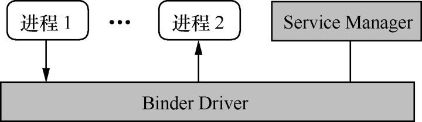

# 进程间通信——Binder

**Service Manager 在 Binder 通行过程中的唯一标志都是0。**


 

## 1. 智能指针

### 1.1 智能指针的设计理念

C/C++ 项目中常见的指针问题：

* 指针没有初始化
* new 了对象后没有及时 delete
* 野指针

智能指针设计，SmartPointer 类：

* SmartPointer 是个类，有一个指针变量指向 object
```C++
class SmartPointer{
        private:
        void *m_ptr;  // 指向 object
};
```

* SmartPointer 是一个模板类

```C++
template<typename T>
class SmartPointer {
private:
    T *m_ptr;   // 指向 object
};
```

* SmartPointer 构造函数应将 m_ptr 置空

```C++
template<typename T>
class SmartPointer {
private:
    inline SmartPointer() : m_ptr(0)

    T *m_ptr;   // 指向 object
};
```

* 引用计数，一个计数器记录该内对对象”被需要“的个数即可，当这个计数器递减到零时，说明该内存对象可以被回收了。


#### 计数器应由 object 自身持有


```C++
template<class T>
class LightRefBase{
public:
    inline LightRefBase():mCount(0){}
    inline void incStrong() const {
        // 增加引用计数
        android_atomic_inc(&mCount);
    }
    inline void desStrong() const{
        if(android_atomic_dec(&mCount) == 1) {
            // 减小引用计数
            delete static_cast<const T*>(this)  // 删除内存对象
        }
    }
protected:
    inline ~LightRefBase(){}
private:
    mutable volatile int32_t mCount;    // 引用计数值
};
```

**LightRefBase** 类主要提供两个方法，即 incStrong 和 decStrong，分别用于增加和减少引用计数值，当没有引用内存对象，还需要自动释放自己。

当一个智能指针应用了 object 时，其父类中的 incStrong 就会被调用，这意味着 SmartPointer 必须要重载它的 ”=“ 运算符。

```C++
template<typename T>
SmartPointer<T> &SmartPointer<T>::operate = (T * other) {
    if(other!=null) {
        m_ptr = other;
        other->incStrong();
    }
    return *this;
}
```

当 SmartPointer 析构时，也应及时调用 decStrong 来释放引用

```C++
template<typename T>
wp<T>::~wp() {
    if(m_ptr) m_ptr->decStrong();
}
```


### 1.2 强指针 sp

**sp:StrongPointer**

```C++
template<typename T>
class sp {
public:
    inline sp() : m_ptr(nullptr) { }
    
    sp(T* other);   // 常用构造函数

    // 其他构造函数
    sp(const sp<T>& other);
    sp(sp<T>&& other) noexcept;
    
    ~sp();  // 析构函数

    // Accessors

    inline T&       operator* () const     { return *m_ptr; }
    inline T*       operator-> () const    { return m_ptr;  }
    inline T*       get() const            { return m_ptr; }
    inline explicit operator bool () const { return m_ptr != nullptr; }

private:
    template<typename Y> friend class sp;
    template<typename Y> friend class wp;
    void set_pointer(T* ptr);
    static inline void check_not_on_stack(const void* ptr);
    T* m_ptr;
};
```

它和之前 SmartPointer 类实现上基本是一致的，比如等号运算符：

```C++
template <typename T>
sp<T>& sp<T>::operator=(T* other) {
    T* oldPtr(*const_cast<T* volatile*>(&m_ptr));
    if (other) {
        check_not_on_stack(other);
        other->incStrong(this);
    }
    if (oldPtr) oldPtr->decStrong(this);
    if (oldPtr != *const_cast<T* volatile*>(&m_ptr)) sp_report_race();
    m_ptr = other;
    return *this;
}
```

### 1.3 弱指针

为了解决对象间相互引用时对象不能释放的问题。


CDad 使用强指针来引用 CChild，而 CChild 只使用弱引用来指向父类。

当强引用数为 0 时，不论弱引用是否为 0 都可以 delete 自己。

**弱指针必须先升级为强指针，才能访问它指向的目标对象。**

```C++
template <typename T>
class wp
{
public:
    typedef typename RefBase::weakref_type weakref_type;

    inline wp() : m_ptr(nullptr), m_refs(nullptr) { }
    
    // 构造函数
    wp(T* other);

    wp(const wp<T>& other);

    ~wp();

    // Assignment
    wp& operator = (const wp<T>& other);
    wp& operator = (const sp<T>& other);
    
    void set_object_and_refs(T* other, weakref_type* refs);

    // promotion to sp，升级为强指针
    sp<T> promote() const;


    // Accessors

    inline  weakref_type* get_refs() const { return m_refs; }

    inline  T* unsafe_get() const { return m_ptr; }

    private:
    template<typename Y> friend class sp;
    template<typename Y> friend class wp;

    T*              m_ptr;
    weakref_type*   m_refs;
};
```

和 sp 相比，wp 在类的定义上有如下重要区别：

* 除了指向目标对象的 m_ptr 外，wp 另外一个 m_refs 指针，类型为 weakref_type
* 没有重载 ->,* 等运算符
* 有一个 prmote 方法来将 wp 提升为 sp
* 目标对象的父类不是 LigthRefBase，而是 RefBase

构造函数

```C++
template<typename T>
wp<T>::wp(T* other)
    : m_ptr(other)
{
    m_refs = other ? m_refs = other->createWeak(this) : nullptr;
}
```

wp 并没有直接增加目标对象的引用计数值，而是调用了 createWeak 方法

**RefBase 类**

```C++
class RefBase
{
public:
            void            incStrong(const void* id) const;    // 增加强引用计数值
            void            decStrong(const void* id) const;    // 减少强引用计数值
            ...

    // 嵌套类，wp 中用到的就是这个类
    class weakref_type
    {
    public:
        RefBase*            refBase() const;

        void                incWeak(const void* id);
        void                decWeak(const void* id);
        ... 
    };

            weakref_type*   createWeak(const void* id) const;   // 生成一个 weakref_type
            
            weakref_type*   getWeakRefs() const;

protected:
                            RefBase();  // 构造函数
    virtual                 ~RefBase();
    
    // 用于修改 object 的生命周期
    enum {
        OBJECT_LIFETIME_STRONG  = 0x0000,
        OBJECT_LIFETIME_WEAK    = 0x0001,
        OBJECT_LIFETIME_MASK    = 0x0001
    };
    

private:
        ...
        weakref_impl* const mRefs;
};
```

RefBase 嵌套了一个重要的类 weakref_type，也就是 m_refs 指针所属的类型。

RefBase 中还有一个 mRefs 成员变量，它是 weakref_type 的实现类。

```C++
class RefBase::weakref_impl : public RefBase::weakref_type
{
public:
    std::atomic<int32_t>    mStrong;    //  强引用计数器
    std::atomic<int32_t>    mWeak;  // 弱引用计数器
    RefBase* const          mBase;
    std::atomic<int32_t>    mFlags;

#if !DEBUG_REFS

    explicit weakref_impl(RefBase* base)
        : mStrong(INITIAL_STRONG_VALUE)
        , mWeak(0)
        , mBase(base)
        , mFlags(OBJECT_LIFETIME_STRONG)
    {
    }

    void addStrongRef(const void* /*id*/) { }
    void removeStrongRef(const void* /*id*/) { }

#else

    weakref_impl(RefBase* base)
        : mStrong(INITIAL_STRONG_VALUE)
        , mWeak(0)
        , mBase(base)
        , mFlags(OBJECT_LIFETIME_STRONG)
        , mStrongRefs(NULL)
        , mWeakRefs(NULL)
        , mTrackEnabled(!!DEBUG_REFS_ENABLED_BY_DEFAULT)
        , mRetain(false)
    {
    }

    ~weakref_impl()
    ...
#endif
};
```

**createWeak 函数**

```C++
RefBase::weakref_type* RefBase::createWeak(const void* id) const
{
    mRefs->incWeak(id); // 增加弱引用计数
    return mRefs;   // 直接返回 weakref_type 对象
}
```
这个函数先增加了 mRefs （也就是 weakref_impl 类型的成员变量）中弱引用计数值，然后返回这个 mRefs。


在 createWeak 中，mRefs 通过 incWeak 增加了计数器的弱引用

```C++
void RefBase::weakref_type::incWeak(const void* id)
{
    weakref_impl* const impl = static_cast<weakref_impl*>(this);
    impl->addWeakRef(id);
    const int32_t c __unused = impl->mWeak.fetch_add(1,
            std::memory_order_relaxed);
    ALOG_ASSERT(c >= 0, "incWeak called on %p after last weak ref", this);
}
```

当 wp 构造完成后，RefBase 所持有的 weakref_type 计数器中的 mWeak 就为 1，后面如果有新的 wp 执行这个对象，mWeak 还会持续增加。

```C++
void RefBase::incStrong(const void* id) const
{
    weakref_impl* const refs = mRefs;
    refs->incWeak(id);  // 增加弱引用计数值

    refs->addStrongRef(id);
    const int32_t c = refs->mStrong.fetch_add(1, std::memory_order_relaxed);    // 增加强引用计数值
    ALOG_ASSERT(c > 0, "incStrong() called on %p after last strong ref", refs);
#if PRINT_REFS
    ALOGD("incStrong of %p from %p: cnt=%d\n", this, id, c);
#endif
    if (c != INITIAL_STRONG_VALUE)  {   // 判断是不是第一次
        return;     // 不是第一次，直接返回
    }

    int32_t old __unused = refs->mStrong.fetch_sub(INITIAL_STRONG_VALUE, std::memory_order_relaxed);
    // A decStrong() must still happen after us.
    ALOG_ASSERT(old > INITIAL_STRONG_VALUE, "0x%x too small", old);
    refs->mBase->onFirstRef();
}
```

同时增加弱引用和强引用计数值，还要判断目标对象是不是第一次被引用，其中 c 变量是”增加之前的值“，如果等于 INITIAL_STRONG_VALUE 就说明是第一次，一方面要回调 onFirstRef 通知对象自己被引用,另一方面要对 mStrong 值做下小调整。

```C++
void RefBase::decStrong(const void* id) const
{
    weakref_impl* const refs = mRefs;
    refs->removeStrongRef(id);
    const int32_t c = refs->mStrong.fetch_sub(1, std::memory_order_release);    // 减少强引用计数
#if PRINT_REFS
    ALOGD("decStrong of %p from %p: cnt=%d\n", this, id, c);
#endif
    LOG_ALWAYS_FATAL_IF(BAD_STRONG(c), "decStrong() called on %p too many times",
            refs);
    if (c == 1) {   // 减少后强引用计数值已经降为 0
        std::atomic_thread_fence(std::memory_order_acquire);
        refs->mBase->onLastStrongRef(id);   // 通知事件
        int32_t flags = refs->mFlags.load(std::memory_order_relaxed);
        if ((flags&OBJECT_LIFETIME_MASK) == OBJECT_LIFETIME_STRONG) {
            delete this;    // 删除对象
            // The destructor does not delete refs in this case.
        }
    }
    
    refs->decWeak(id);  // 减少弱引用计数
}
```

首先减少 mStrong 计数器，如果减少减到 0 （即 c==1 ）,就需要回调 onLastStrongRef 通知这一事件，接着执行删除操作

特别注意，减少强引用计数值同时还要减少弱引用计数值，即最后的 decWeak(id)

```C++
void RefBase::weakref_type::decWeak(const void* id)
{
    weakref_impl* const impl = static_cast<weakref_impl*>(this);
    impl->removeWeakRef(id);
    const int32_t c = impl->mWeak.fetch_sub(1, std::memory_order_release);  // 减少弱引用计数值
    LOG_ALWAYS_FATAL_IF(BAD_WEAK(c), "decWeak called on %p too many times",
            this);
    if (c != 1) return;
    atomic_thread_fence(std::memory_order_acquire);

    int32_t flags = impl->mFlags.load(std::memory_order_relaxed);
    if ((flags&OBJECT_LIFETIME_MASK) == OBJECT_LIFETIME_STRONG) {
        // This is the regular lifetime case. The object is destroyed
        // when the last strong reference goes away. Since weakref_impl
        // outlives the object, it is not destroyed in the dtor, and
        // we'll have to do it here.
        if (impl->mStrong.load(std::memory_order_relaxed)
                == INITIAL_STRONG_VALUE) {
            // Decrementing a weak count to zero when object never had a strong
            // reference.  We assume it acquired a weak reference early, e.g.
            // in the constructor, and will eventually be properly destroyed,
            // usually via incrementing and decrementing the strong count.
            // Thus we no longer do anything here.  We log this case, since it
            // seems to be extremely rare, and should not normally occur. We
            // used to deallocate mBase here, so this may now indicate a leak.
            ALOGW("RefBase: Object at %p lost last weak reference "
                    "before it had a strong reference", impl->mBase);
        } else {
            // ALOGV("Freeing refs %p of old RefBase %p\n", this, impl->mBase);
            delete impl;
        }
    } else {
        // This is the OBJECT_LIFETIME_WEAK case. The last weak-reference
        // is gone, we can destroy the object.
        impl->mBase->onLastWeakRef(id);
        delete impl->mBase;
    }
}
```
先减小 mWeak 计数值，若果发现不为 0 （即 c!=1）就直接返回，否则就是弱引用计数值也为0，此时要根据 LIFETIME 标志分别处理。

当(flags&OBJECT_LIFETIME_MASK) == OBJECT_LIFETIME_STRONGS 时，即释放受强引用控制，（在 incStrong 函数，同时增加了强、弱引用计数器，而增加弱引用时是不会同时增加强引用的，这说明弱引用的值一定会大于等于强引用值），当程序走到这里，弱引用计数值一定为 0，而强引用值有两种情况：

* 强引用值为 INITIAL_STRONG_VALUE，说明这个目标没有被强引用过，也就是没有办法靠强指针来释放目标，所以需要 delete impl->mBase
* 有强引用的情况下，此时要 delete impl，而目标对象会由强引用 decStrong 来释放

析构函数

```C++

RefBase::~RefBase()
{
    int32_t flags = mRefs->mFlags.load(std::memory_order_relaxed);
    // Life-time of this object is extended to WEAK, in
    // which case weakref_impl doesn't out-live the object and we
    // can free it now.
    if ((flags & OBJECT_LIFETIME_MASK) == OBJECT_LIFETIME_WEAK) {
        // It's possible that the weak count is not 0 if the object
        // re-acquired a weak reference in its destructor
        if (mRefs->mWeak.load(std::memory_order_relaxed) == 0) {
            delete mRefs;
        }
    } else if (mRefs->mStrong.load(std::memory_order_relaxed) == INITIAL_STRONG_VALUE) {
        // We never acquired a strong reference on this object.
#if DEBUG_REFBASE_DESTRUCTION
        // Treating this as fatal is prone to causing boot loops. For debugging, it's
        // better to treat as non-fatal.
        ALOGD("RefBase: Explicit destruction, weak count = %d (in %p)", mRefs->mWeak.load(), this);

#if CALLSTACK_ENABLED
        CallStack::logStack(LOG_TAG);
#endif
#else
        LOG_ALWAYS_FATAL("RefBase: Explicit destruction, weak count = %d", mRefs->mWeak.load());
#endif
    }
    // For debugging purposes, clear mRefs.  Ineffective against outstanding wp's.
    const_cast<weakref_impl*&>(mRefs) = nullptr;
}
```

在这种情况下，RefBase 既然是由 decStrong 删除的，而从上面 decStrong 的执行顺序上来看 mWeak 的值还不为 0 ，因而并不会被执行。

**小结：**

* 智能指针分为强指针 sp 和弱指针 wp 两种
* 通常情况下目标对象的父类是 RefBase——这个基类提供了一个 weakref_impl 类型的引用计数器，可以同时进行强弱引用的控制（内部由 mStrong 和 mWeak 提供计数）
* 当 incStrong 增加强引用，也会增加弱引用
* 当 incWeak 时只增加弱引用计数
* 使用者可以通过 extendObjectLifetime 设置引用计数器的规则，不同规则下对删除目标对象的时机判断是不一样的
* 使用者可以根据程序需求来选择合适的智能指针类型和计数规则

## 2. 进程间的数据传递载体——Parcel

Parcel 接口分类

##### 1. Parcel 设置相关

* dataSize()：获取当前已经存储的数据大小
* setDataCapacity(int size)：设置 Parcel 的空间大小，存储的数据不能大于这个值
* setDataPosition(int position)：改变 Parcel 中的读写位置，必须介于 0 和 dataSize() 之间
* dataAvail()：当前 Parcel 的存储能力
* dataPosition()：数据的当前位置值
* dataSize()：当前 Parcel 所包含的数据大小

##### 2. Primitives

原始类型数据的读写操作。

* writeByte(byte)
* readByte()
* writeDouble(double)
* readDouble()

读写操作是配套的，用哪种方式写入数据就要用相应的方式正确读取。

##### 3. Primitive Arrays

* writeBooleanArray(boolean[])
* readBooleanArray(boolean[])
* writeByteArray(byte[])

···

##### 4. Parcelables

遵循 Parcelable 协议的对象可以通过 Parcel 来存取（bundle 就是继承自 Parcelable）

* writeParcelable(Parcelable, int)
* readParcelable(ClassLoader)：读取并返回一个新的 Parcelable 对象
* writeParcelableArray(T[], int)
* readParcelableArray(ClassLoader)：读取并返回一个 Parcelable 对象数组

##### 5. Bundles

Bundle 继承自 Parcelable，是一种特殊的 type-safe 的容器，采用键值对的方式存储数据，并在一定程度上优化了读取效率。

* writeBundle(Bundle)
* readBundle()：读取并返回一个新的 Bundle 对象
* readBundle(ClassLoader)：读取并返回一个新的 Bundle 对象, ClassLoader 用于 Bundle 获取对应的 Parcelable 对象。

##### 6. Active Objects

通常存入的 Parcel 的是对象的内容，而 Active Objects 写入的则是它们的特殊标志引用。

所以从 Parcel 中读取这些对象时，并不是重新创建的对象实例，而是原来那个被写入的实例。

1. **Binder**，利用 Parcel 将 Binder 对象写入，读取时就能得到原始的 Binder 对象,或者是它的特殊代理实现(最终操作的还是原始的 Binder 对象)。

```Java
writeStrongBinder(IBinder)
writeStrongInterface(IInterface)
readStrongBinder()
...
```

2. FileDescriptor,文件描述符

```Java
writeFileDescriptor(FileDescriptor)
readFileDescriptor()
```

##### 7. Untyped Containers

它是用于读写标准的任意类型的 java 容器

```Java
writeArray(Object[])
readArray(ClassLoader)
writeList(List)
readList(List, ClassLoader)
```

**Parcel 内部实现**

可以通过 `Parcel.obtain()` 来获取一个 Parcel 对象。

```Java
    /**
     * Retrieve a new Parcel object from the pool.
     */
    public static Parcel obtain() {
        final Parcel[] pool = sOwnedPool;
        synchronized (pool) {
            Parcel p;
            for (int i=0; i<POOL_SIZE; i++) {
                p = pool[i];
                if (p != null) {
                    pool[i] = null;
                    if (DEBUG_RECYCLE) {
                        p.mStack = new RuntimeException();
                    }
                    p.mReadWriteHelper = ReadWriteHelper.DEFAULT;
                    return p;
                }
            }
        }
        return new Parcel(0);
    }
```

构造函数

```Java
    private Parcel(long nativePtr) {
        if (DEBUG_RECYCLE) {
            mStack = new RuntimeException();
        }
        //Log.i(TAG, "Initializing obj=0x" + Integer.toHexString(obj), mStack);
        init(nativePtr);
    }

    private void init(long nativePtr) {
        if (nativePtr != 0) {
            mNativePtr = nativePtr;
            mOwnsNativeParcelObject = false;
        } else {
            mNativePtr = nativeCreate();    // 为本地层代码准备的指针
            mOwnsNativeParcelObject = true;
        }
    }
```

Parcel 的 JNI 实现 `frameworks/base/core/jni/android_os_Parcel.cpp`, Parce.java 只是一个简单的中介，最终所有类型的读写操作都是通过本地代码实现的

```C++
static jlong android_os_Parcel_create(JNIEnv* env, jclass clazz)
{
    Parcel* parcel = new Parcel();
    return reinterpret_cast<jlong>(parcel);
}
```

所有上面的 mNativePtr 变量实际上是本地层一个 Parcel(C++) 对象。

Parcel(cpp) 类的构造过程

```C++
Parcel::Parcel()
{
    LOG_ALLOC("Parcel %p: constructing", this);
    initState();
}
```

```C++
void Parcel::initState()
{
    LOG_ALLOC("Parcel %p: initState", this);
    mError = NO_ERROR;
    mData = nullptr;
    mDataSize = 0;
    mDataCapacity = 0;
    mDataPos = 0;
    ALOGV("initState Setting data size of %p to %zu", this, mDataSize);
    ALOGV("initState Setting data pos of %p to %zu", this, mDataPos);
    mSession = nullptr;
    mObjects = nullptr;
    mObjectsSize = 0;
    mObjectsCapacity = 0;
    ... // 其他成员变量
}
```

Parcel 对象的初始化过程只是简单给各个变量赋了初始值，没有内存分配动作，Parcel 遵循“动态扩展”的内存申请原则，只有在需要事才会申请内存以避免资源浪费。

几个重要的变量：

`frameworks/native/libs/binder/include/binder/Parcel.h`

```C++
    status_t            mError; // 错误码
    uint8_t*            mData;  // Parcel 中存储的数据，它是一个 unit8_t 类型的指针
    size_t              mDataSize;  // Parcel 中已经存储的数据大小
    size_t              mDataCapacity;  // 最大存储能力
    mutable size_t      mDataPos;   // 数据指针
```

`writeString` 实现：

ServiceManagerProxy 的 getService() 方法中对 Parcel 的操作

```Java
Parcel data = Parcel.obtain();
...
data.writeInterfaceToken(IServiceManager.descriptor);
data.writeString(name)
```

* 获取一个 Parcel 对象，它最终创建了一个本地 Parcel 实例，并做了全面的初始化操作。
* writeInterfaceToken 用于写入 IBinder 接口标志，参数类型是 String 类型。
* 通过 writeString 在 Parcel 中写入需要向 ServiceManager 查询的 Service 名称。

```C++
// Write RPC headers.  (previously just the interface token)
status_t Parcel::writeInterfaceToken(const String16& interface)
{
    return writeInterfaceToken(interface.string(), interface.size());
}

status_t Parcel::writeInterfaceToken(const char16_t* str, size_t len) {
    if (CC_LIKELY(!isForRpc())) {
        const IPCThreadState* threadState = IPCThreadState::self();
        writeInt32(threadState->getStrictModePolicy() | STRICT_MODE_PENALTY_GATHER);
        updateWorkSourceRequestHeaderPosition();
        writeInt32(threadState->shouldPropagateWorkSource() ? threadState->getCallingWorkSourceUid()
                                                            : IPCThreadState::kUnsetWorkSource);
        writeInt32(kHeader);
    }

    // currently the interface identification token is just its name as a string
    return writeString16(str, len);
}
```
等价于

`writeInterfaceToken->writeInt32(policy value)+writeString16(interface)`

```C++
status_t Parcel::writeInt32(int32_t val)
{
    return writeAligned(val);
}
```

它将 val 值按照对齐方式写入 Parcel 的存储空间中，也就是将数据写入 mDataPos 起始的 mData 中（还会判断存储能力是否满足要求，是否要申请新的内存等）。

```C++
status_t Parcel::writeString16(const String16& str)
{
    return writeString16(str.string(), str.size());
}

status_t Parcel::writeString16(const char16_t* str, size_t len)
{
    if (str == nullptr) return writeInt32(-1);

    // NOTE: Keep this logic in sync with android_os_Parcel.cpp
    status_t err = writeInt32(len);     // 先写入数据长度
    if (err == NO_ERROR) {
        len *= sizeof(char16_t);    // 长度*单位大小=所占空间
        uint8_t* data = (uint8_t*)writeInplace(len+sizeof(char16_t));
        if (data) {
            memcpy(data, str, len);     // 将数据复制到 data 所指向的位置中
            *reinterpret_cast<char16_t*>(data+len) = 0;
            return NO_ERROR;
        }
        err = mError;
    }
    return err;
}
```

* 填写数据的长度，占据4个字节
* 计算出数据所占据的空间大小
* 将数据复制到相应的位置中——writeInplace 就是用来计算复制数据的目标地址

```C++
void* Parcel::writeInplace(size_t len)
{
    if (len > INT32_MAX) {
        // don't accept size_t values which may have come from an
        // inadvertent conversion from a negative int.
        return nullptr;
    }
    
    // 计算当以4对齐时，容纳len大小的数据需要多少空间
    const size_t padded = pad_size(len);

    // check for integer overflow
    // 如果溢出直接返回
    if (mDataPos+padded < mDataPos) {
        return nullptr;
    }

    if ((mDataPos+padded) <= mDataCapacity) {
restart_write:
        //printf("Writing %ld bytes, padded to %ld\n", len, padded);
        uint8_t* const data = mData+mDataPos;

        // Need to pad at end?
        if (padded != len) {
#if BYTE_ORDER == BIG_ENDIAN
            static const uint32_t mask[4] = {
                0x00000000, 0xffffff00, 0xffff0000, 0xff000000
            };
#endif
#if BYTE_ORDER == LITTLE_ENDIAN
            static const uint32_t mask[4] = {
                0x00000000, 0x00ffffff, 0x0000ffff, 0x000000ff
            };
#endif
            //printf("Applying pad mask: %p to %p\n", (void*)mask[padded-len],
            //    *reinterpret_cast<void**>(data+padded-4));
            *reinterpret_cast<uint32_t*>(data+padded-4) &= mask[padded-len];
        }

        finishWrite(padded);
        return data;
    }
    
    // 如果执行到这来，说明数据大小已经超过了 Parcel 的存储能力，需要扩大容量
    status_t err = growData(padded);
    if (err == NO_ERROR) goto restart_write;    // 重新开始业务
    return nullptr;
}
```

* 如果空间足够，直接进行尾部填充操作，否则需要申请更多的存储空间（growData），然后返回 restart_write 继续执行。
* 最后调用 finishWrite 来调整 mDataPos 指针，并返回 data 位置以供调用者写入正在的数据内容。

writeInplace 用于确认即将写入的数据的起始和结束位置，并做好 padding 工作，因为有了需要写入的地址（即 data 指针），所以可以直接 memcpy 操作。

`memcpy(data, str, len)`

综上，写入一个String（writeString16）的步骤：

* writeInt32(len)
* memcpy
* padding

```C++
// ServiceManagerProxy 的 getService 可以拆解为
writeInterfaceToken=writeInt32(policy value)+writeString16(interface)
writeString16(interface)=writeInt32(len)+写入数据本身+填充
```

读取方法也必须遵循同样的数据操作顺序。

// todo

## 3. Binder 驱动与协议

Binder Driver 会将自己注册成一个 misc device，并向上层提供一个 /dev/binder 节点，Binder 节点并不对应真实的硬件设备。Binder 驱动运行于内核态，可以提供 open()、ioctl()、mmap()等常用的文件操作。

Binder 驱动还需要填写 file_operations 结构体

```C++
const struct file_operations binder_fops = {
	.owner = THIS_MODULE,
	.poll = binder_poll,
	.unlocked_ioctl = binder_ioctl,
	.compat_ioctl = compat_ptr_ioctl,
	.mmap = binder_mmap,
	.open = binder_open,
	.flush = binder_flush,
	.release = binder_release,
};
```

Binder 所使用的设备驱动入口函数：

`device_initcall(binder_init);`

### 3.1 打开 Binder 驱动——binder_open

```C
static int binder_open(struct inode *nodp, struct file *filp)
{
	struct binder_proc *proc, *itr;
	struct binder_device *binder_dev;
	struct binderfs_info *info;
	struct dentry *binder_binderfs_dir_entry_proc = NULL;
	bool existing_pid = false;

	binder_debug(BINDER_DEBUG_OPEN_CLOSE, "%s: %d:%d\n", __func__,
		     current->group_leader->pid, current->pid);

	proc = kzalloc(sizeof(*proc), GFP_KERNEL);
	if (proc == NULL)
		return -ENOMEM;
		
	// Binder 驱动会在/proc 系统目录下生成各种管理信息，上面代码中的 binder_pro 就是管理数据的记录体（每个进程都有独立记录）
	spin_lock_init(&proc->inner_lock);
	spin_lock_init(&proc->outer_lock);
	// 对新生成的 proc 对象进行各种初始化操作
	get_task_struct(current->group_leader);
	proc->tsk = current->group_leader;
	proc->cred = get_cred(filp->f_cred);
	INIT_LIST_HEAD(&proc->todo);   // todo 链表
	init_waitqueue_head(&proc->freeze_wait);   // wait 链表
	if (binder_supported_policy(current->policy)) {
		proc->default_priority.sched_policy = current->policy;
		proc->default_priority.prio = current->normal_prio;
	} else {
		proc->default_priority.sched_policy = SCHED_NORMAL;
		proc->default_priority.prio = NICE_TO_PRIO(0);
	}

	/* binderfs stashes devices in i_private */
	if (is_binderfs_device(nodp)) {
		binder_dev = nodp->i_private;
		info = nodp->i_sb->s_fs_info;
		binder_binderfs_dir_entry_proc = info->proc_log_dir;
	} else {
		binder_dev = container_of(filp->private_data,
					  struct binder_device, miscdev);
	}
	refcount_inc(&binder_dev->ref);
	proc->context = &binder_dev->context;
	binder_alloc_init(&proc->alloc);

	binder_stats_created(BINDER_STAT_PROC);
	proc->pid = current->group_leader->pid;
	INIT_LIST_HEAD(&proc->delivered_death);
	INIT_LIST_HEAD(&proc->waiting_threads);
	filp->private_data = proc;

	mutex_lock(&binder_procs_lock);    // 获取锁
	hlist_for_each_entry(itr, &binder_procs, proc_node) {
		if (itr->pid == proc->pid) {
			existing_pid = true;
			break;
		}
	}
	hlist_add_head(&proc->proc_node, &binder_procs);   // 将 proc 加入到 binder_process 的队列头部
	mutex_unlock(&binder_procs_lock);

	if (binder_debugfs_dir_entry_proc && !existing_pid) {
		char strbuf[11];

		snprintf(strbuf, sizeof(strbuf), "%u", proc->pid);
		/*
		 * proc debug entries are shared between contexts.
		 * Only create for the first PID to avoid debugfs log spamming
		 * The printing code will anyway print all contexts for a given
		 * PID so this is not a problem.
		 */
		proc->debugfs_entry = debugfs_create_file(strbuf, 0444,
			binder_debugfs_dir_entry_proc,
			(void *)(unsigned long)proc->pid,
			&proc_fops);
	}

	if (binder_binderfs_dir_entry_proc && !existing_pid) {
		char strbuf[11];
		struct dentry *binderfs_entry;

		snprintf(strbuf, sizeof(strbuf), "%u", proc->pid);
		/*
		 * Similar to debugfs, the process specific log file is shared
		 * between contexts. Only create for the first PID.
		 * This is ok since same as debugfs, the log file will contain
		 * information on all contexts of a given PID.
		 */
		binderfs_entry = binderfs_create_file(binder_binderfs_dir_entry_proc,
			strbuf, &proc_fops, (void *)(unsigned long)proc->pid);
		if (!IS_ERR(binderfs_entry)) {
			proc->binderfs_entry = binderfs_entry;
		} else {
			int error;

			error = PTR_ERR(binderfs_entry);
			pr_warn("Unable to create file %s in binderfs (error %d)\n",
				strbuf, error);
		}
	}

	return 0;
}
```

Binder 驱动为用户创建了一个它自己的 binder_proc 实体，之后用户对 Binder 设备的操作都将以这个对象为基础。

### 3.2 binder_mmap

对 Binder 驱动来说,上层用户调用的 mmap() 最终就对应了 binder_mmap()。

**Binder 中采用 mmap 的目的是什么呢？**

mmap() 可以把设备指定的内存块直接映射到应用程序的内存空间中，但是 Binder 本身并不是一个硬件设备,而是基于内存的"伪硬件",那么它又映射了什么内存块到应用程序中呢?

假如有两个进程 A 和 B，其中进程 B 通过 open() 和 mmap() 后与 Binder 驱动建立了联系


* 对于应用程序而言,它通过 mmap() 返回值得到一个内存地址（虚拟地址），这个地址通过虚拟内存转换（分段、分页）后最终指向物理内存的某个位置。
* 对于Binder驱动而言，它也有一个指针(binder_proc->buffer)指向某个虚拟内存地址。而经过虚拟内存转换后，它和应用程序中指向的物理内存处于同一个位置。

这是Binder和应用程序就拥有了若干公用的物理内存块，换句话说，它们对各自内存地址的操作，实际上是在同一块内存中执行的。

那么这么做有什么意义呢？

把进程 A 加进来：


左边部分没有任何变化，即进程 B 和 Binder 共用若干物理内存。

右半部分 Binder 驱动通过 copy_from_user()，把进程 A 中某段数据复制到其 binder_proc->buffer 所指向的内存空间中。因为 binder_proc->buffer 在物理内存中的位置和进程 B 是共享的，因而进程 B 可以直接访问到这段数据，也就是说，Binder 驱动只用了一次复制,就实现了进程 A 和 B 间的数据共享。

```C
static int binder_mmap(struct file *filp, struct vm_area_struct *vma)
{
	struct binder_proc *proc = filp->private_data;     // 取出这一进程对应的 binder_proc 对象

	if (proc->tsk != current->group_leader)
		return -EINVAL;

	binder_debug(BINDER_DEBUG_OPEN_CLOSE,
		     "%s: %d %lx-%lx (%ld K) vma %lx pagep %lx\n",
		     __func__, proc->pid, vma->vm_start, vma->vm_end,
		     (vma->vm_end - vma->vm_start) / SZ_1K, vma->vm_flags,
		     (unsigned long)pgprot_val(vma->vm_page_prot));

   // vma 中的标志是否禁止了 mmap 
	if (vma->vm_flags & FORBIDDEN_MMAP_FLAGS) {
		pr_err("%s: %d %lx-%lx %s failed %d\n", __func__,
		       proc->pid, vma->vm_start, vma->vm_end, "bad vm_flags", -EPERM);
		return -EPERM;
	}
	vma->vm_flags |= VM_DONTCOPY | VM_MIXEDMAP;
	vma->vm_flags &= ~VM_MAYWRITE;

	vma->vm_ops = &binder_vm_ops;
	vma->vm_private_data = proc;

	return binder_alloc_mmap_handler(&proc->alloc, vma);
}
```

几个主要的变量：

* vm_area_strut *vma  
    描述了一块供应用程序使用的虚拟内存，其中 vm->vm_stat 和 vma->vm_end 分别是这块连续的虚拟内存的起止点
    
* vm_strct *area  
    vma 是应用程序中对虚拟内存的描述，相应的 area 变量就是 Binder 驱动中对虚拟内存的描述。
    
* binder_proc *proc  
    Binder 驱动为应用进程分配的一个数据结构，用于存储和该进程有关的所有信息，如内存分配、线程管理等。

`common/drivers/android/binder_alloc.c`

```C
int binder_alloc_mmap_handler(struct binder_alloc *alloc,
			      struct vm_area_struct *vma)
{
	int ret;
	const char *failure_string;
	struct binder_buffer *buffer;

	mutex_lock(&binder_alloc_mmap_lock);
	if (alloc->buffer_size) {  // 是否已经做过映射
		ret = -EBUSY;
		failure_string = "already mapped";
		goto err_already_mapped;
	}
	// 当应用程序申请的内存大小超过 4M，只满足4M请求
	alloc->buffer_size = min_t(unsigned long, vma->vm_end - vma->vm_start,
				   SZ_4M);
	mutex_unlock(&binder_alloc_mmap_lock);

	alloc->buffer = (void __user *)vma->vm_start;

    // 分配pages数组的空间 
	alloc->pages = kcalloc(alloc->buffer_size / PAGE_SIZE,
			       sizeof(alloc->pages[0]),
			       GFP_KERNEL);
	if (alloc->pages == NULL) {
		ret = -ENOMEM;
		failure_string = "alloc page array";
		goto err_alloc_pages_failed;
	}

	buffer = kzalloc(sizeof(*buffer), GFP_KERNEL);
	if (!buffer) {
		ret = -ENOMEM;
		failure_string = "alloc buffer struct";
		goto err_alloc_buf_struct_failed;
	}

	buffer->user_data = alloc->buffer;
	list_add(&buffer->entry, &alloc->buffers);
	buffer->free = 1;
	binder_insert_free_buffer(alloc, buffer);
	alloc->free_async_space = alloc->buffer_size / 2;
	binder_alloc_set_vma(alloc, vma);
	mmgrab(alloc->vma_vm_mm);

	return 0;

err_alloc_buf_struct_failed:
	kfree(alloc->pages);
	alloc->pages = NULL;
err_alloc_pages_failed:
	alloc->buffer = NULL;
	mutex_lock(&binder_alloc_mmap_lock);
	alloc->buffer_size = 0;
err_already_mapped:
	mutex_unlock(&binder_alloc_mmap_lock);
	binder_alloc_debug(BINDER_DEBUG_USER_ERROR,
			   "%s: %d %lx-%lx %s failed %d\n", __func__,
			   alloc->pid, vma->vm_start, vma->vm_end,
			   failure_string, ret);
	return ret;
}
```

在 mmap 中 Binder 驱动实际上只为进程分配了一夜物理内存。虽然它最大支持 4MB 空间的 mmap，但因为这时候没有数据传输，显然没有必要一下子分配那么大的空间。

而且试想一下，如果每个进程都要一次性分配 4MB，那么 25 个进程都要消耗 100MB 以上的内存，这对于一般的嵌入式设备来说是不现实的。

成功分配了一页物理内存后，还需要将这一页内存与应用程序的虚拟内存联系起来，以正真实现共享。

### 3.2 binder_ioctl

这是 Binder 接口函数中工作量最大的一个,它承担了 Binder 驱动的大部分业务,Binder 驱动不提供 read() 和 write() 等常规文件操作，binder_ioctl 可以完全替代它们。


**小结**

Binder 驱动并没有脱离 Linux 的典型驱动模型，提供了多个文件操作接口。

其中 binder_ioctl 实现了应用进程与 Binder 驱动之间的命交互，可以说承载了 Binder 驱动中的大部分业务。