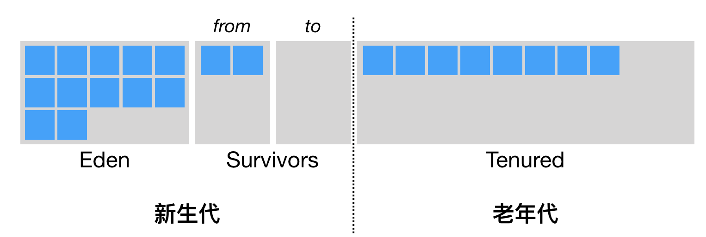
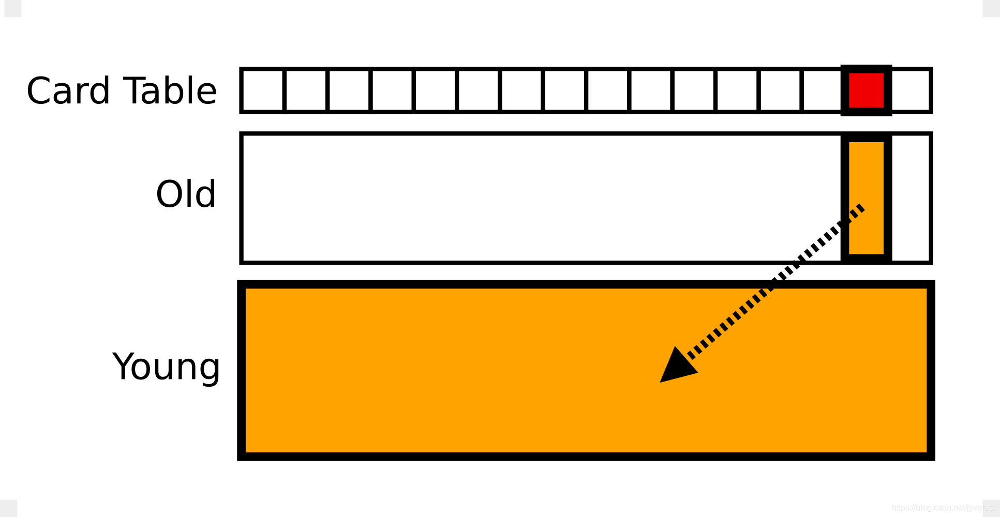
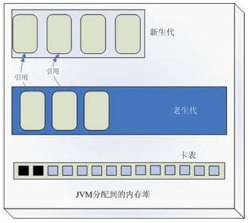

# 垃圾回收(下)

大部分的 Java 对象只存活一小段时间，而存活下来的小部分 Java 对象则会存活很长一段时间。这造就了 Java 虚拟机的分代回收思想。

简单来说，就是将堆空间划分为两代，分别叫做新生代和老年代。

### Java 虚拟机的堆划分

Java 虚拟机将堆划分为新生代和老年代。其中，新生代又被划分为 Eden 区，以及两个大小相同的 Survivor 区。

> 默认情况下，Java 虚拟机采取的是一种动态分配的策略（对应 Java 虚拟机参数 -XX:+UsePSAdaptiveSurvivorSizePolicy），根据生成对象的速率，以及 Survivor 区的使用情况动态调整 Eden 区和 Survivor 区的比例。
> 
> 当然，也可以通过参数 -XX:SurvivorRatio 来固定这个比例。但是需要注意的是，其中一个 Survivor 区会一直为空，因此比例越低浪费的堆空间将越高。

* 调用 new 指令时，它会在 Eden 区中划出一块作为存储对象的内存。由于堆空间是内存共享的，因此需要进行同步。

  > TLAB(Thread Local Allocation Buffer):每个线程可以向 Java 虚拟机申请一段连续的内存，比如 2048 字节，作为线程私有的 TLAB。这个操作需要加锁，线程需要维护两个指针（实际上可能更多，但重要也就两个），一个指向 TLAB 中空余内存的起始位置，一个则指向 TLAB 末尾。接下来的 new 指令，便可以直接通过指针加法（bump the pointer）来实现，即把指向空余内存位置的指针加上所请求的字节数。如果加法后空余内存指针的值仍小于或等于指向末尾的指针，则代表分配成功。否则，TLAB 已经没有足够的空间来满足本次新建操作。这个时候，便需要当前线程重新申请新的 TLAB。
  
* 当 Eden 区空间耗尽时，Java 虚拟机便会触发一次 Minor GC，来收集新生代的垃圾，存活下来的对象，则会被送到 Survivor 区。
  > 新生代有两个 Survivor 区，分别用 from 和 to 来指代。其中 to 指向的 Survivor 区是空的。
  
*  当发生 Minor GC 时，Eden 区和 from 指向的 Survivor 区中存活的对象会被复制到 to 指向的 Survivor 区中，然后交换 from 和 to 的指针，确保下次 Minor GC 时，to 指向的 Survivor 区还是空的。

* Java 虚拟机会记录 Survivor 区中的对象一共被来回复制了几次。如果一个对象被复制的次数为 15 *（对应虚拟机参数 -XX:+MaxTenuringThreshold）* ，那么该对象将被晋升 *(promote)* 至老年代。另外，如果单个 Survivor 区已经被占用了 50% *（对应虚拟机参数-XX:TargetSurvivorRatio）*，那么较高复制次数的对象也会被晋升至老年代。

总而言之，当发生 Minor GC 时，应用了**标记-复制算法**，将 Survivor 区中的老存活对象晋升到老年代，然后将剩下的存活对象和 Eden 区的存活对象复制到另一个 Survivor 区中。理想情况下，Eden 区中的对象基本都死亡了，那么需要复制的数据将非常少，因此采用这种标记 - 复制算法的效果极好。

Minor GC 的另一个好处是不用对整个堆进行垃圾回收。但有个问题，老年代的对象可能引用新生代的对象，在标记存活对象的时候，需要扫描老年代的对象可能引用新生代的对象，这样需要扫描老年代中的对象。

### 卡表(card table)

为了支持高频率的新生代的回收，虚拟机使用一种叫做卡表（Card Table）的数据结构，卡表作为一个比特位的集合，每一个比特位可以用来表示年老代的某一区域中的所有对象是否持有新生代对象的引用。

这样新生代在GC时，可以不用花大量的时间扫描所有年老代对象，来确定每一个对象的引用关系，而可以先扫描卡表，只有卡表的标记位为1时，才需要扫描给定区域的年老代对象。而卡表位为0的所在区域的年老代对象，一定不包含有对新生代的引用。

卡表中每一个位表示年老代4K的空间，卡表记录为0的年老代区域没有任何对象指向新生代，只有卡表位为1的区域才有对象包含新生代引用，因此在新生代GC时，只需要扫描卡表位为1所在的年老代空间。使用这种方式，可以大大加快新生代的回收速度。

### 参考
[卡表和 RSet](https://magicliang.github.io/2018/10/13/%25E5%258D%25A1%25E8%25A1%25A8%25E5%2592%258C-RSet/)

[jvm的card table数据结构](https://segmentfault.com/a/1190000004682407)
