# 树 (Tree)

### "树"有什么特征？

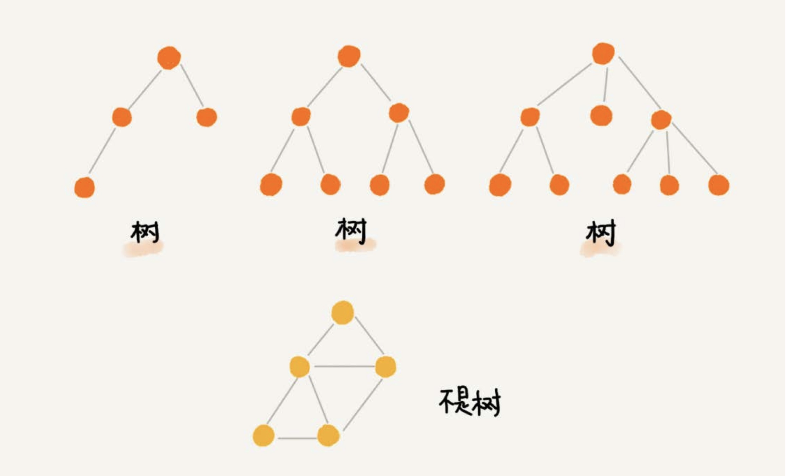

这里每个元素叫做"节点"，用来连接相邻节点之间的关系，叫做"父子关系"。


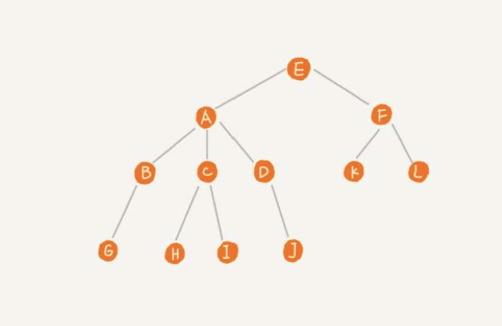

A节点就是B节点的父节点，B节点是A节点的子节点。B、C、D这三个节点的父节点是同一个节点，它们之间互称为兄弟节点。

> 把没有父节点的节点叫作跟节点，也就是图中E节点；把没有子节点的节点叫作叶子节点或者叶节点，比如G、H、I、J、K、L都是叶子节点。

除此之外，关于“树”，还有三个比较相似的概念：高度（Height）、深度（Depth）、层（Level）。它们的定义是这样的：

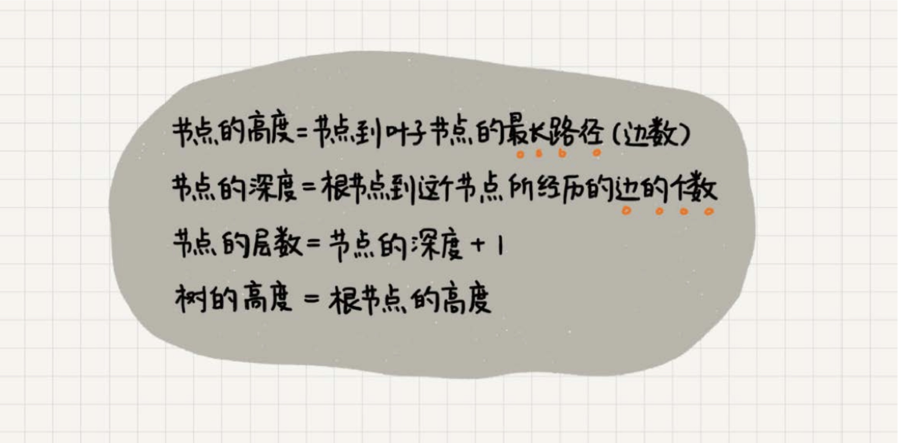

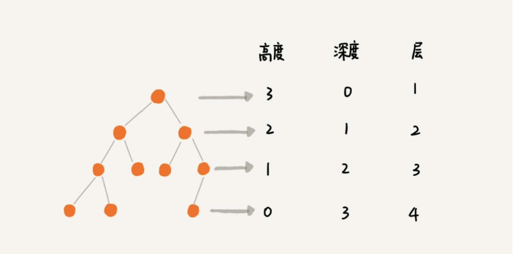

* "高度"从下往上度量，从最底层开始数，并且计数的起点是0；
* "深度"从跟节点开始度量，并且计数起点也是0；
* "层数"跟深度计算类似，不过计数起点是1，也就是根节点位于第1层。

### 二叉树 (Binary Tree)

二叉树：每个节点最多有两个"叉"，也就是两个子节点，左子节点和右子节点。不过并不要求每个节点都有两个子节点，有的节点只有左子节点，有的节点只有右子节点。

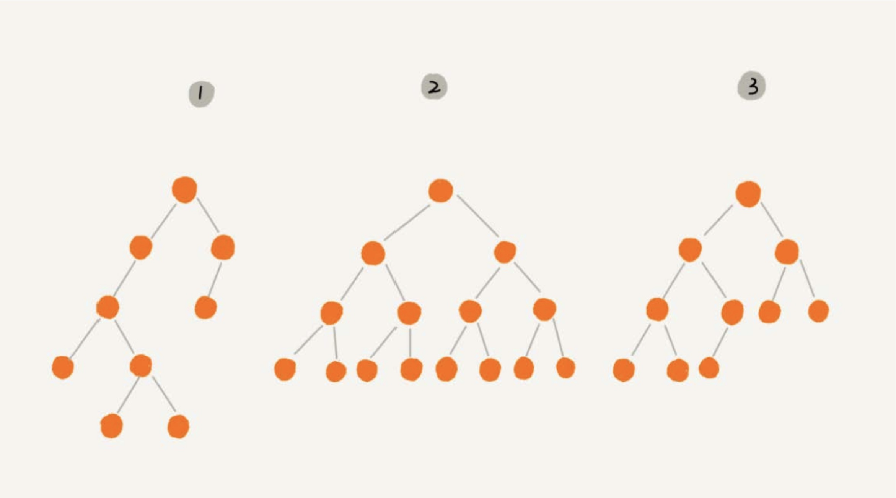

编号2的二叉树，叶子节点全都在最底层，除了叶子节点之外，每个节点都有左右两个子节点，这种二叉树叫做满二叉树。

编号3的二叉树，叶子节点都在最底下两层，最后一层的叶子节点都靠左排列，并且除了最后一层，其他层的节点个数都要达到最大，这种二叉树叫做完全二叉树。

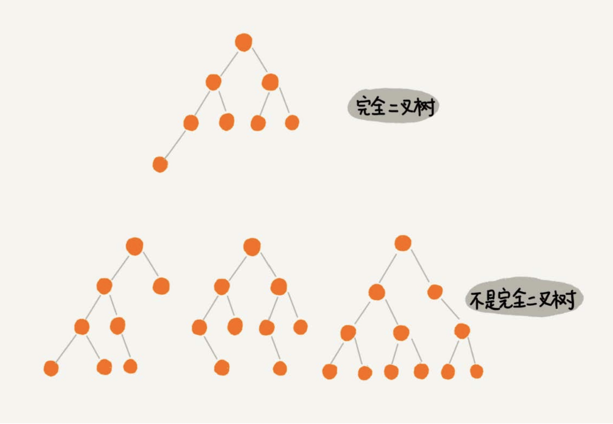

存储一棵二叉树，有两种方法，一种是基于指针或者引用的二叉链式存储法，一种是基于数组的顺序存储法。

**链式存储法**

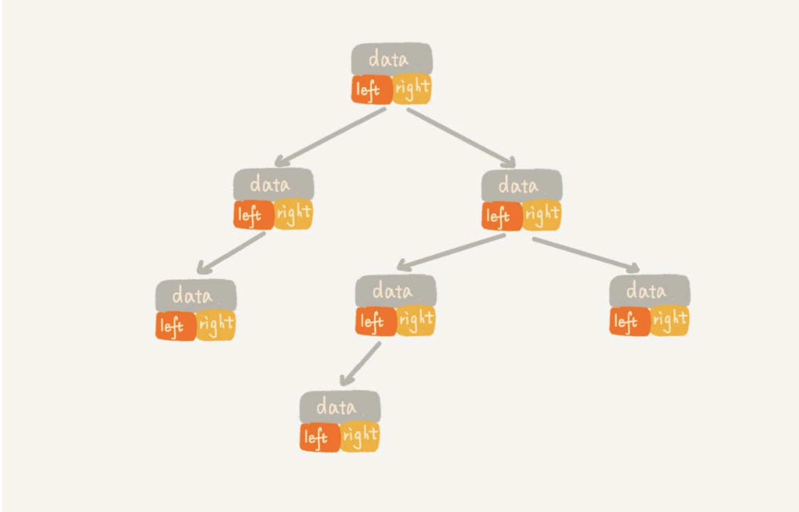


**数组的顺序存储法**

把根节点存储在下标 `i=1` 的位置，那左子节点存储在下标 `2*i=2` 的位置，右子节点存储在 `2*i+1=3` 的位置，以此类推。

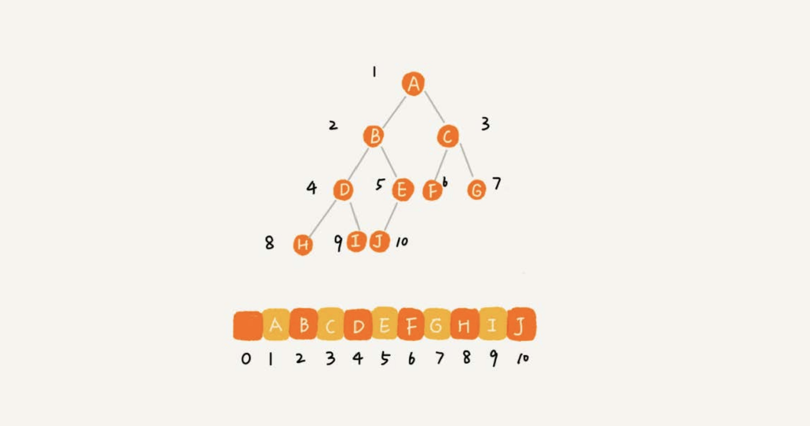

如果节点X存储在数组下标为`i`的位置，下标`2*i`的位置存储的是左子节点，下标`2*i+1`的位置存储的就是右子节点。

反过来，下标为`i/2`的位置存储的就是它的父节点，通过这种方式，只要知道根节点存储的位置（一般根节点存储下标为1的位置），就可以通过下标计算，把整颗树都串起来。

一棵完全二叉树，仅仅“浪费”了一个下标为0的存储位置。如果是非完全二叉树，其实会浪费比较多的数组存储空间。

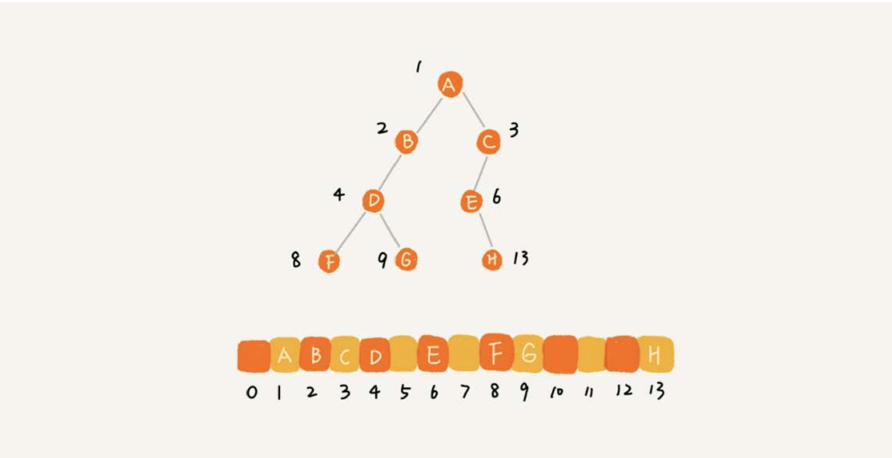

> 如果某棵二叉树是一棵完全二叉树，那用数组存储无疑是最节省内存的一种方式。因为数组的存储方式并不需要像链式存储法那样，要存储额外的左右子节点的指针。
> 这也是为什么完全二叉树会单独拎出来的原因，也是为什么完全二叉树要求最后一层子节点都靠左的原因。

### 二叉树的遍历

* 前序遍历：对于树中的任意节点来说，先打印这个节点，然后打印它的左子树，最后打印它的右子树。
* 中序遍历：对于树中的任意节点来说，先打印它的左子树，然后打印它本身，最后打印它的右子树。
* 后续遍历：对于树中的任意节点来说，先打印它的左子树，然后打印它的右子树，最后打印这个节点本身。

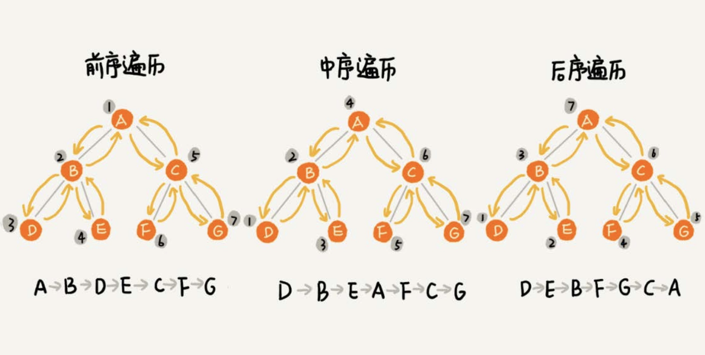

> 实际上，二叉树的前、中、后序遍历就是一个递归的过程。比如，前序遍历，其实就是先打印根节点，然后再递归地打印左子树，最后递归地打印右子树。

> 写递归代码的关键，就是看能不能写出递推公式，而写递推公式的关键就是，如果要解决问题A，就假设子问题B、C已经解决，然后再来看如何利用B、C来解决A。

前序遍历递归公式：
```
preOrder(r) = print(r) -> preOrder(r->left) -> preOrder(r->right)
```

中序遍历递归公式：

```
inOrder(r) = inOrder(r->left) -> print(r) -> inOrder(r->right)
```

后序遍历递归公式：

```
postOrder(r) = postOrder(r->left) -> postOrder(r->right) -> print(r)
```

### 二叉查找树

也叫二叉搜索树，可以实现快速查找，也支持快速插入、删除一个数据。

二叉查找树要求在树中的任意一个节点，其左子树中的每个节点的值，都要小于这个节点的值，而右子树节点的值都大于这个节点。

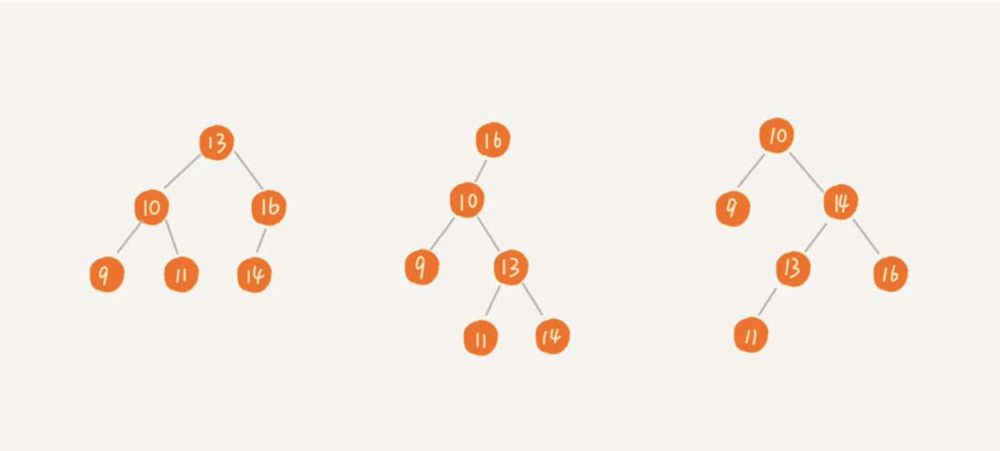

#### 二叉查找树的查找操作

我们先取根节点，如果它等于我们要查找的数据，那就返回。如果要查找的数据比根节点的值小，那就在左子递归查找；如果要查找的数据比根节点值大，那就在右子树中递归查找。

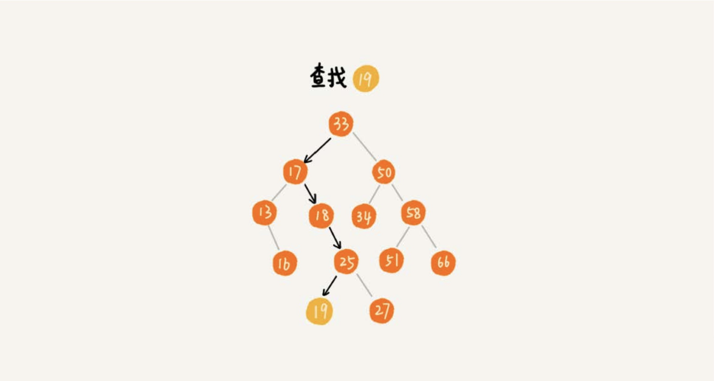

#### 二叉查找树的插入操作

新插入的数据一般都是在叶子节点上，所以只需要从根节点开始，依次比较要插入的数据和节点的大小关系。

如果要插入的数据比节点的数据大，并且节点的右子树为空，就将新数据直接插到右子节点的位置；如果不为空，就再递归遍历右子树，查找插入位置。同理，如果要插入的数据比节点数值小，并且节点的左子树为空，那就将新数据插入到左子节点的位置，如果不为空，就在递归遍历左子树，查找插入位置。

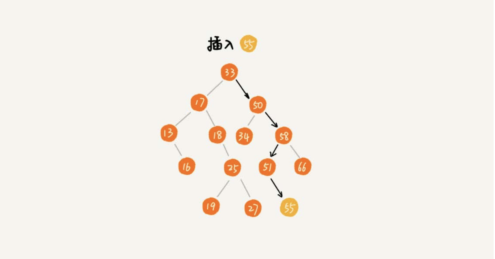

#### 二叉查找树的删除操作

1. 如果要删除的节点没有子节点，只需要直接将父节点中，指向要删除节点的指针置为null；
2. 如果要删除的节点只有一个节点（只有左子节点或者右子节点），只需要更新父节点中，指向要删除节点的指针，让它指向要删除节点的子节点即可。
3. 如果要删除的节点有两个子节点，需要找到这个节点的右子树中的最小节点，把它替换到要删除的节点上，然后删除掉这个最小节点，因为最小节点肯定没有左子节点。


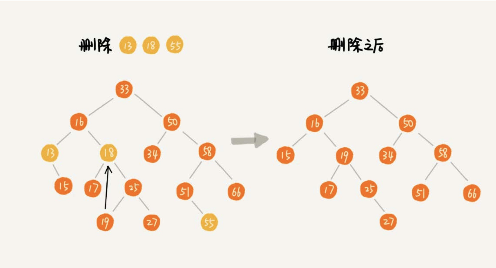


插入、删除、查找的时间复杂度为O(logN)

### 二叉树 VS 散列表

1. 散列表中的数据是无序存储的，如果输出有序数据，需要先进行排序。对于二叉查找树来说，只需要中序遍历，就可以在O(N)的时间复杂度内，输出有序的数据序列。
2. 散列表扩容耗时，而且当遇到散列冲突时，性能不稳当，尽管二叉查找树的性能不稳定，但是在工程中，我们最常用的平衡二叉查找树的性能非常稳定，时间复杂度稳定在O(logN)。
3. 尽管散列表的查找等操作的时间复杂度是常量级的，但因为哈希冲突的存在，这个常量不一定比logn小。
4. 散列表的构造比二叉查找树要复杂，需要考虑的东西很多。比如散列函数的设计、冲突解决办法、扩容、缩容等。
5. 为了避免过多的散列冲突，散列表装载因子不能太大，特别是基于开放寻址法解决冲突的散列表，不然会浪费一定的存储空间。


