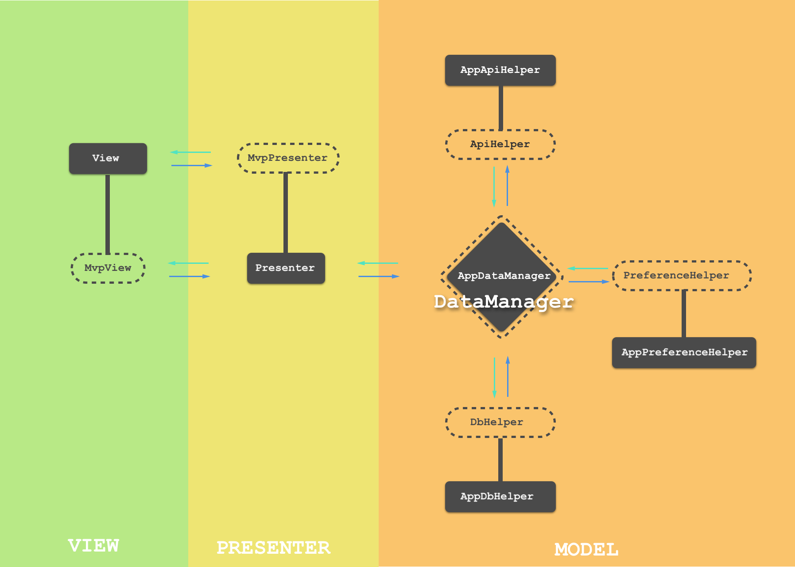
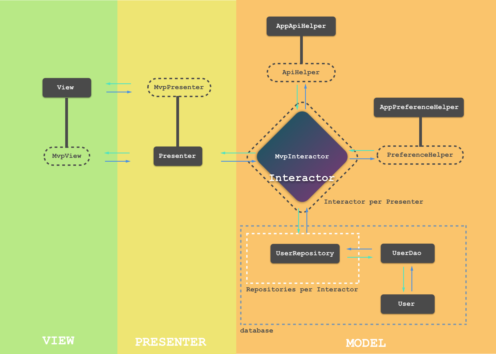

# MVP

### MVP 将应用程序分为三个基本组成部分：

1. **Model**：它负责处理应用程序的数据部分。
2. **View**：它负责在屏幕上用特定的数据铺设视图。
3. **Presenter**：它是连接模型和视图的桥梁。它还充当View的指导者。

### MVP为上述组件制定了一些基本规则，如下所列：

1. View 的唯一责任是按照 Presenter 的指示绘制用户界面。它是应用程序的一个哑巴部分。
2. View 将所有的用户交互委托给它的 Presenter 。
3. View 从不与 Model 直接通信。
4. Presenter 负责将 View 的要求委托给 Model，并指示 View 对特定事件进行操作。
5. Model 负责从服务器、数据库和文件系统获取数据。

### 序言

1. Activity, Fragment, and a CustomView 作为应用程序的 View 部分。
2. 每个 View 都有一个一对一关系的 Presenter。
3. View 通过一个接口与它的 Presenter 进行通信，反之亦然。
4. Model 被分成几个部分。ApiHelper, PreferenceHelper, DatabaseHelper, 和 FileHelper。这些都是DataManager的助手，它实质上是绑定了所有的 Model 部分。
5. Presenter 通过一个接口与 DataManager 进行通信。
6. DataManager 只在被要求时提供服务。
7. Presenter 不能访问 Android 的任何 apis

### 架构图




* **View**：它是应用的一部分，渲染用户界面并接受来自用户的交互。Activity，Fragment 和 CustomView 构成这一部分。
* **MvpView**：它是一个接口，由 View 实现。它通过被暴露的方法和 Presenter 进行通信。
* **Presenter**：它是 View 的决策对应物，是一个纯 Java 类，不能访问 Android 的 API。它接收 View 传递过来的用户交互，然后根据业务逻辑进行决策，最后指示 View 执行特定的动作。它还与 DataManager 进行通信，以获得执行业务逻辑所需的任何数据。
* **MvpPresenter**：它是一个接口，由 Presenter 实现。它暴露方法与 View 进行通信。
* **AppDbHelper**：数据库管理和应用中所有与数据库有关的数据处理都是在这一部分完成。
* **DbHelper**：它是一个由 AppDbHelper 实现的接口，包含了给应用程序调用的方法。该层对 DbHelper 的任何具体实现进行解耦，使 AppDbHelper 成为即插即用的单元。
* **AppPreferenceHelper**：与 AppDbHelper 类型，可以从 SharedPreferences 中读写数据。
* **PreferenceHelper**：与 DbHelper 接口类似，由 AppPreferenceHelper 实现。
* **AppApiHelper**：它负责管理网络 API 调用和 API 数据处理。
* **ApiHelper**：它是一个与DbHelper一样的接口，但由AppApiHelper实现。
* **DataManager**：它是一个由 AppDataManager 实现的接口。它包含所有数据处理操作的方法。理想情况下，它委托所有帮助者类提供的服务。为此，DataManager 接口扩展了DbHelper、PreferenceHelper 和 ApiHelper 接口。
* **AppDataManager**：它是应用程序中任何数据相关操作的一个联系点。DbHelper, PreferenceHelper, 和 ApiHelper 只对 DataManager 起作用。它将所有特定的操作委托给任何 Helper。


### Interactor & Repository

1、对于大型项目，DataManager 和 DbHelper 往往会变得非常大。所有需要对他们进行分散化，DataManager 可以分散化为 Interactor，DbHelper 可以分散化为 Repositories。

* **Interactor**：每个 Presenter 有自己的 Interactor 实例，代替单例的 DataManager。Interactor 的职责与 DataManager 相同，它只关注自己所需的数据访问和调用。
* **Repository**：DbHelper 被分解为 Repositories。例如，用户表的所有数据库查询都是通过 UserRepository 而不是 DbHelper 进行的。UserRepository ，与 DbHelper 类似，通过 UserDao 进行所有相关的查询。一个重要的区别是，Respository 是按需实例化的，每个 Interactor 会得到一个新的 Repository 示例，而不是单例的 DbHelper。




DataManager 和 DbHelper 被 Interactors 和 Respositories 所取代，它们对每个 Presenter 都是单独可用的。

* **MvpInteractor**：它是一个接口，列出了所有应用程序组件共有的数据访问 API 以及单例 ApiHelper 和 PreferencesHelper 的访问方法。

```java
public interface MvpInteractor {

    ApiHelper getApiHelper();

    PreferencesHelper getPreferencesHelper();

    void setUserAsLoggedOut();

    void setAccessToken(String accessToken);
    ...
}
```

* **BaseInteractor**：它实现了 MvpInteractor。所有的 Interactor 都会继承 BaseInteractor。BaseInteractor 中 ApiHelper 和 PreferenceHelper 都是单例的。

```java
public class BaseInteractor implements MvpInteractor {

    private final PreferencesHelper mPreferencesHelper;
    private final ApiHelper mApiHelper;

    @Inject
    public BaseInteractor(PreferencesHelper preferencesHelper, ApiHelper apiHelper) {
        mPreferencesHelper = preferencesHelper;
        mApiHelper = apiHelper;
    }

    @Override
    public ApiHelper getApiHelper() {
        return mApiHelper;
    }

    @Override
    public PreferencesHelper getPreferencesHelper() {
        return mPreferencesHelper;
    }

    @Override
    public void setAccessToken(String accessToken) {
        getPreferencesHelper().setAccessToken(accessToken);
        getApiHelper().getApiHeader()
                .getProtectedApiHeader()
                .setAccessToken(accessToken);
    }
}
```

* Presenter 中的 DataManager 被 Interactor 取代。
* Repository 为每个 Db 表的包装对象。

2、这些组件使架构更具扩展性和灵活性，但代价是需要做更多的工作。我必须再次重申，原始的MVP架构适用于大多数具有一定复杂度的项目，而这个扩展版本适用于具有数百个功能和许多开发人员同时工作的非常大的项目。

3、ApiHelper 和 PreferenceHelper 没有被分成几个部分，因为 Android 应用对它们的依赖性非常有限。

### 参考

[android-mvp-architecture](https://github.com/MindorksOpenSource/android-mvp-architecture)

[Android MVP Architecture Extension with Interactors and Repositories](https://blog.mindorks.com/android-mvp-architecture-extension-with-interactors-and-repositories-bd4b51972339)

