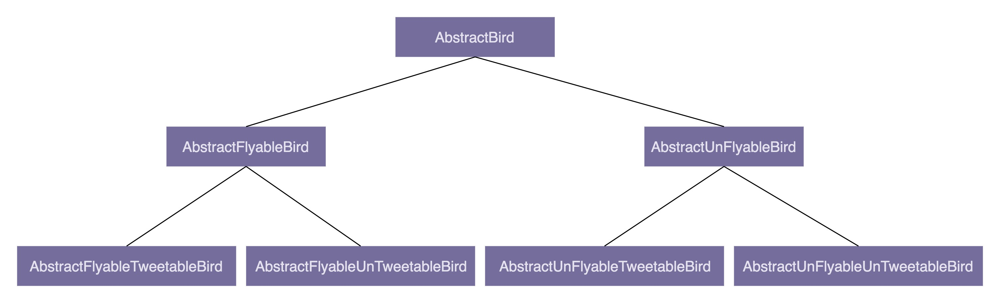

# 设计模式-开篇

### 如何评价代码质量的高低？

#### 1. 可维护性（maintainability）

在不破坏原有代码设计、不引人新的 bug 的情况下，能够快速地修改或者添加代码。

代码分层清晰、模块化好、高内聚低耦合，遵从基于接口而非实现编程的设计原则等等。如果 bug 容易修复，修改、添加新功能能够轻松完成，就可以主观地认为代码是易维护的。

#### 2. 可读性（readability）

代码是否符合编码规范、命名是否达意、注释是否详尽、函数是否长短合适、模块划分是否清晰、是否符合高内聚低耦合等等。

#### 3. 可扩展性（extendsibility）

在不修改或少量修改原有代码的情况下，通过扩展的方式添加新功能代码。

#### 4. 灵活性（flexibility）

* 当添加一个新的功能代码的时候，原有代码已经预留了扩展点，不需要修改原有代码，只要在扩展点上添加代码即可。
* 实现一个功能，原代码已经抽象了很多可以复用的模块、类代码等，可以直接拿来用。

#### 5. 简洁性（simplicity）

KISS 原则："Keep It Simple, Stupid"，即尽量保持代码简单。

**思从深而行从简，真正的高手能云淡风轻地用最简单的方法解决最复杂的问题。**

#### 6. 可复用性（reusability）

DRY(Don't Repeat Yourself)

#### 7. 可测试性（testability）

代码可测试性强。

### 面向对象、设计原则、设计模式、编程规范、重构


### 什么是面向对象编程和面向对象编程语言

面向对象编程（OOP），面向对象编程语言(OOPL)。

面向对象编程两个基础的概念：类（class）和对象（object）。

> 面向对象编程是一种编程范式或编程风格，它以类或对象作为组织代码的基本单元，并将封装、抽象、继承、多态四个特性作为代码设计和实现的基石。

#### 封装（Encapsulation）

类通过暴露有限的访问接口，授权外部仅能通过类提供的方式(或者叫函数)来访问内部信息或者数据，即**访问控制权限**。

类仅仅通过有限的方法暴露必要的操作，能提高类的易用性，调用者不必关系背后的业务细节，用错的概率会减少很多。

#### 抽象（Abstraction）

抽象隐藏方法的具体实现，提供了哪些功能，不需要知道这些功能是如何实现的，比如 Java 中的 interface 或 abstract。

抽象作为一种只关注功能点不关注实现的设计思路，可以帮我们过滤掉许多非必要的信息。

#### 继承（Inheritance）

继承是用来表示类之间的 is-a 关系，继承可以分为单继承和多继承。

继承的最大好处就是代码复用， 不过过度继承，继承层次过深过复杂，就会导致代码可读性可维护性变差。

#### 多态（Polymorphism）

多态是指子类可以替换父类，在实际代码运行过程中，调用子类的方法实现。

多态特性能提高代码的可扩展性和复用性，对于不同的集合类型，可以传递给相同的函数。

### 哪些代码设计看似面向对象，实际是面向过程的？

#### 1. 滥用 getter、setter 方法

面向对象封装的定义是：通过访问权限控制，隐藏内部数据，外部仅能通过类提供有限的接口访问、修改内部数据。所有，暴露不应该暴露的 setter 方法，明显违反了面向对象的封装特性。

在设计实现类的时候，除非真的需要，否则尽量不要给属性定义 setter 方法。此外，返回集合容器也要防范集合内部数据被修改的危险。

#### 2. 滥用全局变量和全局方法

常见的全局变量有单例类对象、静态成员变量、常量等，常见的全局方法有静态方法。

**常见的 Constants 类定义**

```Java

public class Constants {
  public static final String MYSQL_ADDR_KEY = "mysql_addr";
  public static final String MYSQL_DB_NAME_KEY = "db_name";
  public static final String MYSQL_USERNAME_KEY = "mysql_username";
  public static final String MYSQL_PASSWORD_KEY = "mysql_password";
  
  public static final String REDIS_DEFAULT_ADDR = "192.168.7.2:7234";
  public static final int REDIS_DEFAULT_MAX_TOTAL = 50;
  public static final int REDIS_DEFAULT_MAX_IDLE = 50;
  public static final int REDIS_DEFAULT_MIN_IDLE = 20;
  public static final String REDIS_DEFAULT_KEY_PREFIX = "rt:";
  
  // ... 省略更多的常量定义...
}
```

如此大而全的 Constants 类，不是一种好的设计思路：

* 影响代码的可维护性：类会变得原来越大
* 增加代码的编译时间：依赖这个类的代码会很多，每次修改 Constants 类，都会导致依赖它的类文件重新编译
* 影响代码的复用性：如果另一个项目中，复用本项目开发的某个类，而这个类又依赖 Constants 类，即便这个类只依赖 Constants 类中的一小部分常量，仍然需要把整个 Constants 类也一并引用

如何改进：

* 将 Constants 类拆解为功能更加单一的多个类，如果跟 MySQL 配置相关的常量，放到 MysqlConstants 类中
* 哪个类用到了某个常量，我们就把这个常量定义到这个类中

**Utils 类**

只包含静态方法不包含任何属性的 Utils 类，是彻彻底底的面向过程的编程风格，要尽量避免滥用，不要不加思考地随意去定义 Utils 类。真的需要单独定义这样一个 Utils 类吗？是否可以把 Utils 类中的某些方法定义到其他类中呢？

针对不同的功能，设计不同的 Utils 类，比如 FileUtils、IOUtils、StringUtils、UrlUtils 等，不要设计一个过于大而全的 Utils 类。

#### 3. 定义数据和方法分离的类

传统的 MVC 结构分为 Model 层、Controller 层、View 层这三层。

一般情况下，VO、BO、Entity 中只会定义数据，不会定义方法，所有操作这些数据的业务逻辑都定义在对应的 Controller 类、Service 类、Repository 类中。这就是典型的面向过程的编程风格。

### 在面向对象编程中，为什么容易写出面向过程风格的代码？

面向对象编程风格是一种自底向上的思考方式。它不是先去按照执行流程来分解任务，而是将任务翻译成一个一个的小的模块（也就是类），设计类之间的交互，最后按照流程将类组装起来，完成整个任务。

### 抽象类和接口的语法特性

* 抽象类不允许被实例化，只能被继承。它可以包含属性和方法。方法既可以包含代码实现，也可以不包含代码实现。不包含代码实现的方法叫作抽象方法。子类继承抽象类，必须实现抽象类中的所有抽象方法。

* 接口不能包含属性，只能声明方法，方法不能包含代码实现。类实现接口的时候，必须实现接口中声明的所有方法。

### 如何决定改用抽象类还是接口

* 如果要表示一种 `is-a` 的关系，并且是为了解决代码复用的问题，就用抽象类；

* 如果要表示一种 `has-a` 的关系，为了解决抽象而非复用问题，就可以使用接口。

### 为什么基于接口而非实现编程？

这条原则能非常有效地提高代码质量，可以将接口和实现相分离，封装不稳定的实现，暴露稳定的接口。

#### 如何解读”接口“二字

从本质上来看，“接口”就是一组“协议”或者“约定”，是功能提供者提供给使用者的一个“功能列表”。

在软件开发中，最大的挑战之一就是需求的不断变化，这也是考验代码设计好坏的一个标准。

**越抽象、越顶层、越脱离具体某一实现的设计，越能提高代码的灵活性，越能应对未来的需求变化。好的代码设计，不仅能应对当下的需求，而且在将来需求发生变化的时候，仍然能够在不破坏原有代码设计的情况下灵活应对。**

假设我们的系统中有很多涉及图片处理和存储的业务逻辑。

> 图片经过处理之后被上传到阿里云上。为了代码复用，我们封装了图片存储相关的代码逻辑，提供了一个统一的 AliyunImageStore 类，供整个系统来使用。具体的代码实现如下所示：
> ```Java
> public class AliyunImageStore {
>  //... 省略属性、构造函数等...
> 
>  public void createBucketIfNotExisting(String bucketName) {
>    // ... 创建 bucket 代码逻辑...
>    // ... 失败会抛出异常..
>  }
>  
>  public String generateAccessToken() {
>    // ... 根据 accesskey/secrectkey 等生成 access token
>  }
>  
>  public String uploadToAliyun(Image image, String bucketName, String accessToken) {
>    //... 上传图片到阿里云...
>    //... 返回图片存储在阿里云上的地址 (url）...
>  }
>  
>  public Image downloadFromAliyun(String url, String accessToken) {
>    //... 从阿里云下载图片...
>  }
>}
>// AliyunImageStore 类的使用举例
>public class ImageProcessingJob {
>  private static final String BUCKET_NAME = "ai_images_bucket";
>  //... 省略其他无关代码...
>  
>  public void process() {
>    Image image = ...; // 处理图片，并封装为 Image 对象
>    AliyunImageStore imageStore = new AliyunImageStore(/* 省略参数 */);
>    imageStore.createBucketIfNotExisting(BUCKET_NAME);
>    String accessToken = imageStore.generateAccessToken();
>    imagestore.uploadToAliyun(image, BUCKET_NAME, accessToken);
>  }
>  
>}
> ```
> 
> 整个上传流程包含三个步骤：创建 bucket（你可以简单理解为存储目录）、生成 access token 访问凭证、携带 access token 上传图片到指定的 bucket 中。代码实现非常简单，类中的几个方法定义得都很干净，用起来也很清晰，乍看起来没有太大问题，完全能满足我们将图片存储在阿里云的业务需求。
> 
> 不过，软件开发中唯一不变的就是变化。过了一段时间后，我们自建了私有云，不再将图片存储到阿里云了，而是将图片存储到自建私有云上。为了满足这样一个需求的变化，我们该如何修改代码呢？
> 
> 我们需要重新设计实现一个存储图片到私有云的 PrivateImageStore 类，并用它替换掉项目中所有的 AliyunImageStore 类对象。这样的修改听起来并不复杂，只是简单替换而已，对整个代码的改动并不大。不过，我们经常说，“细节是魔鬼”。这句话在软件开发中特别适用。实际上，刚刚的设计实现方式，就隐藏了很多容易出问题的“魔鬼细节”，我们一块来看看都有哪些。
> 
> 新的 PrivateImageStore 类需要设计实现哪些方法，才能在尽量最小化代码修改的情况下，替换掉 AliyunImageStore 类呢？这就要求我们必须将 AliyunImageStore 类中所定义的所有 public 方法，在 PrivateImageStore 类中都逐一定义并重新实现一遍。而这样做就会存在一些问题，我总结了下面两点。
> 
> 首先，AliyunImageStore 类中有些函数命名暴露了实现细节，比如，uploadToAliyun() 和 downloadFromAliyun()。如果开发这个功能的同事没有接口意识、抽象思维，那这种暴露实现细节的命名方式就不足为奇了，毕竟最初我们只考虑将图片存储在阿里云上。而我们把这种包含“aliyun”字眼的方法，照抄到 PrivateImageStore 类中，显然是不合适的。如果我们在新类中重新命名 uploadToAliyun()、downloadFromAliyun() 这些方法，那就意味着，我们要修改项目中所有使用到这两个方法的代码，代码修改量可能就会很大。
> 
> 其次，将图片存储到阿里云的流程，跟存储到私有云的流程，可能并不是完全一致的。比如，阿里云的图片上传和下载的过程中，需要生产 access token，而私有云不需要 access token。一方面，AliyunImageStore 中定义的 generateAccessToken() 方法不能照抄到 PrivateImageStore 中；另一方面，我们在使用 AliyunImageStore 上传、下载图片的时候，代码中用到了 generateAccessToken() 方法，如果要改为私有云的上传下载流程，这些代码都需要做调整。
> 
> 那这两个问题该如何解决呢？解决这个问题的根本方法就是，在编写代码的时候，要遵从“基于接口而非实现编程”的原则，具体来讲，我们需要做到下面这 3 点。
> 
> 1. 函数的命名不能暴露任何实现细节。比如，前面提到的 uploadToAliyun() 就不符合要求，应该改为去掉 aliyun 这样的字眼，改为更加抽象的命名方式，比如：upload()。
> 2. 封装具体的实现细节。比如，跟阿里云相关的特殊上传（或下载）流程不应该暴露给调用者。我们对上传（或下载）流程进行封装，对外提供一个包裹所有上传（或下载）细节的方法，给调用者使用。
> 3. 为实现类定义抽象的接口。具体的实现类都依赖统一的接口定义，遵从一致的上传功能协议。使用者依赖接口，而不是具体的实现类来编程。

基于接口实现：

```Java
public interface ImageStore {
  String upload(Image image, String bucketName);
  Image download(String url);
}
public class AliyunImageStore implements ImageStore {
  //... 省略属性、构造函数等...
  public String upload(Image image, String bucketName) {
    createBucketIfNotExisting(bucketName);
    String accessToken = generateAccessToken();
    //... 上传图片到阿里云...
    //... 返回图片在阿里云上的地址 (url)...
  }
  public Image download(String url) {
    String accessToken = generateAccessToken();
    //... 从阿里云下载图片...
  }
  private void createBucketIfNotExisting(String bucketName) {
    // ... 创建 bucket...
    // ... 失败会抛出异常..
  }
  private String generateAccessToken() {
    // ... 根据 accesskey/secrectkey 等生成 access token
  }
}
// 上传下载流程改变：私有云不需要支持 access token
public class PrivateImageStore implements ImageStore  {
  public String upload(Image image, String bucketName) {
    createBucketIfNotExisting(bucketName);
    //... 上传图片到私有云...
    //... 返回图片的 url...
  }
  public Image download(String url) {
    //... 从私有云下载图片...
  }
  private void createBucketIfNotExisting(String bucketName) {
    // ... 创建 bucket...
    // ... 失败会抛出异常..
  }
}
// ImageStore 的使用举例
public class ImageProcessingJob {
  private static final String BUCKET_NAME = "ai_images_bucket";
  //... 省略其他无关代码...
  
  public void process() {
    Image image = ...;// 处理图片，并封装为 Image 对象
    ImageStore imageStore = new PrivateImageStore(...);
    imagestore.upload(image, BUCKET_NAME);
  }
}
```

在做软件开发的时候，一定要有抽象意识、封装意识、接口意识。在定义接口的时候，不要暴露任何实现细节。接口的定义只表明做什么，而不是怎么做。而且，在设计接口的时候，要多思考一下，这样的接口设计是否足够通用，是否能够做到在替换具体的接口实现的时候，不需要任何接口定义的改动。

### 为什么不推荐使用继承

继承层次过深、过复杂，也会影响到代码的可维护性。

假设我们要设计一个关于鸟的类。

> 我们将“鸟类”这样一个抽象的事物概念，定义为一个抽象类 AbstractBird。所有更细分的鸟，比如麻雀、鸽子、乌鸦等，都继承这个抽象类。
> 
> 我们知道，大部分鸟都会飞，那我们可不可以在 AbstractBird 抽象类中，定义一个 fly() 方法呢？答案是否定的。尽管大部分鸟都会飞，但也有特例，比如鸵鸟就不会飞。鸵鸟继承具有 fly() 方法的父类，那鸵鸟就具有“飞”这样的行为，这显然不符合我们对现实世界中事物的认识。当然，你可能会说，我在鸵鸟这个子类中重写（override）fly() 方法，让它抛出 UnSupportedMethodException 异常不就可以了吗？具体的代码实现如下所示：
> 
> ```Java
> public class AbstractBird {
>  //... 省略其他属性和方法...
>  public void fly() { //... }
>}
>public class Ostrich extends AbstractBird { // 鸵鸟
>  //... 省略其他属性和方法...
>  public void fly() {
>    throw new UnSupportedMethodException("I can't fly.'");
>  }
>}
>```
>
>这种设计思路虽然可以解决问题，但不够优美。因为除了鸵鸟之外，不会飞的鸟还有很多，比如企鹅。对于这些不会飞的鸟来说，我们都需要重写 fly() 方法，抛出异常。这样的设计，一方面，徒增了编码的工作量；另一方面，也违背了我们之后要讲的最小知识原则（Least Knowledge Principle，也叫最少知识原则或者迪米特法则），暴露不该暴露的接口给外部，增加了类使用过程中被误用的概率。
>
>你可能又会说，那我们再通过 AbstractBird 类派生出两个更加细分的抽象类：会飞的鸟类 AbstractFlyableBird 和不会飞的鸟类 AbstractUnFlyableBird，让麻雀、乌鸦这些会飞的鸟都继承 AbstractFlyableBird，让鸵鸟、企鹅这些不会飞的鸟，都继承 AbstractUnFlyableBird 类，不就可以了吗？具体的继承关系如下图所示：
>
>
>从图中我们可以看出，继承关系变成了三层。不过，整体上来讲，目前的继承关系还比较简单，层次比较浅，也算是一种可以接受的设计思路。我们再继续加点难度。在刚刚这个场景中，我们只关注“鸟会不会飞”，但如果我们还关注“鸟会不会叫”，那这个时候，我们又该如何设计类之间的继承关系呢？
>
>是否会飞？是否会叫？两个行为搭配起来会产生四种情况：会飞会叫、不会飞会叫、会飞不会叫、不会飞不会叫。如果我们继续沿用刚才的设计思路，那就需要再定义四个抽象类（AbstractFlyableTweetableBird、AbstractFlyableUnTweetableBird、AbstractUnFlyableTweetableBird、AbstractUnFlyableUnTweetableBird）。
>
>
>
>如果我们还需要考虑“是否会下蛋”这样一个行为，那估计就要组合爆炸了。类的继承层次会越来越深、继承关系会越来越复杂。而这种层次很深、很复杂的继承关系，一方面，会导致代码的可读性变差。因为我们要搞清楚某个类具有哪些方法、属性，必须阅读父类的代码、父类的父类的代码……一直追溯到最顶层父类的代码。另一方面，这也破坏了类的封装特性，将父类的实现细节暴露给了子类。子类的实现依赖父类的实现，两者高度耦合，一旦父类代码修改，就会影响所有子类的逻辑。

继承最大的问题就在于：继承层次过深、继承关系过于复杂会影响到代码的可读性和可维护性。这也是为什么我们不推荐使用继承。

### 组合相比继承有哪些优势

可以利用组合（composition）、接口、委托（delegation）三个技术手段，一块儿来解决刚刚继承存在的问题。

接口具有某种行为的特性，针对”会飞“的特性，定义一个 `Flyable` 接口，只让会飞的鸟去实现这个接口。对于会叫、会下蛋这些行为，可以类似地定义 Tweetable 接口、EggLayable 接口。

```Java
public interface Flyable {
    void fly();
}

public interface Tweetable {
    void tweet();
}

public interface EggLayable {
  void layEgg();
}

public class Ostrich implements Tweetable, EggLayable {// 鸵鸟
  //... 省略其他属性和方法...
  @Override
  public void tweet() { //... }
  @Override
  public void layEgg() { //... }
}

public class Sparrow impelents Flayable, Tweetable, EggLayable {// 麻雀
  //... 省略其他属性和方法...
  @Override
  public void fly() { //... }
  @Override
  public void tweet() { //... }
  @Override
  public void layEgg() { //... }
}
``` 

针对三个接口再定义三个实现类，它们分别是：实现了 fly() 方法的 FlyAbility 类、实现了 tweet() 方法的 TweetAbility 类、实现了 layEgg() 方法的 EggLayAbility 类。然后，通过组合和委托技术来消除代码重复。

```Java
public interface Flyable {
  void fly()；
}

public class FlyAbility implements Flyable {
  @Override
  public void fly() { //... }
}

// 省略 Tweetable/TweetAbility/EggLayable/EggLayAbility
public class Ostrich implements Tweetable, EggLayable {// 鸵鸟
  private TweetAbility tweetAbility = new TweetAbility(); // 组合
  private EggLayAbility eggLayAbility = new EggLayAbility(); // 组合
  //... 省略其他属性和方法...
  @Override
  public void tweet() {
    tweetAbility.tweet(); // 委托
  }
  @Override
  public void layEgg() {
    eggLayAbility.layEgg(); // 委托
  }
}
```

继承主要有三个作用：表示 is-a 关系，支持多态特性，代码复用。

而这三个作用都可以通过其他技术手段来达成。比如 is-a 关系，我们可以通过组合和接口的 has-a 关系来替代；多态特性我们可以利用接口来实现；代码复用我们可以通过组合和委托来实现。

### 如何判断改用组合还是继承

如果类之间的继承结构稳定（不会轻易改变），继承层次比较浅（比如，最多有两层继承关系），继承关系不复杂，我们就可以大胆地使用继承。

反之，系统越不稳定，继承层次很深，继承关系复杂，我们就尽量使用组合来替代继承。


