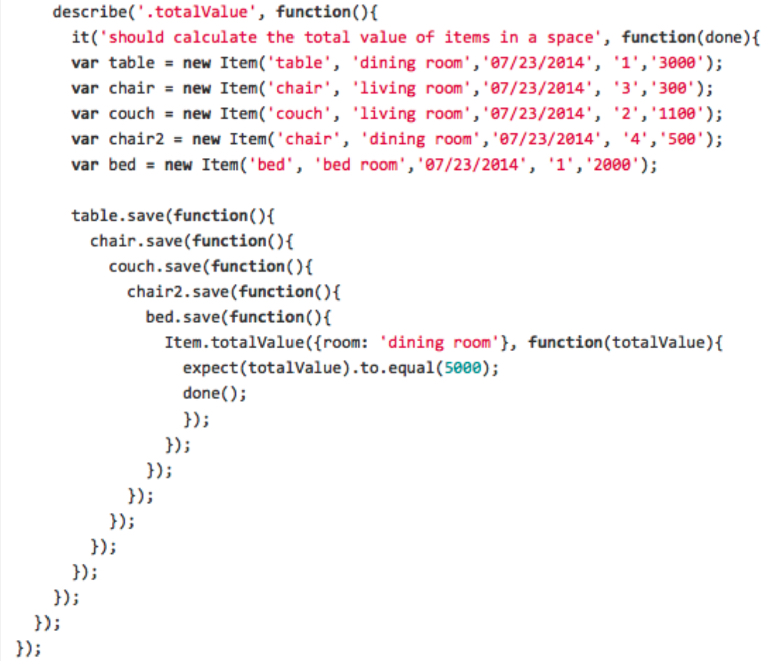
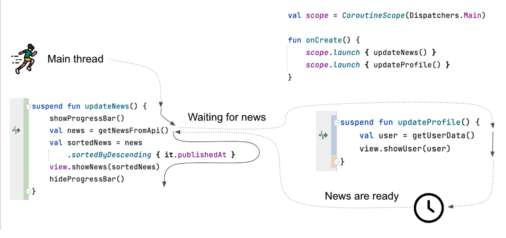
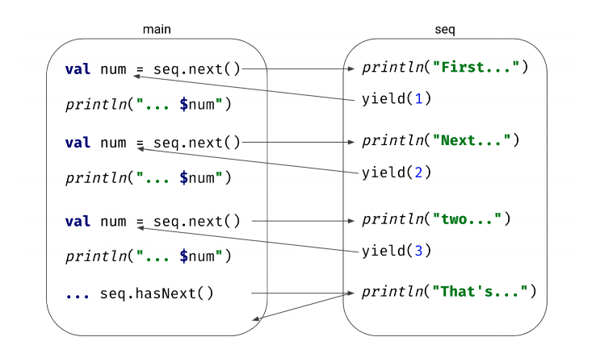

# Kotlin Coroutines（一）

# 1. 了解 Kotlin Coroutines

## 为什么需要学习 Kotlin Coroutines ?

在 JVM 上，我们已经有成熟的库，如 Rxjava 或 Reactor，此外，Java 本身也提供了很对对多线程的支持。许多人也选择使用普通的回调来代替。很明显，我们可以有很多的选择来执行异步操作。

Kotlin Coroutines 提供的功能远不止这些，它们是一个概念的实现，更重要的是 Kotlin Coroutines 是跨平台的。

### Coroutines on Android

开发前端应用时，我们经常需要实现的逻辑：

1. 从一个或多个数据源获取数据（API、视图元素、数据库、preferences、另一个应用），
2. 处理这些数据，
3. 操作这些数据（在 View 中显示、存入数据库、API的参数）

例如：我们开发一款应用，先从 API 获取新闻数据，然后对他们进行分类，最后将它们显示在屏幕上

```kotlin
fun onCreate() {
  val news = getNewsFromApi()
  val sortedNews = news.sortedByDescending { it.publishedAt }
  view.showNews(sortedNews)
}
```

但是，这样会阻塞整个应用，因为主线程不允许进行耗时的网络操作。

#### 线程切换

我们可以通过切换两次线程来解决这个问题：

```kotlin
fun onCreate() {
  thread {
    val news = getNewsFromApi()
    val sortedNews = news.sortedByDescending { it.publishedAt }
    runOnUiThread {
      view.showNews(sortedNews)
    }
  }
}
```

这样存在一些问题：

* 没有机制来取消线程，可能会发生内存泄漏
* 频繁创建线程的成本较高
* 频繁切换线程，难以管理
* 代码不够简洁比较复杂

我们需要找到一个更好的机制解决这些问题。

#### Callbacks

Callbacks 模式可以提供一下帮助：将一个函数传递给另一个函数，该函数在数据准备好时被调用。

```kotlin
fun onCreate() {
  getNewsFromApi { news ->
     val sortedNews = news.sortedByDescending { it.publishedAt }
     view.showNews(sortedNews)
  }
}
```

这同样会发生内存泄漏，无法取消不再需要的线程，但至少回调函数承担了切换线程的责任，它也有其它缺点，比如需要从多端获取数据：

```kotlin
fun showNews() {
  getConfigFromApi { config ->
    getNewsFromApi(config) { news ->
      getUserFromApi { user ->
        view.showNews(user, news)
      }
    }
  }
}
```

这样的代码远非完美：

* 获取新闻和用户数据可能是并行的，但是目前的回调架构不支持这一点（很难通过回调来实现）

* 回调不支持取消，内存泄漏问题

* 越来越多的缩进，多个回调的代码难以阅读，这种情况被称为回调地狱“callback hell”。



* 使用回调时，很难控制在什么之后会发生什么，下面这种显示进度指示器的方式无法执行：

  ```kotlin
  fun onCreate() {
    showProgressBar()
    showNews()
    hideProgressBar() // Wrong
  }
  ```

  如果需要隐藏进度，同样需要将隐藏进度作为一个回调：

  ```kotlin
  fun onCreate() {
    showProgressBar()
    showNews {
      hideProgressBar()
    }
  }
  ```

这就是为什么回调架构对于非琐碎的项目来说远非完美。那 Rxjava 和 Reactive Streams 呢

#### Rxjava 和其他的 reactive streams

在 Java 中流行的另一种方法（包括在Android）是使用 reactive streams（或者 Reactive Extensions）：RxJava 或其继承者 Reactor。通过这种方法，所有的操作都发生在一个可以被启动、处理和观察的数据流内。这些数据流支持线程切换和并发处理。

```kotlin
fun onCreate() {
  disposable += getNewsFromApi()
  	.subscribeOn(Schedulers.io())
  	.observeOn(AndroidSchedulers.mainThread())
  	.map { news ->
      news.sortedByDescending { it.publishedAt }
    }
  	.subscribe { sortedNews ->
      view.showNews(sortedNews)
    }
}
```

这绝对是一个比回调更好的解决方案：没有数据泄露、支持取消、正确使用线程。唯一问题是，它很复杂。如果和一开始的“理想”代码比较，它们的共同点很少。

```kotlin
fun onCreate() {
  val news = getNewsFromApi()
  val sortedNews = news.sortedByDescending { it.publishedAt }
  view.showNews(sortedNews)
}
```

所有这些功能，如subscribeOn、observeOn、map或subscribe都需要学习。取消需要明确。函数需要返回包裹在Observable或Single中的对象。

```kotlin
fun getNewsFromApi():Single<List<News>>
```

对于第二个问题，RxJava 可以正确解决，但是比较复杂

```kotlin
fun showNews() {
  disposables += Observable.zip(
    getConfigFromApi().flaMap { getNewsFromApi(it) },
    getUserFromApi(),
    Function2 { news: List<News>, config: Config -> 
    	Pari(news, config)
    })
  	.subscribeOn(Schedulers.io())
  	.observeOn(AndroidSchedulers.mainThread())
  	.subscribe { (news, config) -> 
                view.showNews(news, config)
    }
}
```

这段代码是真正的并发的，没有内存泄漏，但我们需要引入RxJava函数，如zip、flatMap、将一个值打包成Pair，并对其进行解构。这是一个很好的实现，只是相当复杂。

**总结：RxJava 学习成本高，实现相当复杂。**

#### 使用 Kotlin coroutines

Kotlin coroutines 引入的核心功能是能够在某个时间点挂起一个coroutine，并在未来的某个时间点恢复它。得益于此，我们可能会在主线程上运行我们的代码，并在我们从API请求数据时暂停它。当一个coroutine被挂起时，该线程不会被阻塞，可以自由地进行。它可以被用来改变视图或处理其他的coroutine。一旦数据准备好了，这个coroutine就在等待Main线程（这种情况很少见，但可能有一个coroutine队列在等待它），一旦它得到了这个线程，它就可以从它停止的地方继续下去。



这张图显示了在主线程上运行的函数 `updateNews` 和 `updateProfile` 分别运行在不同的 coroutine 上。它们可以交替运行，因为它们是挂起它们的coroutines而不是阻塞线程。当函数`updateNews` 在等待网络响应时，主线程执行`updateProfile`。

这里假设 `getUserData` 没有挂起，用户数据已经被缓存了，所以它可以运行直到完成。这还不够网络响应的时间，所以当时没有使用主线程（它可以被其它函数使用）。

一旦数据加载完成，主线程会从 `getNewsFromApi` 之后直接开始运行。

>根据定义，协程是可以挂起和恢复的组件。像 async/await 和生成器这样的概念，可以在 JavaScript、Rust 或 Python 等语言中找到，也是使用了协程。

因此，我们的第一个问题可以使用Kotlin协程来解决：

```kotlin
fun onCreate() {
  scope.launch {
    val news = getNewsFromApi()
    val sortedNews = news.sortedByDescending { it.publishedAt }
    view.showNews(sortedNews)
  }
}
```

这段代码与我们一开始想要的效果一样，代码运行在主线程，但不会阻塞主线程。由于挂起机制，当我们需要等待数据时，我们挂起（而不是阻塞）协程。当协程暂停时，主线程可以去做其他的事情，比如绘制一个漂亮的进度条动画。一旦数据准备好了，协程会再次使用主线程并从它之前停止的地方开始运行。

对于多个调用的问题，解决方式类似：

```kotlin
fun showNews() {
  scop.launch {
    val config = getConfigFromApi()
    val news = getNewsFromApi(config)
    val user = getUserFromApi()
    view.showNews(user, news)
  }
}
```

这是一个看起来不错的解决方案，但是它的工作方式并不理想。这些调用将会按顺序执行（一个接一个），如果每个调用需要1秒，整个函数需要3秒，而不是2秒。

如果API调用需要并行执行，可以使用Kotlin协程库 `async` 之类的函数，它可以启动另一个协程，并等待其返回结果（使用 await() 方法）

```kotlin
fun showNews() {
  scop.launch {
    val config = async { getConfigFromApi() }
    val news = async { getNewsFromApi(config.await()) }
    val user = async { getUserFromApi() } 
    view.showNews(user.await(), news.await)
  }
}
```

这段代码仍然是简单和易读的。它使用了在其他语言中流行的async/await模式(JavaScript或C#)，也很高效，没有内存泄漏（假设我们使用取消，这可以毫不费力地做到，我们将在后面解释）。

通过Kotlin协程可以轻松实现很多功能，比如 for-loop 或者集合处理：

```kotlin
// all pages will be loaded simultaneously
fun showAllNews() {
  scop.launch {
    val allNews = (0 until getNumberOfPages())
    	.map { page -> async { getNewsFromApi(page) } }
    	.flatMap { it.await() }
    view.showAllNews(allNews)
  }
}

// next pages are loaded one after anoter
fun showPagesFromFirst() {
  scop.launch {
    for (page in 0 until getNumberOfPages()) {
      val news = getNewsFromApi(page)
      view.showNextPage(news)
    }
  }
}
```


### Coroutines on backend

后端开发人员没有主线程的问题，但是阻塞线程不是很好。线程的成本很高，它需要被创建、维护、需要分配内存等。

下面代码模拟100 000个用户请求后台数据，第一个片段启动了100 000个线程，并让它们休眠一秒钟（会运行一段时间，甚至可能会出现OOM异常而中断）。

第二个片段使用了协程而不是线程并且挂起而不是休眠（它会等待一秒钟，然后会打印所有的点）。启动所有的协程的成本会低很多。

```kotlin
fun main() {
    repeat(100_000) {
        thread {
            Thread.sleep(1000L)
            print(".")
        }
    }
    
    
    runBlocking {
        repeat(100_000) {
            launch {
                delay(1000L)
                println(".")
            }
        }
    }
}
```


下面的示例显示了一个调用另一个挂起函数的挂起函数，当我们使用协程时，唯一的区别就是大多数函数被标记为挂起修饰符 **suspend** 。第二个片段展示了如何轻松地在挂起函数上使用并发——使用 coroutineScope 包装函数，在这里可以使用像 async 这样的协程构造器。

```kotlin
suspend fun getArticle(
	articleKey: String,
  lang: Launger
): ArticleJson? {
  return aritcleRepository.getArticle(articleKey, lang)
  	?.let { toArticleJson(it) }
}

suspend fun getAllArticles(
	userUuid: String?,
  lang: Language
): List<AritcleJson> = coroutineScope {
  val user = async { userRepo.findUserByUUID(userUuid) }
  val articles = articleRepo.getArticles(lang)
  articles
  	.filter { hasAccess(user.await(), it)}
  	.map { toArticleJson(it) }
}
```

## Sequence Builder

Kotlin sequence 与集合(如 List 或 Set)具有相似的概念，但是它是惰性求值。这意味着，下一个元素总是按需计算。

* 做最少数量的必需操作
* 可以无限的
* 更节省内存

由于这些特性，定义一个构建器很有意义，我们使用函数 `sequence` 来定义。在它的 lambda 表达式中，可以调用 `yield` 函数来生成这个序列的下一个元素。

```kotlin
val seq = sequence {
    yield(1)
    yield(2)
    yield(3)
    yield(4)
}

fun main() {
    for (num in seq)
        print(num)
}	// 123
```

这里的 `sequence` 函数是一个小的 DSL，它的参数是一个带有接收器的 lambda 表达式(`suspend SequenceScope<T>.() -> Unit`)。

在这里非常重要的一点，每个数字都是按需生成的，而不是提前生成的。

```kotlin
val seq = sequence {
    println("Generate first")
    yield(1)
    println("Generate second")
    yield(2)
    println("Generate third")
    yield(3)
    println("done")
}

fun main() {
    for (num in seq)
        println("Next number is $num")
}

Generate first
Next number is 1
Generate second
Next number is 2
Generate third
Next number is 3
done
```

当申请第一个数时，进入 `builder` ，打印 "Generating first"，接着产生1。处理完之后，会打印“Next number is 1”。关键的地方是，程序会跳转到之前停止的地方继续执行，去寻找另外一个数字。如果没有暂停机制，不可能在函数中间停止，并在以后从同一地点恢复它。多亏了暂停机制可以在main和序列发生器（sequence generator）之间自由跳转执行。





## 挂起（suspendsion）是如何工作的？

挂起函数是 Kotlin 协程的标志。挂起协程意味着在中间停止它。这类似于停止视频游戏——保存并关闭游戏，你和计算机都可以去做其他的事情。如果想继续玩游戏，可以从上次保存的地方恢复游戏即可。

协程也可以被暂停，当它们被暂停时会返回一个 Continuation，这就像游戏中的保存点——通过它就可以从暂停的地方继续进行。

### Resume（恢复）

一个简单的例子：

```kotlin
suspend fun main() {
  println("Before")
  
  println("After")
}

// Before
// After
```

这只会简单输出"Before" 和 ”After“，如果使用 `suspendCoroutine` 函数在中间挂起将会怎样？

```kotlin
suspend fun main() {
  println("Before")
  
  suspendCoroutine<Unit> { }
  
  println("After")
}

// Before
```

"After" 将不会打印，程序也不会停止将一直运行下去。”Before“之后协程被挂起了。

还可以使用它来启动一个线程，该线程休眠一段时间后恢复:

```java
suspend fun main() {
    println("Before")

    suspendCoroutine<Unit> {
        thread {
            Thread.sleep(1000)
            it.resume(Unit)
        }
    }

    println("After")
}
// Before
// (1 second delay)
// After
```

启动线程可以提取到函数中，在回调中恢复：

```kotlin
fun invokeAfterSecond(operate: () -> Unit) {
    thread {
        Thread.sleep(1000)
        operate.invoke()
    }
}

suspend fun main() {
    println("Before")

    suspendCoroutine<Unit> {
        invokeAfterSecond {
            it.resume(Unit)
        }
    }

    println("After")
}

// Before
// (1 second delay)
// After
```

这样的机制是有效的，但是线程的创建标记消耗资源，在 JVM，可以使用`ScheduledExecutorService` 来管理线程。

```kotlin
private val executor = Executors.newSingleThreadScheduledExecutor() {
    Thread(it, "scheduler").apply { isDaemon = true }
}

suspend fun main() {
    println("Before")

    suspendCoroutine<Unit> { continuation ->
        executor.schedule({ continuation.resume(Unit) }, 1000, TimeUnit.MILLISECONDS)
        invokeAfterSecond {
            continuation.resume(Unit)
        }
    }

    println("After")
}
// Before
// (1 second delay)
// After
```

暂停（挂起 suspending）是一个比较有用的功能，可以把它提取成一个函数，命名为 `delay`

```kotlin
private val executor = Executors.newSingleThreadScheduledExecutor() {
    Thread(it, "scheduler").apply { isDaemon = true }
}

suspend fun delay(time: Long): Unit = suspendCoroutine { continuation ->
    executor.schedule({ continuation.resume(Unit) }, time, TimeUnit.MILLISECONDS)
}

suspend fun main() {
    println("Before")

    delay(1000)

    println("After")

}
```

所有的协程使用 `delay` 函数都是用了同一个线程，这比每次都阻塞一个线程要好得多。

### Resuming with a value

当调用 suspendCoroutine 时,可以指定其返回值的类型。

```kotlin
suspend fun main() {
    val i = suspendCoroutine<Int> { continuation ->
        continuation.resume(42)
    }
    println(i)  // 42

    val str = suspendCoroutine<String> { continuation ->
        continuation.resume("Some text")
    }
    println(str)    // Some text

}
```

例如从网络中获取数据：

```kotlin
suspend fun main() {
    println("Before")

    val user = suspendCoroutine<User> { cont ->
        requestUser { user ->
            cont.resume(user)
        }
    }

    println(user)

    println("After")
}
//	Before
//	(1 second delay)
//	User(name=Test)
//	After
```

直接调用 suspendCoroutine 不方便，可以提取到一个挂起函数中：

```kotlin
suspend fun main() {
    println("Before")

    val user = requestUser()

    println(user)

    println("After")
}

suspend fun requestUser(): User {
    val user = suspendCoroutine<User> { cont ->
        requestUser { user ->
            cont.resume(user)
        }
    }
    return user
}
```

### Resume with an exception

当 resumeWithException 被调用时，会从挂起点抛出异常

```kotlin
class MyException:Throwable("Just an exception")

suspend fun main() {
    try {
        suspendCoroutine<Unit> { continuation ->
            continuation.resumeWithException(MyException())
        }
    } catch (e: MyException) {
        println("Caught! ${e.message}")
    }
}
```

又例如发送网络异常信号：

```kotlin
suspend fun requestUser(): User {
    return suspendCancellableCoroutine { cont ->
        requestUser { resp ->
            if (resp.isSuccessful) {
                cont.resume(resp.data)
            } else {
                val e = ApiException(resp.code, resp.message)
                cont.resumeWithException(e)
            }
        }
    }
}
```

## Coroutines under the hood

* 挂起函数就像状态机，在函数开始和每次挂起函数调用后都会持有一个状态
* 状态和本地数据都会保存在 Continuation 对象中
* 一个方法的 Continuation 装饰了另一个方法的 Continuation，因此，所有的这些 Continuation 代表了调用堆栈，可以在恢复时使用它们。

### Continuation-passing style

挂起函数(suspend fun)会在参数列表的最后位置插入一个 Continuation 参数 

```kotlin
1  suspend fun getUser(): User?
2  suspend fun setUser(user: User)
3  suspend fun checkAvailability(flight: Flight): Boolean
4
5  // under the hood is
6  fun getUser(continuation: Continuation<*>): Any?
7  fun setUser(user: User, continuation: Continuation<*>): Any
8  fun checkAvailability(
9       flight: Flight,
10       continuation: Continuation<*>
11  ): Any
```

### A very simple function

```kotlin
suspend fun myFunction() {
    println("Before")
    delay(1000)
    println("After")
}
```

它在Java/VM上看起来像这样

```kotlin
fun myFunction(continuation: Continuation<*>): Any
```
这个方法需要自己的 continuation 来保存自己的状态。我们可以暂且命名为 MyFunctionContinuation。在方法体的开始，myFunction 方法的 continuation(MyFunctionContinuation) 会包装参数 continuation .

```kotlin
val continuation = MyFunctionContinuation(continuation)
```

如果 contination 已经是包装的，需要保持不变，像下面这样

```kotlin
val continuation = continuation as? MyFunctionContinuation ?: MyFunctionContinuation(continuation)
```

这个方法可以从两个地方开始：要么是第一次调用，要么是从挂起点恢复。可以使用 label 来标记当前的状态：

```kotlin
1  // A simplified picture of how myFunction looks under the hood
2  fun myFunction(continuation: Continuation<Unit>): Any {
3       val continuation = continuation as? MyFunctionContinuation
4           ?: MyFunctionContinuation(continuation)
5
6       if (continuation.label == 0) {
7           println("Before")
8           continuation.label = 1
9           if (delay(1000, continuation) == COROUTINE_SUSPENDED){
10                return COROUTINE_SUSPENDED
11           }
12       }
13       if (continuation.label == 1) {
14           println("After")
15           return Unit
16       }
17       error("Impossible")
18  }
```

MyFunctionContinuation 的实现，它继承了 ContinuationImpl，这个类和它的超类（BaseContinuationImpl）负责整个恢复过程。

```kotlin
class MyFunctionContinuation(
     continuation: Continuation<*>
) : ContinuationImpl(continuation) {
     var result: Any? = null // in this case it is not needed,
     // as we resume with Unit, but later we will see how it
     // is useful
     var label = 0

     override fun invokeSuspend(`$result`: Any?): Any? {
         this.result = `$result`;
         return myFunction(this);
     }
};
```


