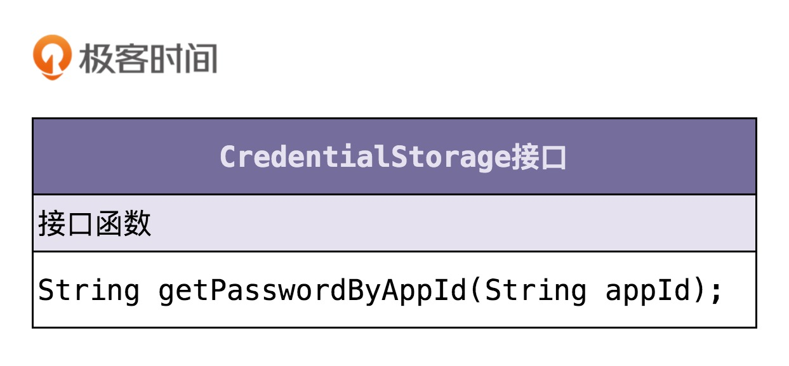

# 设计模式-实战一

# 如何对接口鉴权这样一个功能开发做面向对象分析？

对于“如何做需求分析，如何做职责划分？需要定义哪些类？每个类应该具有哪些属性、方法？类与类之间该如何交互？如何组装类成一个可执行的程序？”等等诸多问题，都没有清晰的思路，更别提利用成熟的设计原则、思想或者设计模式，开发出具有高内聚低耦合、易扩展、易读等优秀特性的代码了。

## 案例介绍和难点剖析

通过 HTTP 协议暴露接口给其他系统调用，其他系统通过 URL 来调用微服务的接口，为了保证接口调用的安全性，希望设计实现一个接口调用鉴权功能，只有经过认证之后的系统才能调用我们的接口，没有认证过的系统调用我们的接口会被拒绝。

### 1. 需求不明确

需求过于模糊、笼统，不够具体、细化，离落地到设计、编码还有一定的距离。

面向对象分析可以粗略地看成“需求分析”。实际上，不管是需求分析还是面向对象分析，我们首先要做的都是将笼统的需求细化到足够清晰、可执行。

### 2. 缺少锻炼

鉴权作为一个跟具体业务无关的功能，我们完全可以把它开发成一个独立的框架，集成到很多业务系统中。而作为被很多系统复用的通用框架，比起普通的业务代码，我们对框架的代码质量要求要更高。

## 对案例进行需求分析

### 1. 第一轮基础分析

最简单的解决方案就是，通过用户名加密码来做认证。我们给每个允许访问我们服务的调用方，派发一个应用名（或者叫应用 ID、AppID）和一个对应的密码（或者叫秘钥）。调用方每次进行接口请求的时候，都携带自己的 AppID 和密码。微服务在接收到接口调用请求之后，会解析出 AppID 和密码，跟存储在微服务端的 AppID 和密码进行比对。如果一致，说明认证成功，则允许接口调用请求；否则，就拒绝接口调用请求。

### 第二轮分析

这样的验证方式，每次都要明文传输密码。密码很容易被截获，是不安全的。那如果我们借助加密算法（比如 SHA），对密码进行加密之后，再传递到微服务端验证，是不是就可以了呢？实际上，这样也是不安全的，因为加密之后的密码及 AppID，照样可以被未认证系统（或者说黑客）截获，未认证系统可以携带这个加密之后的密码以及对应的 AppID，伪装成已认证系统来访问我们的接口。

提出问题，然后再解决问题，我们可以借助 OAuth 的验证思路来解决。调用方将请求接口的 URL 跟 AppID、密码拼接在一起，然后进行加密，生成一个 token。

调用方在进行接口请求的的时候，将这个 token 及 AppID，随 URL 一块传递给微服务端。微服务端接收到这些数据之后，根据 AppID 从数据库中取出对应的密码，并通过同样的 token 生成算法，生成另外一个 token。用这个新生成的 token 跟调用方传递过来的 token 对比。如果一致，则允许接口调用请求；否则，就拒绝接口调用请求。


### 3. 第三轮分析优化

不过，这样的设计仍然存在重放攻击的风险，还是不够安全。每个 URL 拼接上 AppID、密码生成的 token 都是固定的。未认证系统截获 URL、token 和 AppID 之后，还是可以通过重放攻击的方式，伪装成认证系统，调用这个 URL 对应的接口。

为了解决这个问题，我们可以进一步优化 token 生成算法，引入一个随机变量，让每次接口请求生成的 token 都不一样。我们可以选择时间戳作为随机变量。原来的 token 是对 URL、AppID、密码三者进行加密生成的，现在我们将 URL、AppID、密码、时间戳四者进行加密来生成 token。调用方在进行接口请求的时候，将 token、AppID、时间戳，随 URL 一并传递给微服务端。

微服务端在收到这些数据之后，会验证当前时间戳跟传递过来的时间戳，是否在一定的时间窗口内（比如一分钟）。如果超过一分钟，则判定 token 过期，拒绝接口请求。如果没有超过一分钟，则说明 token 没有过期，就再通过同样的 token 生成算法，在服务端生成新的 token，与调用方传递过来的 token 比对，看是否一致。如果一致，则允许接口调用请求；否则，就拒绝接口调用请求。


### 4. 第四轮分析优化

实际上，还有一个细节我们没有考虑到，那就是，如何在微服务端存储每个授权调用方的 AppID 和密码。当然，这个问题并不难。最容易想到的方案就是存储到数据库里，比如 MySQL。不过，开发像鉴权这样的非业务功能，最好不要与具体的第三方系统有过度的耦合。

### 5. 最终确定需求

* 调用方进行接口请求的时候，将 URL、AppID、密码、时间戳拼接在一起，通过加密算法生成 token，并且将 token、AppID、时间戳拼接在 URL 中，一并发送到微服务端。
* 微服务端在接收到调用方的接口请求之后，从请求中拆解出 token、AppID、时间戳。
* 微服务端首先检查传递过来的时间戳跟当前时间，是否在 token 失效时间窗口内。如果已经超过失效时间，那就算接口调用鉴权失败，拒绝接口调用请求。
* 如果 token 验证没有过期失效，微服务端再从自己的存储中，取出 AppID 对应的密码，通过同样的 token 生成算法，生成另外一个 token，与调用方传递过来的 token 进行匹配；如果一致，则鉴权成功，允许接口调用，否则就拒绝接口调用。

这就是我们需求分析的整个思考过程，从最粗糙、最模糊的需求开始，通过“提出问题 - 解决问题”的方式，循序渐进地进行优化，最后得到一个足够清晰、可落地的需求描述。

需求分析的过程实际上是一个不断迭代优化的过程。我们不要试图一下就能给出一个完美的解决方案，而是先给出一个粗糙的、基础的方案，有一个迭代的基础，然后再慢慢优化，这样一个思考过程能让我们摆脱无从下手的窘境。

## 如何进行面向对象设计？

面向对象分析的产出是详细的需求描述，那面向对象设计的产出就是类。在面向对象设计环节，我们将需求描述转化为具体的类的设计。

### 1. 划分职责进而识别出有哪些类

根据需求描述，把其中涉及的功能点，一个一个罗列出来，然后再去看哪些功能点职责相近，操作同样的属性，可否应该归为同一个类。

首先，我们要做的是逐句阅读上面的需求描述，拆解成小的功能点，一条一条罗列下来。注意，拆解出来的每个功能点要尽可能的小。每个功能点只负责做一件很小的事情（专业叫法是“单一职责”）

1. 把 URL、AppID、密码、时间戳拼接为一个字符串；
2. 对字符串通过加密算法加密生成 token；
3. 将 token、AppId、时间戳拼接到 URL 中，形成新的 URL；
4. 解析 URL，得到 token、AppID、时间戳等信息；
5. 从存储中取出 AppID 和对应的密码；
6. 根据时间戳判断 token 是否过期失效； 
7. 验证两个 token 是否匹配；

可以发现：
* 1、2、6、7 都是跟 token 有关，负责 token 的生成、验证；
* 3、4 都是在处理 URL，负责 URL 的拼接、解析；
* 5 是操作 AppID 和密码，负责从存储中读取 AppID 和密码；

所有，可以粗略得得到三个核心类：AuthToken、Url、CredentialStorage。

* AuthToken 负责实现 1、2、6、7 这四个操作；
* Url 负责 3、4 两个操作；
* CredentialStorage 负责 5 这个操作；

针对复杂的需求开发，我们首先要做的是进行模块划分，将需求先简单划分成几个小的、独立的功能模块，然后再在模块内部，应用我们刚刚讲的方法，进行面向对象设计。而模块的划分和识别，跟类的划分和识别，是类似的套路。

### 2. 定义类及其属性和方法

#### AuthToken 类相关的功能点有四个：

* 把 URL、AppID、密码、时间戳拼接为一个字符串；
* 对字符串通过加密算法加密生成 token；
* 根据时间戳判断 token 是否过期失效；
* 验证两个 token 是否匹配。


发现这样三个小细节：

* 第一个细节：并不是所有出现的名词都被定义为类的属性，比如 URL、AppID、密码、时间戳这几个名词，我们把它作为了方法的参数。
* 第二个细节：我们还需要挖掘一些没有出现在功能点描述中属性，比如 createTime，expireTimeInterval，它们用在 isExpired() 函数中，用来判定 token 是否过期。
* 第三个细节：我们还给 AuthToken 类添加了一个功能点描述中没有提到的方法 getToken()。

第一个细节告诉我们，从业务模型上来说，**不应该属于这个类的属性和方法，不应该被放到这个类里**。比如 URL、AppID 这些信息，从业务模型上来说，不应该属于 AuthToken，所以我们不应该放到这个类中。

第二、第三个细节告诉我们，在设计类具有哪些属性和方法的时候，不能单纯地依赖当下的需求，还要分析这个类从业务模型上来讲，理应具有哪些属性和方法。这样可以一方面保证类定义的完整性，另一方面不仅为当下的需求还为未来的需求做些准备。

#### Url 类相关的功能点有两个：

* 将 token、AppID、时间戳拼接到 URL 中，形成新的 URL；
* 解析 URL，得到 token、AppID、时间戳等信息。


#### CredentialStorage 类相关的功能点有一个：

* 从存储中取出 AppID 和对应的密码。

将 CredentialStorage 设计成了接口，基于接口而非具体的实现编程。



### 3. 定义类与类之间的交互关系

UML 统一建模语言中定义了六种类之间的关系。它们分别是：泛化、实现、关联、聚合、组合、依赖。

### 4. 将类组装起来并提供执行入口

接口鉴权并不是一个独立运行的系统，而是一个集成在系统上运行的组件，所以，我们封装所有的实现细节，设计了一个最顶层的 ApiAuthencator 接口类，暴露一组给外部调用者使用的 API 接口，作为触发执行鉴权逻辑的入口。


## 如何进行面向对象编程？

面向对象设计完成之后，我们已经定义清晰了类、属性、方法、类之间的交互，并且将所有的类组装起来，提供了统一的执行入口。

```Java
public interface ApiAuthencator {
  void auth(String url);
  void auth(ApiRequest apiRequest);
}
public class DefaultApiAuthencatorImpl implements ApiAuthencator {
  private CredentialStorage credentialStorage;
  
  public ApiAuthencator() {
    this.credentialStorage = new MysqlCredentialStorage();
  }
  
  public ApiAuthencator(CredentialStorage credentialStorage) {
    this.credentialStorage = credentialStorage;
  }
  @Override
  public void auth(String url) {
    ApiRequest apiRequest = ApiRequest.buildFromUrl(url);
    auth(apiRequest);
  }
  @Override
  public void auth(ApiRequest apiRequest) {
    String appId = apiRequest.getAppId();
    String token = apiRequest.getToken();
    long timestamp = apiRequest.getTimestamp();
    String originalUrl = apiRequest.getOriginalUrl();
    AuthToken clientAuthToken = new AuthToken(token, timestamp);
    if (clientAuthToken.isExpired()) {
      throw new RuntimeException("Token is expired.");
    }
    String password = credentialStorage.getPasswordByAppId(appId);
    AuthToken serverAuthToken = AuthToken.generate(originalUrl, appId, password, timestamp);
    if (!serverAuthToken.match(clientAuthToken)) {
      throw new RuntimeException("Token verfication failed.");
    }
  }
}
```

