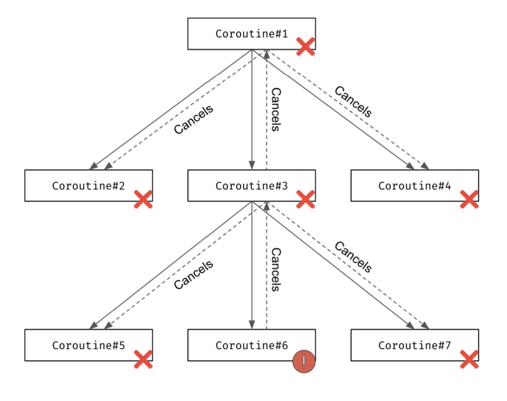

# Kotlin Coroutines（二）

# Kotlin Coroutines Library

## Coroutine builders

三个基本的协程构建器：

* launch
* runBlocking
* async

### launch builder

lauch 的工作方式类似于启动一个线程（thread function）。

```Java
fun main() {
    GlobalScope.launch {
        delay(1000L)
        println("World!")

    }

    GlobalScope.launch {
        delay(1000L)
        println("World!")

    }

    GlobalScope.launch {
        delay(1000L)
        println("World!")

    }

    println("World!!")
    Thread.sleep(2000L)
}
```

*在实际开发中，应该很少会使用 GlobalScope*

需要注意，在 main 函数的末尾需要调用 Thread.sleep()，否则，这个函数在启动协程后会立即结束（协程没有执行他们的任务），因为 block 不是阻塞线程，而是挂起协程。block 只是设置一个计时器在设定时间后恢复，并在此之前挂起一个协程。

### runBlocking builder

一般情况下，coroutines 不应该阻塞线程，只是挂起线程。另一方面，有些情况下，阻塞线程是有必要的。比如在主函数中，就需要阻塞线程，否则主线程会过早执行结束，这种情况下，可以使用 runBlocking。这意味着 runBlocking 中的 delay(1000L)表现得像 Thread.sleep(1000L)。

```kotlin
fun main() {
     runBlocking {
         delay(1000L)
         println("World!")
     }
     runBlocking {
          delay(1000L)
          println("World!")
     }
     runBlocking {
         delay(1000L)
         println("World!")
     }
     println("Hello,")
}
// (1 sec)
// World!
// (1 sec)
// World!
// (1 sec)
// World!
// Hello,”
```

```kotlin
fun main() {
    Thread.sleep(1000L)
    println("World!")
    Thread.sleep(1000L)
    println("World!")
    Thread.sleep(1000L)
    println("World!")
    println("Hello,")
}
// (1 sec)
// World!
// (1 sec)
// World!
// (1 sec)
// World!
// Hello,”
```

### async builder

async builder，async 函数会返回一个 Deferred<T> 类型的对象，T 是产生值的类型。Deferred 有一个挂起方法 await，它会返回这个值。

async 在被调用时立即启动一个 coroutine，它是一种同时启动几个流程，然后一起等待其结果的方法。

```kotlin
fun main() = runBlocking {
    val res1 = GlobalScope.async {
        delay(1000L)
        "Text 1"
    }

    val res2 = GlobalScope.async {
        delay(3000L)
        "Text 2"
    }

    val res3 = GlobalScope.async {
        delay(2000L)
        "Text 3"
    }

    println(res1.await())
    println(res2.await())
    println(res3.await())
}
// (1 sec)
// Text 1
// (2 sec)
// Text 2
// Text 3”
```

async builder 通常用于并行化两个流程，比如从两个不同的地方获取数据，将它们结合在一起。

```kotlin
scop.launch {
    val news = async {
        newsRepo.getNews()
            .sortedByDescending { it.date }
    }
    val newsSummary = newsRepo.getNewsSummary()
    view.showNews(
        newsSummary,
        news.await()
    )
}
```

### Structured Concurrency(结构化并发)

launch 和 asynch 是 CoroutineScope 的扩展函数，runBlocking 的 block 参数是一个函数类型，它的接收器是同一个 CoroutineScope 接口。

```kotlin
fun <T> runBlocking(context: CoroutineContext, 
block: suspend CoroutineScope.() -> T): T

fun <T> CoroutineScope.async(
    context: CoroutineContext = EmptyCoroutineContext,
    start: CoroutineStart = CoroutineStart.DEFAULT,
    block: suspend CoroutineScope.() -> T
): Deferred<T>

fun CoroutineScope.launch(
    context: CoroutineContext = EmptyCoroutineContext,
    start: CoroutineStart = CoroutineStart.DEFAULT,
    block: suspend CoroutineScope.() -> Unit
): Job
```

在 runBlocking 提供的接收器上通过 this.launch 或者简单地调用 launch，这样的话，launch 就会变为 runBlocking 的子程序，runBlocking 会暂停，直到所有的子程序都完成。

```kotlin
fun main() = runBlocking {
    launch {
        delay(1000L)
        println("World!")
    }
    launch {
        delay(2000L)
        println("World!")
    }
    println("Hello,")
}
// Hello,
// (1 sec)
// World!
// (1 sec)
// World!
```

“发”为“子”提供一个范围，而“子”则在这个范围内被调用，这就建立了一种被称为结构化并发的关系。

* 子代继承父代上下文（也可以覆盖）
* 父代挂起工作，直到所有的子代完成工作
* 当父程序被取消时，其子程序也会被取消
* 当子程序发生错误时，父程序也会被销毁

### Bigger picture

挂起函数需要从其他挂起函数中调用，都需要从一些 coroutine builder 开始，除了 runBlocking，builder 需要在 CoroutineScope 上启动。一旦第一个 builder 在一个作用域上启动，其他 builder 就可以在第一个 builder 的作用域上启动，以此类推。


### Using coroutineScope

为了实现异步调用，需要提供一个作用域(scope)，可以使用 coroutineScope 函数

```kotlin
suspend fun getArticlesForUser(
    userToken: String?
): List<ArticalJson> = coroutineScop {
    val articles = async { articleRepository.getArticles() }
    val user = userService.getUser(userToken)
    articles.await()
        .filter { canSeeOnList(user, it) }
        .map { toArticleJson(it) }
}
```                            

## Coroutine context

coroutine builder 的定义，第一个参数是 CoroutineContext 类型。

```kotlin
public fun CoroutineScope.launch(
    context: CoroutineContext = EmptyCoroutineContext,
    start: CoroutineStart = CoroutineStart.DEFAULT,
    block: suspend CoroutineScope.() -> Unit
): Job {
    ...
}
```   
接收器和最后一个参数的接收器都是 CoroutineScope 类型，这个 CoroutineScope 似乎是一个重要的概念。

```kotlin
public interface CoroutineScope {
    public val coroutineContext: CoroutineContext
}
```

它似乎只是 CoroutineContext 的一个包装类。

Continuation 定义：

```kotlin
public interface Continuation<in T> {
    public val context: CoroutineContext
    public fun resumeWith(result: Result<T>)
}
```

它也包含 CoroutineContext，这个类型被最重要的 Kotlin coroutine 元素所使用。那么它是什么？

### CoroutineContext interface

CoroutineContext 是一个接口，代表一个元素或者一个元素的集合。它在概念上类似于一个 map 或者一个 set。它是一个元素实例的索引集，如 Job、CoroutineName、CouroutineDispatcher 等。不寻常的是，每个元素也是一个 CoroutineContext。这样做是为了方便上下文的规范和修改。

```kotlin
launch(CoroutineName("Name1")) {...}
launch(CoroutineName("Name2") + Job()) {...}
```

这个集合中的每个元素都有一个唯一的键，用来识别它。这些键是通过引用来比较的。

例如，CoroutineName或Job实现了CoroutineContext.Element，它实现了CoroutineContext接口。

```kotlin
fun main() {
    val name: CoroutineName = CoroutineName("A name")
    val element: CoroutineContext.Element = name
    val context: CoroutineContext = element
    
    val job: Job = Job()
    val jobElement: CoroutineContext.Element = job
    val jobContext:CoroutineContext = jobElement
}
```

### Finding elements in CoroutineContext

由于 CoroutineContext 就像一个集合，可以使用 get 找到一个具有具体键的元素，就像在 map 中一样，当一个元素在 context 中，它将被返回，否则返回 null。

```kotlin
fun main() {
    val ctx: CoroutineContext = CoroutineName("A name")
    
    val coroutineName: CoroutineName? = ctx[CoroutineName]
    // or ctx.get(CoroutineName)
    println(coroutineName?.name)    // A name
    val job: Job? = ctx[Job]
    println(job)    // null
}
```

为了找到一个 CoroutineName，我们只用了 CoroutineName，这不是一个类型，也不是一个类，这是一个伴生对象。这是Kotlin的一个特点，一个类的名字本身就可以作为其同伴对象的引用，所以ctx[CoroutineName]只是ctx[CoroutineName.Key]的一个快捷方式。

```kotlin
public data class CoroutineName(
    val name: String
) : AbstractCoroutineContextElement(CoroutineName) {

    public companion object Key : CoroutineContext.Key<CoroutineName>

    override fun toString(): String = "CoroutineName($name)"
}
```

*在kotlinx.coroutines库中，使用同伴对象作为同名元素的键，是一种常见的做法。这使得它更容易记忆。一个键可能指向一个类（如CoroutineName）或一个由许多具有相同键的类实现的接口（如Job和SupervisorJob）。*

### Adding contexts

使 CoroutineContext 真正有用的是将两个合并在一起的能力。当两个具有不同键的元素被添加时，产生的上下文对两个键都有响应。

```kotlin
fun main() {
    val ctx1: CoroutineContext = CoroutineName("Name1")           
    println(ctx1[CoroutineName]?.name) // Name1
    println(ctx1[Job]?.isActive) // null
 
    val ctx2: CoroutineContext = Job()
    println(ctx2[CoroutineName]?.name) // null
    println(ctx2[Job]?.isActive) // true, because "Active"
    // is the default state of a job created this way

    val ctx3 = ctx1 + ctx2
    println(ctx3[CoroutineName]?.name) // Name1
    println(ctx3[Job]?.isActive) // true”
}
```

当另一个具有相同键的元素被添加时，就像在一个map中一样，新的元素会取代之前的元素。

```kotlin
fun main() {
    val ctx1: CoroutineContext = CoroutineName("Name1")
    println(ctx1[CoroutineName]?.name) // Name1

    val ctx2: CoroutineContext = CoroutineName("Name2")
    println(ctx2[CoroutineName]?.name) // Name2

    val ctx3 = ctx1 + ctx2
    println(ctx3[CoroutineName]?.name) // Name2
}
```

### Empty coroutine context

由于 CoroutineContext 就像一个集合，也有一个空的。这样的上下文不返回任何元素，而且如果添加的话也不会修改另一个上下文。

```kotlin
fun main() {
    val empty: CoroutineContext = EmptyCoroutineContext
    println(empty[CoroutineName])   // null
    println(empty[Job])     // null
    
    val ctxName = empty + CoroutineName("Name1") + empty
    println(ctxName[CoroutineName])     // CoroutineName(Name1)
}
```

### Subtracting elements

元素也可以通过使用 minusKey 函数按键从一个上下文中删除。

```kotlin
fun main() {
    val ctx = CoroutineName("Name1") + Job()
    println(ctx[CoroutineName]?.name) // Name1
    println(ctx[Job]?.isActive) // true
    
    val ctx2 = ctx.minusKey(CoroutineName)
    println(ctx2[CoroutineName]?.name) // null
    println(ctx2[Job]?.isActive) // true

    val ctx3 = (ctx + CoroutineName("Name2"))
        .minusKey(CoroutineName)
    println(ctx3[CoroutineName]?.name) // null
    println(ctx3[Job]?.isActive) // true
}
```

## Coroutine context and builders

所以CoroutineContext只是一种持有和传递数据的方式。默认情况下，父代会将其上下文传递给子代。

```kotlin
fun main() = runBlocking(CoroutineName("main")) {
    log("Started")  // [main] Started
    val v1 = async {
        delay(500)
        log("Running async")    // [main] Running async
        42
    }
    launch {
        delay(1000)
        log("Running launch")   // [main] Running launch
    }
    log("The answer is ${v1.await()}")  // [main] The answer is 42
}
```

每个子代都可以定义特定的上下文，这个上下文可以覆盖父类的上下文。

```kotlin
fun main() = runBlocking(CoroutineName("main")) {
    log("Started")  // [main] Started
    val v1 = async(CoroutineName("c1")) {
        delay(500)
        log("Running async")    // [c1] Running async
        42
    }
    launch(CoroutineName("c2")) {
        delay(1000)
        log("Running launch")   // [c2] Running async
    }
    log("The answer is ${v1.await()}")  // [main] The answer is 42
}
```
由于具有相同键的新元素总是取代旧的元素，子上下文总是覆盖具有相同键的元素。

有一个特殊的上下文叫做Job，它是可变的，用于子程序和父程序之间的通信。

### Accessing

CoroutineScope有属性coroutineContext，可以用来访问上下文。但如果我们是在一个普通的挂起函数中呢？在一个挂起的函数中是可以访问到父上下文的。

```kotlin
suspend fun printName() {
    println(coroutineContext[CoroutineName]?.name)
}

suspend fun main() = withContext(CoroutineName("Outer")) {
    printName() // Outer
    launch(CoroutineName("Inner")) {
        printName() // Inner
    }
    delay(10)
    printName() // Outer
}
```

## Job and children awaiting


Job 可以用来取消 coroutines、跟踪状态等。

### What is Job?

从概念上来讲，Job 代表有生命周期且可取消，从形式上讲，Job 是一个接口，具有具体的契约和状态，类似于一个抽象类。

Job 的生命周期和状态，有如下几种状态和转换：


“Active”状态表示 Job 正在运行并完成其工作。如果该Job是由 coroutine builder 创建的，这就是该 coroutine 主体将被执行的状态。在这种状态下，可以启动子协程。大多数协程将在“Active”状态下启动。只有那些被懒惰启动的协程，从“New”状态开始，并需要启动装换到“Active”状态。如果Job任务完成并没有被中断，将变为“Completing”状态，此时可以等待其子程序。一旦子程序任务完成，状态会变为“Completed”状态，这是最终状态。如果Job在运行时取消或失败了（“Active” 或者 “Completing”）,其状态会变为“Canceling”。在这种状态下，有最后的机会做一些清理工作，比如关闭连接或释放资源。一旦完成，将会变为“Cancelled”状态。

```kotlin
suspend fun main() = coroutineScope {
    val job = Job()
    println(job)    // JobImpl{Active}
    job.complete()
    println(job)    // JobImpl{Completed}

    val activeJob = launch {  }
    println(activeJob)  // StandaloneCoroutine{Active}
    activeJob.join()
    println(activeJob)  // StandaloneCoroutine{Completed}

    val lazyJob = launch(start = CoroutineStart.LAZY) {  }
    println(lazyJob)    // LazyStandaloneCoroutine{New}
    lazyJob.start()
    println(lazyJob)    // LazyStandaloneCoroutine{Active}
    lazyJob.join()
    println(lazyJob)    // LazyStandaloneCoroutine{Completed} 

}
```                                                                                                                                                                      

### Coroutine builders create their jobs based on their parent job

```kotlin
fun main(): Unit = runBlocking {
    val job: Job = launch {
        delay(1000)
        println("Test")
    }
}
```                   

`async` 返回值 Deferred<T>，它也实现了 Job 接口：

```kotlin
fun main(): Unit = runBlocking {
    val ret: Deferred<String> = async {
        delay(1000)
        "Test"
    }
    val job: Job = ret
}
```                   

每个 coroutine builder 会创建 Job，父代可以引用它所有子代Job，子类也可以引用父代的Job。  

```kotlin
fun main(): Unit = runBlocking {
    val job: Job = launch {
        delay(1000)
    }
    
    val parentJob: Job = coroutineContext.job
    println(job == parentJob)   // false
    val parentChildren: Sequence<Job> = parentJob.children
    println(parentChildren.first() == job)  // true
}
``` 

### Children awaiting

Job 可以使用 join 方法来实现等待。join 是一个挂起函数，它可以挂起，直到Job达到最终状态（Completed 或者 Cancelled）。

```kotlin
fun main():Unit = runBlocking {
    val job1 = launch {
        delay(1000)
        println("Text1")
    }

    val job2 = launch {
        delay(1000)
        println("Test2")
    }

    job1.join()
    job2.join()

    println("All test are done")
}
// Text1
// Text2
// All test are done
```

### Job factory function

在没有协程的情况下，可以使用 Job() 工程函数创建一个 Job。该 Job 不与任何协程有关联，但可以作为一个上下文使用。

一个常见的错误是使用 Job() 工厂函数创建一个 Job，启动一些协程，然后调用 join，这样程序永远不会结束，因为 Job 仍处于 Active 状态，即使所有的子程序都完成了，因为这个上下文仍可以被其他协程使用。

```kotlin
suspend fun main(): Unit = coroutineScop {
    val job = Job()
    launch(job) {
        delay(1000)
        println("Text 1")
    }
    
    launch(job) {
        delay(2000)
        println("Text 2")
    }
    job.join()
}
// (1 sec)
// Text 1
// (1 sec)
// Text 2
// (runs forvever)
```

## Cancellation

Kotlin Coroutines 的一个重要功能是取消，一个好的取消机制是非常有价值的，直接杀死一个线程是一个糟糕的解决方案——应该有一个地方可以来关闭连接和释放资源。

### Basic cancellation

```kotlin
fun main() = runBlocking {
    val job = launch {
        repeat(1_000) { i ->
            delay(200)
            println("Printing $1")
        }
    }
    delay(1100)
    job.cancel()
    job.join()
    println("Cancelled successfully")
}
// Printing 0
// Printing 1
// Printing 2
// Printing 3
// Printing 4
// Cancelled successfully
```

在调用 cancel() 之后，通常还以调用 join()，否则会产生一些竞争条件。例如，如果只调用 cancel()，“Cancel successfully” 有可能在最后一个 “Printing $i”之前被打印出来。

使用 Job() 构建的 job 可以使用同样的方式来取消协程，这样就可以一次取消多个协程。

在 Android 中，我们需要在离开页面时取消所有的协程程序。

### How does cancellation work?

当 job 被取消时，它的状态会变为“Cancelling”。在第一个挂起点（suspension point），会抛出 CancellationException 异常，可以用 try-catch 来捕获。基于此，我们可以在 finally 块执行一些清理操作，比如关闭文件或者关闭数据库连接。

```kotlin
suspend fun main() = coroutineScope {
    val job = Job()
    launch(job) {
        try {
            delay(Random.nextLong(2000))
            println("Done")
        } finally {
            println("Will always be printed")
        }
    }

    delay(1000)
    job.cancel()
    job.join()
}
```

### Just one more call

当 Job 处于 "Cancelling" 状态时，将无法被挂起（suspension）或者启动另一个协程。如果尝试启动一个协程，会被忽略，如果尝试挂起，又会抛出异常。

```kotlin
suspend fun main() = coroutineScope {
    val job = Job()
    launch(job) {
        try {
            delay(200)
            println("Job is done")
        } finally {
            println("Finally")
            launch {    // will be ignored
                println("Will not be printed")
            }
            delay(100)  // here exception is throw
            println("Will not be printed")
        }
    }
    delay(100)
    job.cancel()
    job.join()
    println("Cancel done")
}
// Finally
// Cancel done
```
如果在协程被取消之后确实还需要挂起或启动另一个协程，可以使用 `withContext(NonCancellable)` 方法。

```kotlin
suspend fun main() = coroutineScope {
    val job = Job()
    launch(job) {
        try {
            delay(200)
            println("Job is done")
        } finally {
            println("Finally")
            withContext(NonCancellable) {
                delay(100)
                println("Cleanup done")
            }

        }
    }
    delay(100)
    job.cancel()
    job.join()
    println("Done")
}
// Finally
// Cleanup done
// Done
```

### invokeOnCompletion

另一中机制是使用 Job 的 invokeOnCompletion 方法，当协程处于“Competed”或者“Canceled”状态时，会回调此方法。

```kotlin
suspend fun main() = coroutineScope {
    val job = launch {
        delay(1000)
    }
    job.invokeOnCompletion { exception: Throwable? ->
        println("Finished")
    }
    delay(400)
    job.cancel()
    job.join()
}
```

### Stopping the unstoppable

因为取消只会发生在挂起点（suspension points），如果没有被挂起，就不会被取消。

```kotlin
suspend fun main() = coroutineScope {
    val job = Job()
    launch(job) {
        repeat(1_000) { i ->
            Thread.sleep(200)
            println("Printing $i")
        }
    }

    delay(1100)
    job.cancelAndJoin()
    println("Canceled successfully")
    delay(1000)
}
// Printing 0
// Printing 1
// Printing 2
// Printing 3
// ...(up to 1000)
```

上面例子的协程不会被取消，因为没有挂起点。这里有几种方式可以去处理这种情况。

* 使用 yield() 方法，此函数会暂停并立即恢复协程。
* 判断协程的状态：isActive
* ensureActive() 方法

### suspendCancellableCoroutine

类似于之前提到的 `suspendCoroutine`

```kotlin
1  suspend fun getOrgRepos(): List<Repo> =
2       suspendCancellableCoroutine { continuation ->
3           val orgReposCall = apiService.getOrgReposCall()
4           orgReposCall.enqueue(object : Callback<List<Repo>> {
5                override fun onResponse(
6                    call: Call<List<Repo>>,
7                    response: Response<List<Repo>>
8                ){
9                    if (response.isSuccessful) {
10                         val body = response.body()
11                         if (body != null) {
12                             continuation.resume(body)
13                         } else {
14                             continuation.resumeWithException(
15                                 ResponseWithEmptyBody
16                             )
17                         }
18                    } else {
19                         continuation.resumeWithException(
20                             ApiException(
21                                 response.code(),
22                                 response.message()
23                             )
24                         )
25                    }
26                }
27
28                override fun onFailure(
29                    call: Call<List<Repo>>,
30                    t: Throwable
31                ) {
32                    continuation.resumeWithException(t)
33                }
34           })
35           continuation.invokeOnCancellation {
36                orgReposCall.cancel()
37           }
38       }
```

注意 `invokeOnCancellation` 方法，当协程被取消时会被调用，通常用来执行一些清理操作。

## Exception handing

当协程运行出现异常时，它不仅会取消自己还会把异常传递给父协程。父协程也会取消自己、所有的子协程并把异常传递给父协程，直到程序停止运行。



### Stop breaking my coroutines

使用 try-catch 包裹整个 coroutine builder 并没有什么帮助

```kotlin
fun main(): Unit = runBlocking {

    try {
        launch {
            delay(1000)
            throw error("Some error.")
        }
    } catch (e: Exception) {
        println("Will not be printed")
    }


    launch {
        delay(1000)
        println("Will not be printed")
    }

}
// Exception in thread "main" java.lang.IllegalStateException: Some error.
```

### SupervisorJob

阻止协程停止的一个重要方式是使用 SupervisorJob 。它是一个特殊的 job，它会忽略子协程的异常。它常用于一个作用域启动多个协程的场景。

```kotlin
fun main(): Unit = runBlocking {

    val scope = CoroutineScope(SupervisorJob())
    scope.launch {
        delay(1000)
        throw error("Some error")
    }
    scope.launch {
        delay(2000)
        println("Will be printed")
    }

    delay(3000)

}
// Exception in thread "DefaultDispatcher-worker-1" java.lang.IllegalStateException: Some error
// Will be printed
```

### supervisorScop

```kotlin
fun main() = runBlocking {
    supervisorScope {
        launch {
            delay(1000)
            throw error("Some error")
        }

        launch {
            delay(2000)
            println("Will be printed")
        }
    }

    delay(1000)
    println("Done")
}
// Exception in thread "main" java.lang.IllegalStateException: Some error
// (1 sec)
// Will be printed
```

### Coroutine exception handler

```kotlin
fun main() = runBlocking {
    val handler = CoroutineExceptionHandler { ctx, exception ->
        println("Caught $exception")
    }

    val scope = CoroutineScope(SupervisorJob() + handler)
    scope.launch {
        delay(1000)
        throw Error("Some error")
    }
    scope.launch {
        delay(2000)
        println("Will be printed")
    }
    delay(3000)
}
// Caught java.lang.Error: Some error
Will be printed
```

## Scoping functions

```kotlin
fun main() = runBlocking {
    val a = coroutineScope {
        delay(1000)
        10
    }
    println("a is calculated")

    val b = coroutineScope {
        delay(1000)
        20
    }

    println(a)
    println(b)
}
// (1 sec)
// a is calculted
// (1 sec)
// 10
// 20
```

* 继承父协程 context
* 会等待所有的子协程
* 当父协程取消时会取消所有的子协程

coroutineScope 现在通常被用来包装挂起的主体。

```kotlin
suspend fun main(): Unit = coroutineScop {
    launch {
        delay(1000)
        println("World")
    }
    println("Hello, ")
}
// Hello
// (1 sec)
// World
```

coroutineScope 会从一个挂起的上下文创建一个作用域，它继承了父协程，支持结构化并发。

### withContext

```kotlin
1  fun CoroutineScope.log(text: String) {
2       val name = this.coroutineContext[CoroutineName]?.name
3       println("[$name] $text")
4}
5
6  fun main() = runBlocking(CoroutineName("Parent")) {
7       log("Before")
8
9       withContext(CoroutineName("Child 1")) {
10           delay(1000)
11           log("Hello 1")
12       }
13
14       withContext(CoroutineName("Child 2")) {
15           delay(1000)
16           log("Hello 2")
17       }
18
19       log("After")
20  }
21  // [Parent] Before
22  // (1 sec)
23  // [Child 1] Hello 1
24  // (1 sec)
25  // [Child 2] Hello 2
26  // [Parent] After
```

withContext 方法通常被用来在代码块设置不同的协程域，通常和 dispatchers 一起使用。

> coroutineScop {} 和 async {}.await 很相似。withContext(context) {} 和 async(context){}.await() 很相似。最大的不同是 async 需要一个作用域，而 coroutineScope 和 withContext 来自挂起函数。

## Dispatchers

在 Kotlin coroutines 中，Dispatch 是 CoroutineContext ，它决定了协程在哪个线程上运行。

### Default dispatcher

默认的 dispatcher 是 Dispatcher.Default，它被设计用来运行CPU密集型的操作。

```kotlin
suspend fun main() = coroutineScope {
    repeat(1000) {
        launch { // or launch(Dispatchers.Default) {
            // To make it busy
            List(1000) { Random.nextLong() }.maxOrNull()

            val threadName = Thread.currentThread().name
            println("Running on thread: $threadName")
        }
    }
}
// Running on thread: DefaultDispatcher-worker-6
// Running on thread: DefaultDispatcher-worker-1
// Running on thread: DefaultDispatcher-worker-3
// Running on thread: DefaultDispatcher-worker-5
// Running on thread: DefaultDispatcher-worker-4
// Running on thread: DefaultDispatcher-worker-6
// Running on thread: DefaultDispatcher-worker-2
// Running on thread: DefaultDispatcher-worker-5
// Running on thread: DefaultDispatcher-worker-7
// Running on thread: DefaultDispatcher-worker-2
// Running on thread: DefaultDispatcher-worker-5
```

### Main dispatcher

在Android中，可以使用 Dispatchers.Main 让协程在主线程运行

### IO dispatcher

Dispatchers.IO 被设计用来执行长时间的 I/O 操作。

该调度器与Dispatchers.Default调度器共享线程，因此使用withContext(Dispatchers.IO) { ... }并不会实际切换到另一个线程。

```kotlin
suspend fun main(): Unit = coroutineScope {
    launch(Dispatchers.Default) {
        println(Thread.currentThread().name)
        withContext(Dispatcher.IO) {
            println(Thread.currentThread().name)
        }
    }
}
// DefaultDispatcher-worker-2
// DefaultDispatcher-worker-2
```

### Dispatcher with a pool of threads

对于那些（可能）密集阻塞线程的库来说，最好的做法是用它们独立的线程池定义它们自己的调度器。

```kotlin
val NUMBER_OF_THREADS = 20
val dispatcher = Executors
    .newFixedThreadPool(NUMBER_OF_THREADS)
    .asCoroutineDispatcher()

suspend fun main() = coroutineScope {
    val dispatcher = Executors.newFixedThreadPool(5)
        .asCoroutineDispatcher()

    repeat(1000) {
        launch(dispatcher) {
            Thread.sleep(200)
            val threadName = Thread.currentThread().name
            println("Running on thread: $threadName")
        }
    }
}

// Running on thread: pool-2-thread-5
// Running on thread: pool-2-thread-1
// Running on thread: pool-2-thread-4
// Running on thread: pool-2-thread-3
// Running on thread: pool-2-thread-2
// Running on thread: pool-2-thread-5
```

### Dispatcher with a single thread


                                                     
