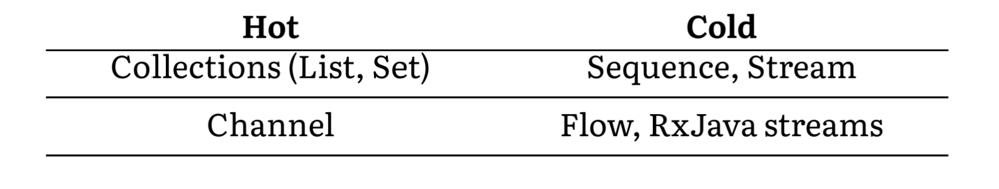

# Kotlin Coroutines（三）

# Channel and Flow

## Channel

Channel 被添加为协程间通信的基元。它支持任意数量的接受者和发送者，并且每一个发送到 channel 的数据都会被接收一次。


Channel 是一个接口，它实现了另外两个接口：

* SendChannel：发送元素，关闭 channel
* ReceiveChannel：接收元素

```kotlin
1  interface SendChannel<in E> {
2       suspend fun send(element: E)
3       fun close(): Boolean
4}
5
6  interface ReceiveChannel<out E> {
7       suspend fun receive(): E
8}
9
10  interface Channel<E> : SendChannel<E>, ReceiveChannel<E>
```
你可能注意到，send 和 receive 都是挂起函数：

* 当我们试图接收时，如果 channel 中没有元素，那么协程就会被挂起，直到元素可用。
* 另一方面，当 channel 达到其容量时，send 也会被挂起

一个channel可以有多个生产者和消费者。大多情况下都是一个生产者和一个消费者。


一个简单的例子：

```kotlin
suspend fun main(): Unit = coroutineScope {
    val channel = Channel<Int>()
    launch {
        repeat(5) { index ->
            println("Producing next one")
            delay(1000)
            channel.send(index)
        }
    }

    launch {
        repeat(5) {
            val received = channel.receive()
            println(received)
        }
    }
}
// Producing next one
// Producing next one
// 0
// Producing next one
// 1
// Producing next one
// 2
// Producing next one
// 3
// 4
```

这个实现远远不够完美。首先，接收方需要知道有多少个元素将要发送。这种情况很少发生，我们更倾向于只要发送方愿意发送就监听，直到它被关闭，可以使用for循环或 consumeEach 函数。

```kotlin
suspend fun main(): Unit = coroutineScope {
    val channel = Channel<Int>()
    launch {
        repeat(5) { index ->
            println("Producing next one")
            delay(1000)
            channel.send(index)
        }
        channel.close()
    }

    launch {
        for (element in channel) {
            println(element)
        }
    }
}
```

使用这种方式发送数据的常见问题就是容易忘记关闭通道。这样很容易出现一些异常。一个很方便的方法是使用 produce 方法，他会返回一个 ReceiveChannel

```kotlin
fun CoroutineScope.produceNumbers(): ReceiveChannel<Int> = 
    produce {
        var x = 0
        while(true) send(x++)
    }
```

当协程以任何方式结束，produce 方法都会关闭 channel。

```kotlin
suspend fun main(): Unit = coroutineScope {
    val channel = produce {
        repeat(5) { index ->
            println("Producing next one")
            delay(1000)
            send(index * 2)
        }
    }

    launch {
        for (element in channel) {
            println(element)
        }
    }
}
```

### Channel types

根据设置容量的大小，区分了四种类型的 channel

* **Unlimited**：容量为 Channel.UNLIMITED的 channel，它有无限的缓冲容量，并且发送永远不会挂起
* **Buffered**：容量为具体的或者 Channel.BUFFERED（默认为64）
* **Rendezvous**(默认)：容量为 0 或者 Channel.RENDEZVOUS，这意味着只有当发送方和接收方相遇时，交换才能发生。这意味着当等待另一个人的时候，至少会被暂停一段时间。
* **Conflated**：容量为 Channel.CONFLATED，有一个大小为1的缓冲区，每个新的元素都会取代前一个元素。

我们让快速生产，缓慢消费。通过 unlimited，channel 会接受所有的元素，然后让它们一个接一个地被接收

```kotlin
suspend fun main(): Unit = coroutineScope {
    val channel = produce(capacity = Channel.UNLIMITED) {
        repeat(5) { index ->
            send(index * 2)
            delay(100)
            println("Sent")
        }
    }
    delay(1000)

    for (element in channel) {
        println(element)
        delay(1000)
    }
}
// Sent
// (0.1 sec)
// Sent
// (0.1 sec)
// Sent
// (0.1 sec)
// Sent
// (0.1 sec)
// Sent
// (1 - 4 * 0.1 = 0.6 sec)
// 0
// (1 sec)
// 2
// (1 sec)
// 4
// (1 sec)
// 6
// (1 sec)
// 8
// (1 sec)
```

通过具体的容量，一开始会生产的很快直到缓冲区变满为止，接着生产者会等待消费者。

```kotlin
suspend fun main(): Unit = coroutineScope {
    val channel = produce(capacity = 3) {
        repeat(5) { index ->
            send(index * 2)
            delay(100)
            println("Sent")
        }
    }
    delay(1000)

    for (element in channel) {
        println(element)
        delay(1000)
    }
}
// Sent
// (0.1 sec)
// Sent
// (0.1 sec)
// Sent
// (1 - 2 * 0.1 = 0.8 sec)
// 0
// Sent
// (1 sec)
// 2
// Sent
// (1 sec)
// 4
// (1 sec)
// 6
// (1 sec)
// 8
// (1 sec)
```

默认容量的 channel，一开始生产者就会等待消费者。

```kotlin
suspend fun main(): Unit = coroutineScope {
    val channel = produce(capacity = Channel.RENDEZVOUS) {
        repeat(5) { index ->
            send(index * 2)
            delay(100)
            println("Sent")
        }
    }
    delay(1000)

    for (element in channel) {
        println(element)
        delay(1000)
    }
}
// 0
// Sent
// 2
// Sent
// 4
// Sent
// 6
// Sent
// 8
// Sent
```

conflated ，不会存储之前的元素，新的元素会代替之前的元素，所以只会接收到最后一个元素。

```kotlin
suspend fun main(): Unit = coroutineScope {
    val channel = produce(capacity = Channel.CONFLATED) {
        repeat(5) { index ->
            send(index * 2)
            delay(100)
            println("Sent")
        }
    }
    delay(1000)

    for (element in channel) {
        println(element)
        delay(1000)
    }
}
// Sent
// Sent
// Sent
// Sent
// Sent
// 8
```

### On buffer overflow

如果缓存满了可以自定义策略：

* SUSPEND(default)
* DROP_OLDEST：丢弃最老的元素
* DROP_LATEST：丢弃最新的元素

### Fun-out

多个协程可以从一个 channel 接收，为了正确地接收，应用使用 for-loop


```kotlin
fun CoroutineScope.produceNumbers() = produce {
    repeat(100) {
        delay(100)
        send(it)
    }
}

fun CoroutineScope.launchProcessor(id: Int, channel: ReceiveChannel<Int>) = launch {
    for (msg in channel) {
        println("#$id received $msg")
    }
}

suspend fun main(): Unit = coroutineScope {
    val channel = produceNumbers()
    repeat(3) { id ->
        delay(10)
        launchProcessor(id, channel)
    }

}
// #0 received 0
// #1 received 1
// #2 received 2
// #0 received 3
// #1 received 4
// #2 received 5
// #0 received 6
// #1 received 7
// #2 received 8
```

 ### Fun-in
 
 多个协程可以发送给同一个 channel。
 
 

```kotlin
suspend fun sendString(channel: SendChannel<String>, text: String, time: Long) {
    while (true) {
        delay(time)
        channel.send(text)
    }
}

fun main() = runBlocking {
    val channel = Channel<String>()
    launch {
        sendString(channel, "foo", 200)
    }

    launch {
        sendString(channel, "BAR!", 500)
    }

    repeat(50) {
        println(channel.receive())
    }

    coroutineContext.cancelChildren()

}
```

### Hot and cold data sources

Kotlin coroutines 最初只有 Channel，但是这是不够的，Channel 是一个 hot stream，但是我们经常需要一个 cold stream。



### Hot vs cold

第一个也是最大的区别，hot 数据流上的创建者和操作会马上开始，而 cold 数据流上的构建者和操作会在被需要时才会开始。

```kotlin
1  @OptIn(ExperimentalStdlibApi::class)
2  fun main() {
3       val l = buildList {
4           repeat(3) {
5                add("User$it")
6                println("L: Added User")
7}
8}
9       // L: Added User
10       // L: Added User
11       // L: Added User
12
13       val l2 = l.map {
14           println("L: Processing")
15           "Processed $it"
16       }
17       // L: Processing
18       // L: Processing
19       // L: Processing
20
21       val s = sequence {
22           repeat(3) {
23                yield("User$it")
24                println("S: Added User")
25           }
26       }
27
28       val s2 = s.map {
29           println("S: Processing")
30           "Processed $it"
31       }
32  }
```

因此，cold 数据流

* 可以是无限的
* 尽量减少操作次数
* 使用更少的内存（不需要分配所有中间的集合）

```kotlin
1  fun m(i: Int): Int {
2       print("m$i ")
3       return i * i
4}
5
6  fun f(i: Int): Boolean {
7       print("f$i ")
8       return i >= 10
9}
10
11  fun main() {
12       listOf(1, 2, 3, 4, 5, 6, 7, 8, 9, 10)
13           .map { m(it) }
14           .find { f(it) }
15           .let { print(it) }
16       // m1 m2 m3 m4 m5 m6 m7 m8 m9 m10 f1 f4 f9 f16 16
17
18       println()
19
20       sequenceOf(1, 2, 3, 4, 5, 6, 7, 8, 9, 10)
21           .map { m(it) }
22           .find { f(it) }
23           .let { print(it) }
24       // m1 f1 m2 f4 m3 f9 m4 f16 16
25  }
```
cold 数据流的实现方式是，所有的操作都由最后一个终端操作执行。中间的操作只是用一个新的操作来装饰前一个流。

hot 数据流：

* 随时准备使用（每个操作都可以是一个终端操作）
* 多次使用时不需要重新计算结果

```kotlin
1  fun m(i: Int): Int {
2       print("m$i ")
3       return i * i
4}
5
6  fun main() {
7       val l = listOf(1, 2, 3, 4, 5, 6, 7, 8, 9, 10)
8           .map { m(it) } // m1 m2 m3 m4 m5 m6 m7 m8 m9 m10
9
10       println()
11       println(l.find { it > 10 }) // 16
12       println(l.find { it > 10 }) // 16
13       println(l.find { it > 10 }) // 16
14
15       val s = sequenceOf(1, 2, 3, 4, 5, 6, 7, 8, 9, 10)
16           .map { m(it) }
17
18       println(s.find { it > 10 }) // m1 m2 m3 m4 16
19       println(s.find { it > 10 }) // m1 m2 m3 m4 16
20       println(s.find { it > 10 }) // m1 m2 m3 m4 16
21  }
```

Hot channels, cold flow

## Flow introduction

Flow表示一个正在被异步计算的数值流。Flow接口本身只允许收集流动的元素（Flow的collect有点像集合的forEach）。

```Kotlin
interface Flow<out T> {
    suspend fun collect(collector: FlowCollector<T>)
}
```

### The characteristics of Flow

Flow 的终端操作（如 collect）只是挂起协程而不会阻塞线程。

```Kotlin
1  fun getSequence(): Flow<String> = flow {
2       repeat(3) {
3           delay(1000)
4           emit("User$it")
5}
6}
7
8  suspend fun main() {
9       withContext(newSingleThreadContext("main")) {
10           launch {
11                repeat(3) {
12                    delay(100)
13                    println("Processing on coroutine")
14                }
15           }
16
17           val list = getSequence()
18           list.collect { println(it) }
19       }
20  }
21  // Processing on coroutine
22  // (0.1 sec)
23  // Processing on coroutine
24  // (0.1 sec)
25  // Processing on coroutine
26  // (0.8 sec)
27  // User0
28  // (1 sec)
29  // User1
30  // (1 sec)
31  // User2
```

Flow 跟协程机制一样，可以被取消也支持结构化并发。

```Kotlin
1  // Notice, that this function is not suspend
2  // and does not need CoroutineScope
3  fun usersFlow(): Flow<String> = flow {
4       repeat(3) {
5           delay(1000)
6           val ctx = currentCoroutineContext()
7           val name = ctx[CoroutineName]?.name
8           emit("User$it in $name")
9}
10  }
11
12  suspend fun main() {
13       val users = usersFlow()
14
15       withContext(CoroutineName("Name1")) {
16           val job = launch {
17                users.collect { println(it) }
18           }
19
20           launch {
21                delay(2100)
22                println("I got enough")
23                job.cancel()
24           }
25       }
26
27       withContext(CoroutineName("Name2")) {
28           users.collect { println(it) }
29       }
30  }
31  // (1 sec)
32  // User0 in Name1
33  // (1 sec)
34  // User1 in Name1
35  // (0.1 sec)
36  // I got enough
37  // (1 sec)
38  // User0 in Name2
39  // (1 sec)
40  // User1 in Name2
41  // (1 sec)
42  // User2 in Name2
```

### Flow nomenclature

每个 flow 都由几个要素组成：

* flow 通常从一个 flow builder ，一个不同对象或者辅助函数转换开始
* flow 的最后一个操作被称为终端操作（terminal operation），它往往是唯一一个挂起或者需要 scop 的操作。 
* 在这之间，我们可能有中间操作。它们中的每一个都以某种方式修改了这个flow。


## Flow building

### Flow raw values

最简单的例子去创建 flow 是使用 flowOf 方法：

```Kotlin
suspend fun main() {
    flowOf(1, 2, 3, 4, 5)
        .collect { print(it) } // 12345
}
```

一下情况下可能需要没有值的 flow，可以使用 emptyFlow() 方法：

```Kotlin
suspend fun main() {
    emptyFlow<Int>()
        .collect { print(it) }
} // (nothing)
```

### Converters

可以通过 asFlow 方法转换任何的 Iterable、Iterator 或者 Sequence 为 flow

```Kotlin
1  suspend fun main() {
2       listOf(1, 2, 3, 4, 5)
3           // or setOf(1, 2, 3, 4, 5)
4           // or sequenceOf(1, 2, 3, 4, 5)
5           .asFlow()
6           .collect { print(it) } // 12345
7}
```

这些功能产生了一个可立即使用的元素flow。

### Converting a function to Flow


