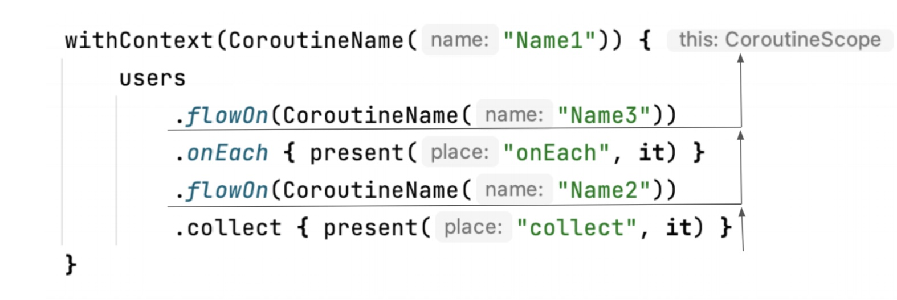

# Kotlin Coroutines（三）

# Channel and Flow

## Channel

Channel 被添加为协程间通信的基元。它支持任意数量的接受者和发送者，并且每一个发送到 channel 的数据都会被接收一次。


Channel 是一个接口，它实现了另外两个接口：

* SendChannel：发送元素，关闭 channel
* ReceiveChannel：接收元素

```kotlin
1  interface SendChannel<in E> {
2       suspend fun send(element: E)
3       fun close(): Boolean
4}
5
6  interface ReceiveChannel<out E> {
7       suspend fun receive(): E
8}
9
10  interface Channel<E> : SendChannel<E>, ReceiveChannel<E>
```
你可能注意到，send 和 receive 都是挂起函数：

* 当我们试图接收时，如果 channel 中没有元素，那么协程就会被挂起，直到元素可用。
* 另一方面，当 channel 达到其容量时，send 也会被挂起

一个channel可以有多个生产者和消费者。大多情况下都是一个生产者和一个消费者。


一个简单的例子：

```kotlin
suspend fun main(): Unit = coroutineScope {
    val channel = Channel<Int>()
    launch {
        repeat(5) { index ->
            println("Producing next one")
            delay(1000)
            channel.send(index)
        }
    }

    launch {
        repeat(5) {
            val received = channel.receive()
            println(received)
        }
    }
}
// Producing next one
// Producing next one
// 0
// Producing next one
// 1
// Producing next one
// 2
// Producing next one
// 3
// 4
```

这个实现远远不够完美。首先，接收方需要知道有多少个元素将要发送。这种情况很少发生，我们更倾向于只要发送方愿意发送就监听，直到它被关闭，可以使用for循环或 consumeEach 函数。

```kotlin
suspend fun main(): Unit = coroutineScope {
    val channel = Channel<Int>()
    launch {
        repeat(5) { index ->
            println("Producing next one")
            delay(1000)
            channel.send(index)
        }
        channel.close()
    }

    launch {
        for (element in channel) {
            println(element)
        }
    }
}
```

使用这种方式发送数据的常见问题就是容易忘记关闭通道。这样很容易出现一些异常。一个很方便的方法是使用 produce 方法，他会返回一个 ReceiveChannel

```kotlin
fun CoroutineScope.produceNumbers(): ReceiveChannel<Int> = 
    produce {
        var x = 0
        while(true) send(x++)
    }
```

当协程以任何方式结束，produce 方法都会关闭 channel。

```kotlin
suspend fun main(): Unit = coroutineScope {
    val channel = produce {
        repeat(5) { index ->
            println("Producing next one")
            delay(1000)
            send(index * 2)
        }
    }

    launch {
        for (element in channel) {
            println(element)
        }
    }
}
```

### Channel types

根据设置容量的大小，区分了四种类型的 channel

* **Unlimited**：容量为 Channel.UNLIMITED的 channel，它有无限的缓冲容量，并且发送永远不会挂起
* **Buffered**：容量为具体的或者 Channel.BUFFERED（默认为64）
* **Rendezvous**(默认)：容量为 0 或者 Channel.RENDEZVOUS，这意味着只有当发送方和接收方相遇时，交换才能发生。这意味着当等待另一个人的时候，至少会被暂停一段时间。
* **Conflated**：容量为 Channel.CONFLATED，有一个大小为1的缓冲区，每个新的元素都会取代前一个元素。

我们让快速生产，缓慢消费。通过 unlimited，channel 会接受所有的元素，然后让它们一个接一个地被接收

```kotlin
suspend fun main(): Unit = coroutineScope {
    val channel = produce(capacity = Channel.UNLIMITED) {
        repeat(5) { index ->
            send(index * 2)
            delay(100)
            println("Sent")
        }
    }
    delay(1000)

    for (element in channel) {
        println(element)
        delay(1000)
    }
}
// Sent
// (0.1 sec)
// Sent
// (0.1 sec)
// Sent
// (0.1 sec)
// Sent
// (0.1 sec)
// Sent
// (1 - 4 * 0.1 = 0.6 sec)
// 0
// (1 sec)
// 2
// (1 sec)
// 4
// (1 sec)
// 6
// (1 sec)
// 8
// (1 sec)
```

通过具体的容量，一开始会生产的很快直到缓冲区变满为止，接着生产者会等待消费者。

```kotlin
suspend fun main(): Unit = coroutineScope {
    val channel = produce(capacity = 3) {
        repeat(5) { index ->
            send(index * 2)
            delay(100)
            println("Sent")
        }
    }
    delay(1000)

    for (element in channel) {
        println(element)
        delay(1000)
    }
}
// Sent
// (0.1 sec)
// Sent
// (0.1 sec)
// Sent
// (1 - 2 * 0.1 = 0.8 sec)
// 0
// Sent
// (1 sec)
// 2
// Sent
// (1 sec)
// 4
// (1 sec)
// 6
// (1 sec)
// 8
// (1 sec)
```

默认容量的 channel，一开始生产者就会等待消费者。

```kotlin
suspend fun main(): Unit = coroutineScope {
    val channel = produce(capacity = Channel.RENDEZVOUS) {
        repeat(5) { index ->
            send(index * 2)
            delay(100)
            println("Sent")
        }
    }
    delay(1000)

    for (element in channel) {
        println(element)
        delay(1000)
    }
}
// 0
// Sent
// 2
// Sent
// 4
// Sent
// 6
// Sent
// 8
// Sent
```

conflated ，不会存储之前的元素，新的元素会代替之前的元素，所以只会接收到最后一个元素。

```kotlin
suspend fun main(): Unit = coroutineScope {
    val channel = produce(capacity = Channel.CONFLATED) {
        repeat(5) { index ->
            send(index * 2)
            delay(100)
            println("Sent")
        }
    }
    delay(1000)

    for (element in channel) {
        println(element)
        delay(1000)
    }
}
// Sent
// Sent
// Sent
// Sent
// Sent
// 8
```

### On buffer overflow

如果缓存满了可以自定义策略：

* SUSPEND(default)
* DROP_OLDEST：丢弃最老的元素
* DROP_LATEST：丢弃最新的元素

### Fun-out

多个协程可以从一个 channel 接收，为了正确地接收，应用使用 for-loop


```kotlin
fun CoroutineScope.produceNumbers() = produce {
    repeat(100) {
        delay(100)
        send(it)
    }
}

fun CoroutineScope.launchProcessor(id: Int, channel: ReceiveChannel<Int>) = launch {
    for (msg in channel) {
        println("#$id received $msg")
    }
}

suspend fun main(): Unit = coroutineScope {
    val channel = produceNumbers()
    repeat(3) { id ->
        delay(10)
        launchProcessor(id, channel)
    }

}
// #0 received 0
// #1 received 1
// #2 received 2
// #0 received 3
// #1 received 4
// #2 received 5
// #0 received 6
// #1 received 7
// #2 received 8
```

 ### Fun-in
 
 多个协程可以发送给同一个 channel。
 
 

```kotlin
suspend fun sendString(channel: SendChannel<String>, text: String, time: Long) {
    while (true) {
        delay(time)
        channel.send(text)
    }
}

fun main() = runBlocking {
    val channel = Channel<String>()
    launch {
        sendString(channel, "foo", 200)
    }

    launch {
        sendString(channel, "BAR!", 500)
    }

    repeat(50) {
        println(channel.receive())
    }

    coroutineContext.cancelChildren()

}
```

### Hot and cold data sources

Kotlin coroutines 最初只有 Channel，但是这是不够的，Channel 是一个 hot stream，但是我们经常需要一个 cold stream。


### Hot vs cold

第一个也是最大的区别，hot 数据流上的创建者和操作会马上开始，而 cold 数据流上的构建者和操作会在被需要时才会开始。

```kotlin
1  @OptIn(ExperimentalStdlibApi::class)
2  fun main() {
3       val l = buildList {
4           repeat(3) {
5                add("User$it")
6                println("L: Added User")
7}
8}
9       // L: Added User
10       // L: Added User
11       // L: Added User
12
13       val l2 = l.map {
14           println("L: Processing")
15           "Processed $it"
16       }
17       // L: Processing
18       // L: Processing
19       // L: Processing
20
21       val s = sequence {
22           repeat(3) {
23                yield("User$it")
24                println("S: Added User")
25           }
26       }
27
28       val s2 = s.map {
29           println("S: Processing")
30           "Processed $it"
31       }
32  }
```

因此，cold 数据流

* 可以是无限的
* 尽量减少操作次数
* 使用更少的内存（不需要分配所有中间的集合）

```kotlin
1  fun m(i: Int): Int {
2       print("m$i ")
3       return i * i
4}
5
6  fun f(i: Int): Boolean {
7       print("f$i ")
8       return i >= 10
9}
10
11  fun main() {
12       listOf(1, 2, 3, 4, 5, 6, 7, 8, 9, 10)
13           .map { m(it) }
14           .find { f(it) }
15           .let { print(it) }
16       // m1 m2 m3 m4 m5 m6 m7 m8 m9 m10 f1 f4 f9 f16 16
17
18       println()
19
20       sequenceOf(1, 2, 3, 4, 5, 6, 7, 8, 9, 10)
21           .map { m(it) }
22           .find { f(it) }
23           .let { print(it) }
24       // m1 f1 m2 f4 m3 f9 m4 f16 16
25  }
```
cold 数据流的实现方式是，所有的操作都由最后一个终端操作执行。中间的操作只是用一个新的操作来装饰前一个流。

hot 数据流：

* 随时准备使用（每个操作都可以是一个终端操作）
* 多次使用时不需要重新计算结果

```kotlin
1  fun m(i: Int): Int {
2       print("m$i ")
3       return i * i
4}
5
6  fun main() {
7       val l = listOf(1, 2, 3, 4, 5, 6, 7, 8, 9, 10)
8           .map { m(it) } // m1 m2 m3 m4 m5 m6 m7 m8 m9 m10
9
10       println()
11       println(l.find { it > 10 }) // 16
12       println(l.find { it > 10 }) // 16
13       println(l.find { it > 10 }) // 16
14
15       val s = sequenceOf(1, 2, 3, 4, 5, 6, 7, 8, 9, 10)
16           .map { m(it) }
17
18       println(s.find { it > 10 }) // m1 m2 m3 m4 16
19       println(s.find { it > 10 }) // m1 m2 m3 m4 16
20       println(s.find { it > 10 }) // m1 m2 m3 m4 16
21  }
```

Hot channels, cold flow

## Flow introduction

Flow表示一个正在被异步计算的数值流。Flow接口本身只允许收集流动的元素（Flow的collect有点像集合的forEach）。

```Kotlin
interface Flow<out T> {
    suspend fun collect(collector: FlowCollector<T>)
}
```

### The characteristics of Flow

Flow 的终端操作（如 collect）只是挂起协程而不会阻塞线程。

```Kotlin
1  fun getSequence(): Flow<String> = flow {
2       repeat(3) {
3           delay(1000)
4           emit("User$it")
5}
6}
7
8  suspend fun main() {
9       withContext(newSingleThreadContext("main")) {
10           launch {
11                repeat(3) {
12                    delay(100)
13                    println("Processing on coroutine")
14                }
15           }
16
17           val list = getSequence()
18           list.collect { println(it) }
19       }
20  }
21  // Processing on coroutine
22  // (0.1 sec)
23  // Processing on coroutine
24  // (0.1 sec)
25  // Processing on coroutine
26  // (0.8 sec)
27  // User0
28  // (1 sec)
29  // User1
30  // (1 sec)
31  // User2
```

Flow 跟协程机制一样，可以被取消也支持结构化并发。

```Kotlin
1  // Notice, that this function is not suspend
2  // and does not need CoroutineScope
3  fun usersFlow(): Flow<String> = flow {
4       repeat(3) {
5           delay(1000)
6           val ctx = currentCoroutineContext()
7           val name = ctx[CoroutineName]?.name
8           emit("User$it in $name")
9}
10  }
11
12  suspend fun main() {
13       val users = usersFlow()
14
15       withContext(CoroutineName("Name1")) {
16           val job = launch {
17                users.collect { println(it) }
18           }
19
20           launch {
21                delay(2100)
22                println("I got enough")
23                job.cancel()
24           }
25       }
26
27       withContext(CoroutineName("Name2")) {
28           users.collect { println(it) }
29       }
30  }
31  // (1 sec)
32  // User0 in Name1
33  // (1 sec)
34  // User1 in Name1
35  // (0.1 sec)
36  // I got enough
37  // (1 sec)
38  // User0 in Name2
39  // (1 sec)
40  // User1 in Name2
41  // (1 sec)
42  // User2 in Name2
```

### Flow nomenclature

每个 flow 都由几个要素组成：

* flow 通常从一个 flow builder ，一个不同对象或者辅助函数转换开始
* flow 的最后一个操作被称为终端操作（terminal operation），它往往是唯一一个挂起或者需要 scop 的操作。 
* 在这之间，我们可能有中间操作。它们中的每一个都以某种方式修改了这个flow。


## Flow building

### Flow raw values

最简单的例子去创建 flow 是使用 flowOf 方法：

```Kotlin
suspend fun main() {
    flowOf(1, 2, 3, 4, 5)
        .collect { print(it) } // 12345
}
```

一下情况下可能需要没有值的 flow，可以使用 emptyFlow() 方法：

```Kotlin
suspend fun main() {
    emptyFlow<Int>()
        .collect { print(it) }
} // (nothing)
```

### Converters

可以通过 asFlow 方法转换任何的 Iterable、Iterator 或者 Sequence 为 flow

```Kotlin
1  suspend fun main() {
2       listOf(1, 2, 3, 4, 5)
3           // or setOf(1, 2, 3, 4, 5)
4           // or sequenceOf(1, 2, 3, 4, 5)
5           .asFlow()
6           .collect { print(it) } // 12345
7}
```

这些功能产生了一个可立即使用的元素flow。

### Converting a function to Flow

可以将 suspend lambda 表达式转为 Flow

```Kotlin
1  suspend fun main() {
2       val function = suspend {
3           // this is suspending lambda expression
4           delay(1000)
5           "UserName"
6}
7
8       function.asFlow()
9           .collect { println(it) }
10  }
11  // (1 sec)
12  // UserName
```

要转换一个普通函数，使用 `::` 引用它：

```Kotlin
1  suspend fun getUserName(): String {
2       delay(1000)
3       return "UserName"
4}
5
6  suspend fun main() {
7       ::getUserName
8           .asFlow()
9           .collect { println(it) }
10  }
11  // (1 sec)
12  // UserName
```


### Flow builder

可以使用 `flow` 方法构建 Flow，在它的 lambda 表达式里通过 emit 方法发送数据，也可以使用 emitAll 发送来自 Channel 或者 Flow 的所有数据

```Kotlin
1  fun makeFlow(): Flow<Int> = flow {
2       repeat(3) { num ->
3           delay(1000)
4           emit(num)
5}
6}
7
8  suspend fun main() {
9       makeFlow()
10           .collect { println(it) }
11  }
12  // (1 sec)
13  // 0
14  // (1 sec)
15  // 1
16  // (1 sec)
17  // 2
```

### channelFlow

Flow 是 cold 数据流，所以它在被需要时按需产生数据。

```Kotlin
data class User(val name: String)

interface UserApi {
    suspend fun takePage(pagerNumber: Int): List<User>
}

class FakeUserApi : UserApi {

    private val users = List(20) { User("User$it") }
    private val pageSize: Int = 3

    override suspend fun takePage(pagerNumber: Int): List<User> {
        delay(100)
        return users
            .drop(pageSize * pagerNumber)
            .take(pageSize)
    }

}

fun allUsersFlow(api: UserApi): Flow<User> = flow {
    var page = 0
    do {
        println("Fetching page $page")
        val users = api.takePage(page++)
        emitAll(users.asFlow())
    } while (!users.isNullOrEmpty())
}


suspend fun main() {
    val api = FakeUserApi()
    val users = allUsersFlow(api)
    val user = users.first {
        println("Checking $it")
        delay(100)
        it.name == "User3"
    }

    println(user)
}
// Fetching page 0
// (1 sec)
// Checking User(name=User0)
// (1 sec)
// Checking User(name=User1)
// (1 sec)
// Checking User(name=User2)
// (1 sec)
// Fetching page 1
// (1 sec)
// Checking User(name=User3)
// (1 sec)
// User(name=User3)
```

当我们还在处理元素的时候，我们想提前获取页面。就像所提出的案例一样--这样做可能会导致更多的网络调用，但结果更快。可以使用 `channelFlow` 方法，它像一个Flow，因为它实现了Flow接口，作为一个普通的函数，可以像一个 cold steam 一样被启动。它也有点像Channel，因为一旦它被启动，就会在一个单独的coroutine中产生数值，而不需要等待接收器。

```Kotlin
1  fun allUsersFlow(api: UserApi): Flow<User> = channelFlow {
2       var page = 0
3       do {
4           println("Fetching page $page")
5           val users = api.takePage(page++) // suspending
6           users.forEach { send(it) }
7       } while (!users.isNullOrEmpty())
8}

// Fetching page 0
// (1 sec)
// Checking User(name=User0)
// Fetching page 1
// (1 sec)
// Checking User(name=User1)
// Fetching page 2
// (1 sec)
// Checking User(name=User2)
// Fetching page 3
// (1 sec)
// Checking User(name=User3)
// Fetching page 4
// (1 sec)
// User(name=User3)
```

channelFlow的一个典型用例是当我们需要独立计算值时。为了支持这一点，channelFlow创建了一个coroutine范围，所以我们可以直接启动coroutine构建器，就使用 launch 那样。

```Kotlin
1  fun <T> Flow<T>.merge(other: Flow<T>): Flow<T> =
2       channelFlow {
3           launch {
4                collect { send(it) }
5}
6           other.collect { send(it) }
7}
8
9  fun <T> contextualFlow(): Flow<T> = channelFlow {
10      launch(Dispatchers.IO) {
11          send(computeIoValue())
12      }
13      launch(Dispatchers.Default) {
14          send(computeCpuValue())
15      }
16  }
```

### callbackFlow

`callbackFlow` 它为Flow支持 callback 而设计：

* `sendBlocking(value)`：类似 send，它会阻塞线程，可以用于非挂起的方法
* `invokeOnClose {...}` 可以用于反注册回调

```Kotlin
1  fun flowFrom(api: CallbackBasedApi): Flow<T> = callbackFlow {
2       val callback = object : Callback {
3           override fun onNextValue(value: T) {
4                try {
5                    sendBlocking(value)
6                } catch (e: Exception) {
7                    // Handle exception from the channel:
8                    // failure in flow or premature closing
9}
10           }
11           override fun onApiError(cause: Throwable) {
12 cancel(CancellationException("API Error", cause))
13           }
14           override fun onCompleted() = channel.close()
15       }
16       api.register(callback)
17       invokeOnClose { api.unregister(callback) }
18  }
```

## Flow lifecycle

### onEach

对一个流动的值做出操作，可以使用 onEach 函数

```Kotlin
suspend fun main() {
    flowOf(1, 2, 3, 4) 
        .onEach { println(it) }
        .collect()  // 1234
}
```

它会按顺序一个接一个处理这些元素。

### onStart

一但 flow 开始，即终端操作被调用，它就会被立即执行。

```Kotlin
suspend fun main() {
    flowOf(1,2)
        .onEach { delay(1000) }
        .onStart { println("Before") }
        .collect { println(it) }
}
// Before
// (1 sec)
// 1
// (1 sec)
// 2
```

可以在 `onStart` 发送元素，这种元素将从这个地方流向下游。

```Kotlin
1  suspend fun main() {
2       flowOf(1, 2)
3           .onEach { delay(1000) }
4           .onStart { emit(0) }
5           .collect { println(it) }
6}
7  // 0
8  // (1 sec)
9  // 1
10  // (1 sec)
11  // 2
```

### onCompletion

有几种方法可以使一个流程完成。最常见的是当流程构建器完成时（最后一个元素被发送），尽管它也发生在未捕获的异常或协程程序取消的情况下。在所有的情况下，我们可以使用onCompletion方法为flow的完成添加一个监听器。

```Kotlin
1  suspend fun main() = coroutineScope {
2       flowOf(1, 2)
3           .onEach { delay(1000) }
4           .onCompletion { println("Completed") }
5           .collect { println(it) }
6}
7  // (1 sec)
8  // 1
9  // (1 sec)
10  // 2
11  // Completed
```

```Kotlin
1  suspend fun main() = coroutineScope {
2       val job = launch {
3           flowOf(1, 2)
4                .onEach { delay(1000) }
5                .onCompletion { println("Completed") }
6                .collect { println(it) }
7}
8       delay(1100)
9       job.cancel()
10  }
11  // (1 sec)
12  // 1
13  // (0.1 sec)
14  // Completed
```

在 Android，通常在 onStart 方法显示加载条，在 onCompletion 隐藏

```Kotlin
1  fun updateNews() {
2       scope.launch {
3           newsFlow()
4                .onStart { showProgressBar() }
5                .onCompletion { hideProgressBar() }
6                .collect { view.showNews(it) }
7}
8}
```

### catch

可以使用 `catch` 方法捕获一异常：

```Kotlin
1  class MyError : Throwable("My error")
2
3  val flow = flow {
4       emit(1)
5       emit(2)
6       throw MyError()
7}
8
9  suspend fun main(): Unit {
10       flow.onEach { println("Got $it") }
11           .catch { println("Caught $it") }
12           .collect { println("Collected $it") }
13  }
14  // Got 1
15  // Collected 1
16  // Got 2
17  // Collected 2
18  // Caught MyError: My error
```

方法catch通过捕捉一个异常来停止它。前面的步骤已经完成，但catch仍然可以发出新的值，并保持其余流程的活力。

```Kotlin
1  val flow = flow {
2       emit("Message1")
3       throw MyError()
4}
5
6  suspend fun main(): Unit {
7       flow.catch { emit("Error") }
8           .collect { println("Collected $it") }
9}
10  // Collected Message1
11  // Collected Error
```

### Uncaught exception

flow 出现未捕获的异常会立即取消这个 flow，collect 会重新抛出该异常。这种异常可以使用 try-catch 来捕获。

```Kotlin
1  val flow = flow {
2       emit("Message1")
3       throw MyError()
4}
5
6  suspend fun main(): Unit {
7       try {
8           flow.collect { println("Collected $it") }
9       } catch (e: MyError) {
10           println("Caught")
11       }
12  }
13  // Collected Message1
14  // Caught
```

注意，catch 不会捕获终端操作的异常，例如，如果 collct 发生异常，它不会被捕获，异常会比抛出

```Kotlin
1  val flow = flow {
2       emit("Message1")
3       emit("Message2")
4}
5
6  suspend fun main(): Unit {
7       flow.onStart { println("Before") }
8           .catch { println("Caught $it") }
9           .collect { throw MyError() }
10  }
11  // Before
12  // Exception...
```

所以有一种常见的做法，如果我们怀疑那里可能会发生异常，我们就把这个处理程序移到onEach，放在catch之前：

```Kotlin
1  val flow = flow {
2       emit("Message1")
3       emit("Message2")
4}
5
6  suspend fun main(): Unit {
7       flow.onStart { println("Before") }
8           .onEach { throw MyError() }
9           .catch { println("Caught $it") }
10           .collect()
11  }
12  // Before
13  // Caught MyError: My error
```

### flowOn

flow 操作的上下文来自调用 collect 方法的上下文

```Kotlin
1  fun usersFlow(): Flow<String> = flow {
2       repeat(2) {
3           val ctx = currentCoroutineContext()
4           val name = ctx[CoroutineName]?.name
5           emit("User$it in $name")
6}
7}
8
9  suspend fun main() {
10       val users = usersFlow()
11       withContext(CoroutineName("Name1")) {
12           users.collect { println(it) }
13       }
14       withContext(CoroutineName("Name2")) {
15           users.collect { println(it) }
16       }
17  }
18  // User0 in Name1
19  // User1 in Name1
20  // User0 in Name2
21  // User1 in Name2
```

可以使用 `flowOn` 方法修改上下文

```Kotlin
1  suspend fun present(place: String, message: String) {
2       val ctx = coroutineContext
3       val name = ctx[CoroutineName]?.name
4       println("[$name] $message on $place")
5}
6
7  fun messagesFlow(): Flow<String> = flow {
8       present("flow builder", "Message")
9       emit("Message")
10  }
11
12  suspend fun main() {
13       val users = messagesFlow()
14       withContext(CoroutineName("Name1")) {
15           users
16                .flowOn(CoroutineName("Name3"))
17                .onEach { present("onEach", it) }
18                .flowOn(CoroutineName("Name2"))
19                .collect { present("collect", it) }
20       }
21  }
22  // [Name3] Message on flow builder
23  // [Name2] Message on onEach
24  // [Name1] Message on collect
```

记住，flowOn只对流量上游的函数起作用。



### launchOn

collect 是一个挂起操作，它可以挂起一个协程，直到 flow 完成。这就是为什么通常需要 launch 来包装它，以便在另一个协程上开始 flow 处理。这就是为什么有 `lauchOn` 的原因，他在一个新的协程中启动 collect。

launchOn经常被用来在一个单独的coroutine中启动flow处理。

```Kotlin
1  suspend fun main(): Unit = coroutineScope {
2       flowOf("User1", "User2")
3           .onStart { println("Users:") }
4           .onEach { println(it) }
5           .launchIn(this)
6}
7  // Users:
8  // User1
9  // User2
```
## Flow processing

### map

它根据其转换功能对每个流动的元素进行转换。

```Kotlin
1  suspend fun main() {
2       flowOf(1, 2, 3) // [1, 2, 3]
3           .map { it * it } // [1, 4, 9]
4           .collect { print(it) } // 149
5}
```


```Kotlin
1  fun <T, R> Flow<T>.map(
2       transform: suspend (value: T) -> R
3  ): Flow<R> = flow { // here we create a new flow
4       collect { value -> // here we collect from receiver
5           emit(transform(value))
6}
7}
```

map是一个非常流行的函数。 它的使用情况包括解压或将值转换为不同的类型。

```Kotlin
1  // Here we use map to have user actions from input events
2  fun actionsFlow(): Flow<UserAction> =
3       observeInputEvents()
4           .map { toAction(it.code) }
5
6  // Here we use map to convert from User to UserJson
7  fun getAllUser(): Flow<UserJson> =
8       userRepository.getAllUsers()
9           .map { it.toUserJson() }
```

### filter

它返回一个只包含原始flow中符合给定谓词的值的flow。

```Kotlin
1  suspend fun main() {
2       flowOf(1, 2, 3, 4) // [1, 2, 3, 4]
3           .filter { isEven(it) } // [2, 4]
4           .collect { print(it) } // 24
5}
6
7  fun isEven(num: Int): Boolean = num % 2 == 0
```


```Kotlin
1  fun <T> Flow<T>.filter(
2       predicate: suspend (T) -> Boolean
3  ): Flow<T> = flow { // here we create a new flow
4       collect { value -> // here we collect from receiver
5           if (predicate(value)) {
6                emit(value)
7       }
8   }
9}
```

### merge, zip and combine

merge 将两个 flow 合为一个：

```Kotlin
1  suspend fun main() {
2       val ints: Flow<Int> = flowOf(1, 2, 3)
3       val doubles: Flow<Double> = flowOf(0.1, 0.2, 0.3)
4
5       val together: Flow<Number> = merge(ints, doubles)
6       print(together.toList()) // [1, 2, 3, 0.1, 0.2, 0.3]
7}
```


使用 merge，一个flow的元素不会等待其他flow

```Kotlin
1  suspend fun main() {
2       val ints: Flow<Int> = flowOf(1, 2, 3)
3           .onEach { delay(1000) }
4       val doubles: Flow<Double> = flowOf(0.1, 0.2, 0.3)
5
6       val together: Flow<Number> = merge(ints, doubles)
7       together.collect { println(it) }
8}
9  // 0.1
10  // 0.2
11  // 0.3
12  // (1 sec)
13  // 1
14  // (1 sec)
15  // 2
16  // (1 sec)
17  // 3
```

zip，指定一个函数来决定元素是如何配对的（转化为一个将在新flow中发射的元素）。每个元素只能是一个配对的一部分，它需要等待它的配对。没有配对的元素会丢失。

```Kotlin
1  suspend fun main() {
2       val flow1 = flowOf("A", "B", "C")
3           .onEach { delay(400) }
4       val flow2 = flowOf(1, 2, 3, 4)
5           .onEach { delay(1000) }
6       flow1.zip(flow2) { f1, f2 -> "${f1}_${f2}" }
7           .collect { println(it) }
8}
9  // (1 sec)
10  // A_1
11  // (1 sec)
12  // B_2
13  // (1 sec)
14  // C_3
```


combine，和 zip 一样，它们都会等待较慢的 flow 产生第一个元素来产生第一个对。

当我们使用combine时，每一个新的元素都会取代它的前一个元素。如果第一对元素已经形成，将与另一flow的前一个元素一起产生一个新的元素对。


注意，ZIP需要偶数对，所以它在第一个flow关闭时就会关闭。 combine没有这样的限制，所以它会发射直到两个flow都关闭。

```Kotlin
1  suspend fun main() {
2       val flow1 = flowOf("A", "B", "C")
3           .onEach { delay(400) }
4       val flow2 = flowOf(1, 2, 3, 4)
5           .onEach { delay(1000) }
6       flow1.combine(flow2) { f1, f2 -> "${f1}_${f2}" }
7           .collect { println(it) }
8}
9  // (1 sec)
10  // B_1
11  // (0.2 sec)
12  // C_1
13  // (0.8 sec)
14  // C_2
15  // (1 sec)
16  // C_3
17  // (1 sec)
18  // C_4
```

### scan

```Kotlin
1  suspend fun main() {
2       flowOf(1, 2, 3, 4)
3           .onEach { delay(1000) }
4           .scan(0) { acc, v -> acc + v }
5           .collect { println(it) }
6}
7  // 0
8  // (1 sec)
9  // 1
10  // (1 sec)
11  // 3
12  // (1 sec)
13  // 6
14  // (1 sec)
15  // 10
```


### flatMapConcat,  flatMapMerge  and  flatMapLatest 

函数flatMapConcat是一个接一个地处理产生的flow,当第一个流程完成后，第二个流程可以开始。

```Kotlin
1  fun flowFrom(elem: String) = flowOf(1, 2, 3)
2       .onEach { delay(1000) }
3       .map { "${it}_${elem} " }
4
5  suspend fun main() {
6       flowOf("A", "B", "C")
7           .flatMapConcat { flowFrom(it) }
8           .collect { println(it) }
9}
10  // (1 sec)
11  // 1_A
12  // (1 sec)
13  // 2_A
14  // (1 sec)
15  // 3_A
16  // (1 sec)
17  // 1_B
18  // (1 sec)
19  // 2_B
20  // (1 sec)
21  // 3_B
22  // (1 sec)
23  // 1_C
24  // (1 sec)
25  // 2_C
26  // (1 sec)
27  // 3_C
```

flatMapMerge, 它同时处理 flow

```Kotlin
1  fun flowFrom(elem: String) = flowOf(1, 2, 3)
2       .onEach { delay(1000) }
3       .map { "${it}_${elem} " }
4
5  suspend fun main() {
6       flowOf("A", "B", "C")
7           .flatMapMerge { flowFrom(it) }
8           .collect { println(it) }
9}
10  // (1 sec)
11  // 1_A
12  // 1_B
13  // 1_C
14  // (1 sec)
15  // 2_A
16  // 2_B
17  // 2_C
18  // (1 sec)
19  // 3_A
20  // 3_B
21  // 3_C
```

可并发处理的flow的数量可以用concurrency参数来设置（默认16）。

```Kotlin
1  suspend fun main() {
2       flowOf("A", "B", "C")
3           .flatMapMerge(concurrency = 2) { flowFrom(it) }
4           .collect { println(it) }
5}
6  // (1 sec)
7  // 1_A
8  // 1_B
9  // (1 sec)
10  // 2_A
11  // 2_B
12  // (1 sec)
13  // 3_A
14  // 3_B
15  // (1 sec)
16  // 1_C
17  // (1 sec)
18  // 2_C
19  // (1 sec)
20  // 3_C
```

flatMapMerge 典型的使用就是为每个元素请求数据时：

```Kotlin
9  // A better solution
10  suspend fun getOffers(
11       categories: List<Category>
12  ): Flow<Offer> = coroutineScope {
13       categories.asFlow()
14           .flatMapMerge(concurrency = 20) {
15                api.requestOffers(it).asFlow()
16           }
17  }
```

flatMapLatest:

```Kotlin
1  suspend fun main() {
2       flowOf("A", "B", "C")
3           .onEach { delay(1200) }
4           .flatMapLatest { flowFrom(it) }
5           .collect { println(it) }
6}
7  // (2.2 sec)
8  // 1_A
9  // (1.2 sec)
10  // 1_B
11  // (1 sec)
12  // 1_C
13  // (1 sec)
14  // 2_C
15  // (1 sec)
16  // 3_C
```

## StateFlow and SharedFlow

StateFlow和SharedFlow的用处:它们能够以最佳方式向多个消费者发出状态更新和值。

### SharedFlow

`MutableSharedFlow` 这就像是一个广播通道：每个人都可以发送（发射）信息，而这个信息将被每个听众（收集）收到。

```Kotlin
1  suspend fun main(): Unit = coroutineScope {
2       val mutableSharedFlow =
3           MutableSharedFlow<String>(replay = 0)
4
5       launch {
6           mutableSharedFlow.collect {
7                println("#1 received $it")
8}
9}
10       launch {
11           mutableSharedFlow.collect {
12                println("#2 received $it")
13           }
14       }
15
16       mutableSharedFlow.emit("Message1")
17       mutableSharedFlow.emit("Message2")
18  }
19  // #1 received Message1
20  // #2 received Message1
21  // #1 received Message2
22  // #2 received Message3
```

MutableSharedFlow也可以保留已发送的消息。如果我们设置了replay参数（默认为0），设定的最后一个值的数量将被保留。 如果现在有一个coroutine开始观察，它将首先收到这些值。这个缓存也可以用resetReplayCache来恢复。

```Kotlin
1  suspend fun main(): Unit = coroutineScope {
2       val mutableSharedFlow = MutableSharedFlow<String>(
3           replay = 2,
4)
5       mutableSharedFlow.emit("Message1")
6       mutableSharedFlow.emit("Message2")
7       mutableSharedFlow.emit("Message3")
8
9       println(mutableSharedFlow.replayCache)
10       // [Message2, Message3]
11
12       launch {
13           mutableSharedFlow.collect {
14                println("#1 received $it")
15           }
16           // #1 received Message2
17           // #1 received Message3
18       }
19
20       delay(100)
21       mutableSharedFlow.resetReplayCache()
22       println(mutableSharedFlow.replayCache)
23       // []
24  }
```

### StateFlow

```Kotlin
1  class LatestNewsViewModel(
2       private val newsRepository: NewsRepository
3  ) : ViewModel() {
4       private val _uiState =
5           MutableStateFlow<NewsState>(LoadingNews)
6       val uiState: StateFlow<NewsState> = _uiState
7
8       fun onCreate() {
9           scope.launch {
10                _uiState.value =
11                    NewsLoaded(newsRepository.getNews())
12           }
13       }
14 }
```