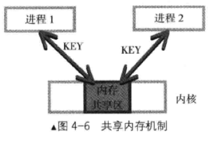
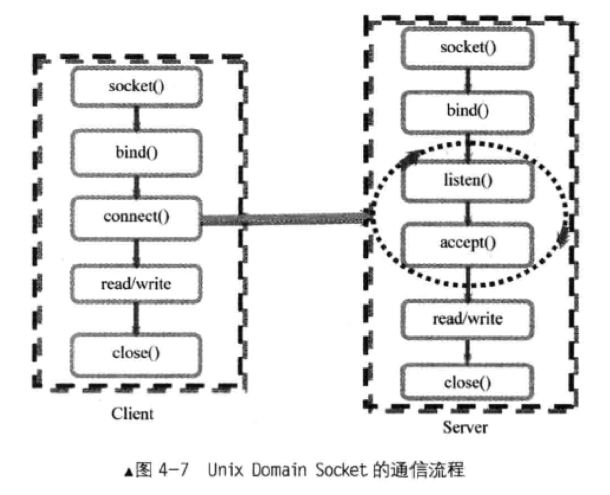

## 进程间通信的经典实现

### 共享内存（Shared Memory）

两个进程可以直接共享访问同一块内存区域，减少数据的复制操作，速度上优势比较明显。




### 管道

* 管道是单向的，意味着如果既要“读”又要“写”，就得建立两个管道。
* 一个管道同时具有“读取”端（read end）和“写入”端（write end）。
* 管道有容量限制。即当 pipe 满时，写操作（write）将阻塞；反之，读操作（read）也会阻塞。

```C
int pipe(int pipefd[2], int flags)
```

### Socket



## 同步机制的经典实现

### 信号量（Semaphore）

### Mutex