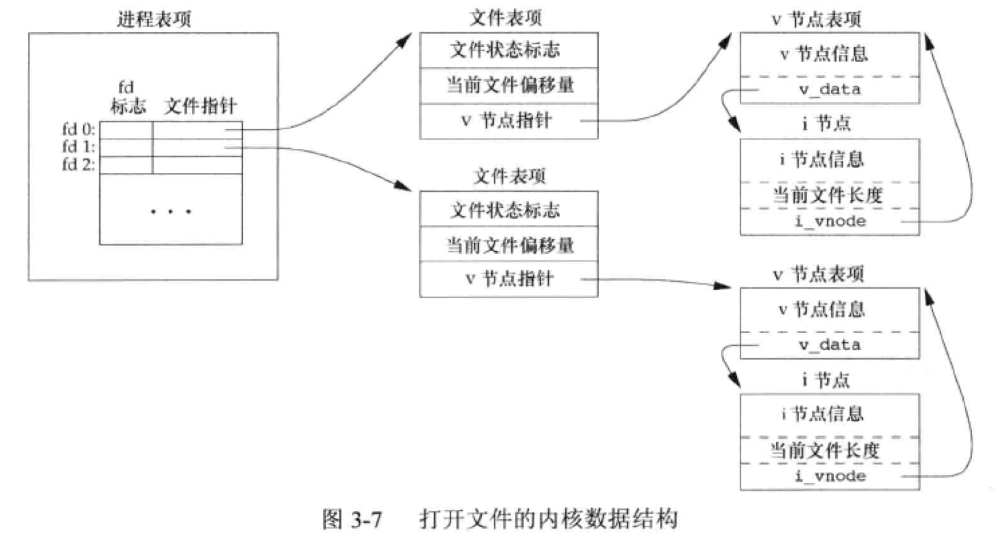
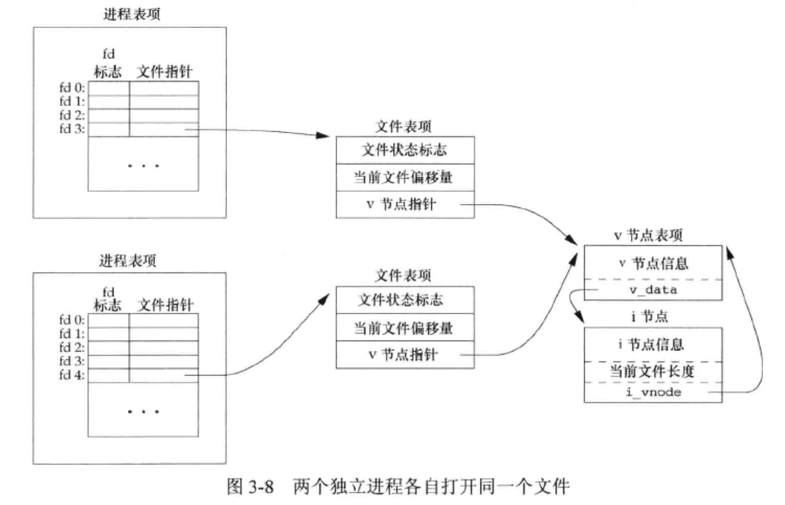
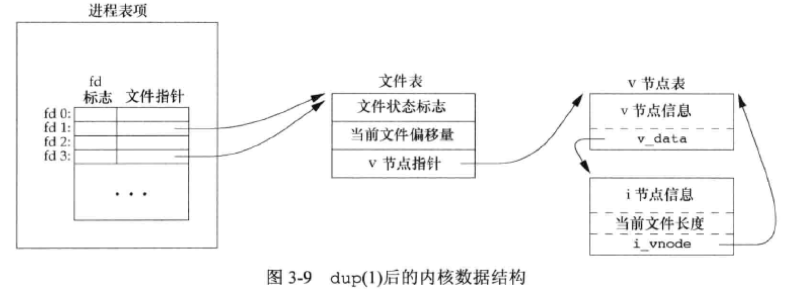

# 文件 I/O

## 文件描述符

对于内核而言，所有打开的文件都是通过文件描述符引用。文件描述符是一个非负整数。

UNIX 系统 shell 把文件描述符0与进程的标准输入关联，文件描述符1与标准输出关联，文件描述符2与标准错误关联。（常量：STDIN_FILENO、STDOUT_FILENO 和 STDERR_FILENO）这些常量都在头文件<unistd.h>中定义。

### 函数 open 和 openat

```C
头文件：
    #include <sys/types.h>    #include <sys/stat.h>    #include <fcntl.h>

定义函数：
    int open(const char * pathname, int flags);
    int open(const char * pathname, int flags, mode_t mode);
```

**参数：**

```C
参数 pathname 指向欲打开的文件路径字符串. 

参数flags:
O_RDONLY 以只读方式打开文件
O_WRONLY 以只写方式打开文件
O_RDWR 以可读写方式打开文件. 
上述三种旗标是互斥的, 也就是不可同时使用, 但可与下列的旗标利用OR(|)运算符组合.
O_CREAT 若欲打开的文件不存在则自动建立该文件.
O_EXCL 如果O_CREAT 也被设置, 此指令会去检查文件是否存在. 文件若不存在则建立该文件, 否则将导致打开文件错误. 此外, 若O_CREAT 与O_EXCL 同时设置, 并且欲打开的文件为符号连接, 则会打开文件失败.
O_NOCTTY 如果欲打开的文件为终端机设备时, 则不会将该终端机当成进程控制终端机.
O_TRUNC 若文件存在并且以可写的方式打开时, 此旗标会令文件长度清为0, 而原来存于该文件的资料也会消失.
O_APPEND 当读写文件时会从文件尾开始移动, 也就是所写入的数据会以附加的方式加入到文件后面.
O_NONBLOCK 以不可阻断的方式打开文件, 也就是无论有无数据读取或等待, 都会立即返回进程之中.
O_NDELAY 同O_NONBLOCK.
O_SYNC 以同步的方式打开文件.
O_NOFOLLOW 如果参数pathname 所指的文件为一符号连接, 则会令打开文件失败.
O_DIRECTORY 如果参数pathname 所指的文件并非为一目录, 则会令打开文件失败。
```

由 open 和 openat 函数返回的文件描述符一定是最小的未用描述符数值。这一点被某些应用程序用来在标准输入、标准输出或标准错误上打开新的文件。例如，一个应用程序可以先关闭标准输出（通常是文件描述符1），然后打开另一个文件，执行打开操作就能了解到该文件一定会在文件描述符1上打开。


### 函数 close

close 函数关闭一个打开文件

```C
函数说明：
当使用完文件后若已不再需要则可使用 close()关闭该文件, close()会让数据写回磁盘, 并释放该文件所占用的资源. 
参数fd 为先前由open()或creat()所返回的文件描述词.

头文件：
#include <unistd.h>

定义函数：
int close(int fd);
```

当一个进程终止时，内核自动关闭它所有的打开文件。

### 函数 lseek

每打开文件都有一个与其相关联的“当前文件偏移量”（current file offset）。默认情况该偏移量设置为0。

```C
函数说明：
每一个已打开的文件都有一个读写位置, 当打开文件时通常其读写位置是指向文件开头, 若是以附加的方式打开文件(如O_APPEND), 则读写位置会指向文件尾. 当read()或write()时, 读写位置会随之增加,lseek()便是用来控制该文件的读写位置.

参数fildes 为已打开的文件描述词, 
参数offset 为根据参数whence来移动读写位置的位移数.
 
参数 whence 为下列其中一种:
    SEEK_SET 参数offset 即为新的读写位置.
    SEEK_CUR 以目前的读写位置往后增加offset 个位移量.
    SEEK_END 将读写位置指向文件尾后再增加offset 个位移量. 当whence 值为SEEK_CUR 或
    SEEK_END 时, 参数offet 允许负值的出现.

头文件：
#include <sys/types.h>    #include <unistd.h>

定义函数：
off_t lseek(int fildes, off_t offset, int whence);
```

文件偏移量可以大于文件的当前长度，这种情况下，对该文件的下一次写将加长该文件，并在文件中构成一个空洞，位于文件中但没有写过的字节都为读为0。

```C
#include <stdio.h>
#include <fcntl.h>
#include <unistd.h>
#include <stdlib.h>

char buf1[] = "abcdefghij";
char buf2[] = "ABCDEFGHIJ";

int main() {
    int fd;

    if ((fd = creat("file.hole", S_IRUSR | S_IWUSR | S_IRGRP | S_IROTH)) < 0)
        printf("Crate error\n");

    if (write(fd, buf1, 10) != 10)
        printf("buf1 write error\n");
    /* offset now = 10 */

    if (lseek(fd, 16384, SEEK_SET) == -1)
        printf("lseek error\n");
    /* offset now = 16384 */

    if (write(fd, buf2, 10) != 10)
        printf("buf2 write error\n");
    /* offset now = 16394 */

    exit(0);

}
```

[UNXI 文件 mode_t 详解](https://www.cnblogs.com/tureno/articles/6060414.html)

### 函数 read

read 函数从打开文件中读取数据

```C
函数说明：
read()会把参数fd 所指的文件传送 count 个字节到buf 指针所指的内存中. 若参数count 为0, 则read()不会有作用并返回0. 返回值为实际读取到的字节数, 如果返回0, 表示已到达文件尾或是无可读取的数据,此外文件读写位置会随读取到的字节移动.

头文件：
#include <unistd.h>

定义函数：
ssize_t read(int fd, void * buf, size_t count);

```

如 read 成功，则返回读到的字节数，如已到达文件的尾端，则返回0

有多种情况可使实际读到的字节数少于要求读的字节数：

* 读普通文件时，在读到要求字数之前已到达了文件的尾端。
* 当从终端设备读时，通常一次最多读一行。
* 当从网络读时，网络中缓冲机制可能造成返回值小于所要求读的字节数。
* 当从管道或 FIFO 读时，如果管道包含的字节少于所需的数量，那么read将只返回实际可用的字节数。
* 但从某些面向记录的设备（如磁盘）读时，一次最多返回一个记录。
* 当一信号造成中断，而已经读了部分数量时。

### 函数 write

write 函数向打开文件写数据

```C
函数说明：
write()会把参数buf 所指的内存写入count 个字节到参数fd 所指的文件内. 当然, 文件读写位置也会随之移动.

头文件：
#include <unistd.h>

定义函数：
ssize_t write (int fd, const void * buf, size_t count);
```

## 文件共享

内核使用 3 种数据结构表示打开文件：

（1）每个进程在进程表中都有一个记录项，记录项中包含一张打开文件描述符表。

    a. 文件描述符标志
    b. 指向一个文件表项的指针
    
（2）内核为所打开文件维护一张文件表。
    
    a. 文件状态标志（读、写、同步和非阻塞等）
    b. 当前文件偏移量
    c. 指向该文件 v 节点表项的指针。
    
（3）每个打开文件（或设备）都有一个 v 节点（v-node）结构。v 节点包含了文件类型和对此文件进行各种操作函数的指针。



两个独立进程各自打开同一文件



第一个进程在文件描述符3上打开该文件，二另一个进程在文件描述符4上打开该文件。打开该文件的每个进程都获得各自的一个文件表项，但对一个给定的文件只有一个 v 节点表项。

### 函数 dup 和 dup2

这两个函数都可用来复制一个现有的文件描述符

```
头文件：#include <unistd.h>

int dup (int oldfd);

int dup2(int odlfd, int newfd);
```

由 dup 返回的新文件描述符一定是当前可用文件描述符中的最小数值。

对于 dup2 ，可用 `fd2` 参数指定新描述符的值。如果 `fd2` 已经打开，则先将其关闭。如果 `fd` 等于 `fd2`，则 dup2 返回 `fd2`，而不会关闭它。

这些函数返回新的文件描述符与参数 `fd` 共享同一个文件表项。




```C
#include <stdio.h>
#include <sys/fcntl.h>
#include <unistd.h>

int main() {
    int fd = open("hello.file", O_CREAT | O_RDWR | O_TRUNC, S_IRUSR | S_IWUSR);
    if (fd < 0) {
        printf("Open error\n");
        return 0;
    }

    // 将标准输出重定向到fd
    int nfd = dup2(fd, STDOUT_FILENO);
    if (nfd < 0) {
        printf("Dup error\n");
        return 0;
    }

    char buf[5];
    int n;

    while ((n = read(STDIN_FILENO, buf, 5)) > 0) {
        if (write(STDOUT_FILENO, buf, n) != n)
            printf("Write error\n");
    }
    return 0;
}
```

上面的例子使用dup2将标准输出重定向为hello.file文件

```C
cat hell.file
hello world
```

### /dev/fd

较新的系统都提供名未 /dev/fd 的目录，其目录项是名为 0、1、2 等文件。

打开文件 /dev/fd/n 等效于复制描述符 n （假定描述符 n 是打开的）。


