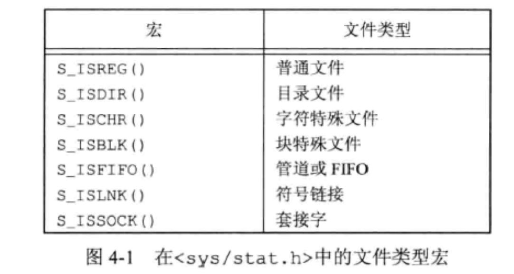
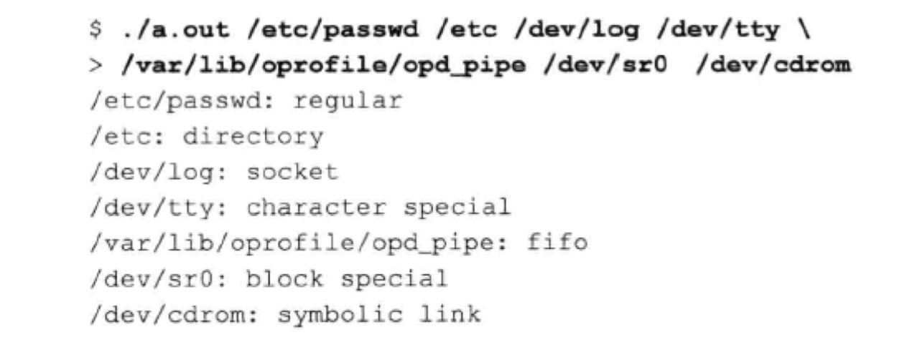
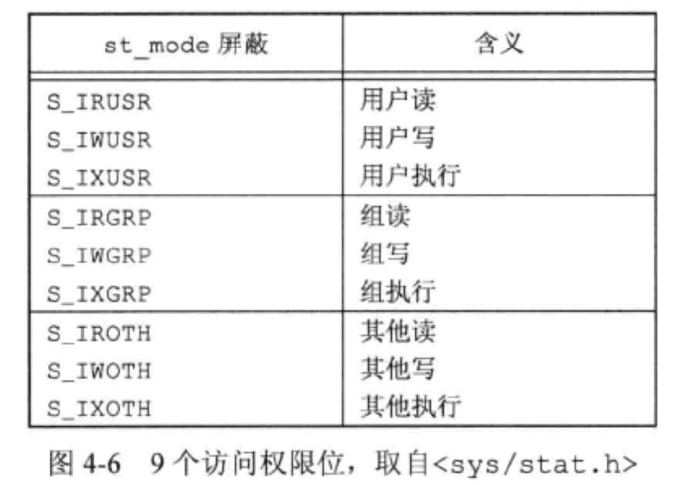
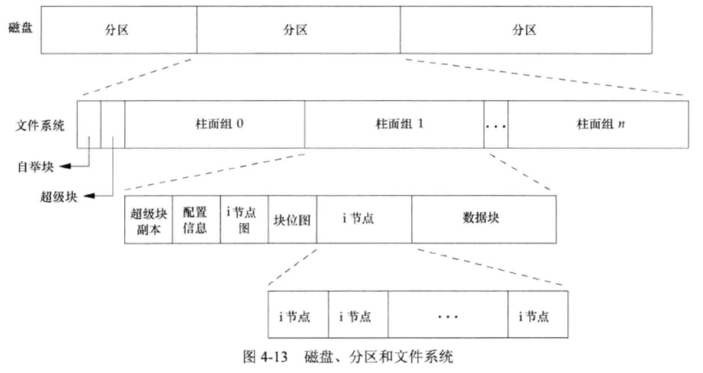
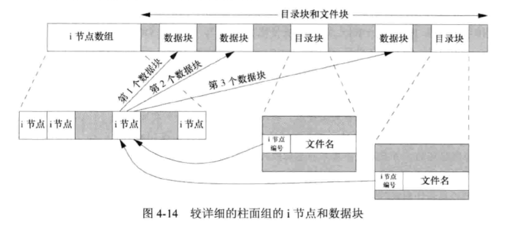
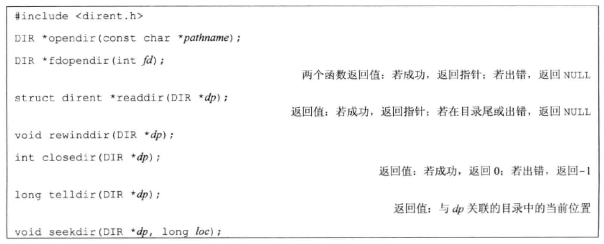

# 文件和目录

### 函数 stat、fstat、fstatat 和 lstat

```C
函数说明：
stat()用来将参数 file_name 所指的文件状态, 复制到参数 buf 所指的结构中。

头文件：
#include <sys/stat.h>   #include <unistd.h>

定义函数：
int stat(const char * file_name, struct stat *buf);
```

下面是struct stat 内各参数的说明：

```
struct stat
{
    dev_t st_dev; //device 文件的设备编号
    ino_t st_ino; //inode 文件的i-node
    mode_t st_mode; //protection 文件的类型和存取的权限
    nlink_t st_nlink; //number of hard links 连到该文件的硬连接数目, 刚建立的文件值为1.
    uid_t st_uid; //user ID of owner 文件所有者的用户识别码
    gid_t st_gid; //group ID of owner 文件所有者的组识别码
    dev_t st_rdev; //device type 若此文件为装置设备文件, 则为其设备编号
    off_t st_size; //total size, in bytes 文件大小, 以字节计算
    unsigned long st_blksize; //blocksize for filesystem I/O 文件系统的I/O 缓冲区大小.
    unsigned long st_blocks; //number of blocks allocated 占用文件区块的个数, 每一区块大小为512 个字节.
    time_t st_atime; //time of lastaccess 文件最近一次被存取或被执行的时间, 一般只有在用mknod、utime、read、write 与tructate 时改变.
    time_t st_mtime; //time of last modification 文件最后一次被修改的时间, 一般只有在用mknod、utime 和write 时才会改变
    time_t st_ctime; //time of last change i-node 最近一次被更改的时间, 此参数会在文件所有者、组、权限被更改时更新
};
```

### 文件类型

1. 普通文件（regular file）。
2. 目录文件（directory file）。对一个目录文件具有读权限的任一进程都可以读该目录的内容，但只有内核可以直接写目录文件。
3. 块特殊文件（block special file）。
4. 字符特殊文件（character special file）。
5. FIFO。这种类型的文件用于进程间通信。
6. 套接字（socket）。用于进程间网络通信。
7. 符号链接（symbolic link）。这种类型的文件指向另一个文件。

文件类型信息包含在 stat 结构的 st_mode 成员中。

```C
先前所描述的st_mode 则定义了下列数种情况：
1、S_IFMT 0170000 文件类型的位遮罩
2、S_IFSOCK 0140000 scoket
3、S_IFLNK 0120000 符号连接
4、S_IFREG 0100000 一般文件
5、S_IFBLK 0060000 区块装置
6、S_IFDIR 0040000 目录
7、S_IFCHR 0020000 字符装置
8、S_IFIFO 0010000 先进先出
9、S_ISUID 04000 文件的 (set user-id on execution)位
10、S_ISGID 02000 文件的 (set group-id on execution)位
11、S_ISVTX 01000 文件的sticky 位
12、S_IRUSR (S_IREAD) 00400 文件所有者具可读取权限
13、S_IWUSR (S_IWRITE)00200 文件所有者具可写入权限
14、S_IXUSR (S_IEXEC) 00100 文件所有者具可执行权限
15、S_IRGRP 00040 用户组具可读取权限
16、S_IWGRP 00020 用户组具可写入权限
17、S_IXGRP 00010 用户组具可执行权限
18、S_IROTH 00004 其他用户具可读取权限
19、S_IWOTH 00002 其他用户具可写入权限
20、S_IXOTH 00001 其他用户具可执行权限上述的文件类型在 POSIX 中定义了检查这些类型的宏定义
21、S_ISLNK (st_mode) 判断是否为符号连接
22、S_ISREG (st_mode) 是否为一般文件
23、S_ISDIR (st_mode) 是否为目录
24、S_ISCHR (st_mode) 是否为字符装置文件
25、S_ISBLK (s3e) 是否为先进先出
26、S_ISSOCK (st_mode) 是否为socket 若一目录具有sticky 位 (S_ISVTX), 则表示在此目录下的文件只能被该文件所有者、此目录所有者或root 来删除或改名.
```




```C
#include <sys/stat.h>
#include <printf.h>
#include <stdlib.h>

int main(int argc, char *argv[]) {
    int i;
    struct stat buf;
    char *ptr;

    for (i = 1; i < argc; ++i) {
        printf("%s: ", argv[i]);
        if (lstat(argv[i], &buf) < 0) {
            printf("lstat error\n");
            continue;
        }
        if (S_ISREG(buf.st_mode))
            ptr = "regular";
        else if (S_ISDIR(buf.st_mode))
            ptr = "directory";
        else if (S_ISCHR(buf.st_mode))
            ptr = "character regular";
        else if (S_ISBLK(buf.st_mode))
            ptr = "block regular";
        else if (S_ISFIFO(buf.st_mode))
            ptr = "FIFO";
        else if (S_ISLNK(buf.st_mode))
            ptr = "symbolic link";
        else if (S_ISSOCK(buf.st_mode))
            ptr = "socket";
        else
            ptr = " ** unknown mode ** ";

        printf("%s: \n", ptr);
    }
    exit(0);
}
```



### 文件访问权限

每个文件有 9 个访问权限位，可将它们分为 3 类



### 函数 access 和 faccessat

```C
函数说明：
access()会检查是否可以读/写某一已存在的文件。

头文件：
#include <unistd.h>

定义函数：
int access(const char * pathname, int mode);
```

参数mode 有几种情况组合：

```
1、R_OK, W_OK, X_OK和F_OK. R_OK, W_OK 与X_OK 用来检查文件是否具有读取写入和执行的权限。
2、F_OK 则是用来判断该文件是否存在。由于access()只作权限的核查, 并不理会文件形态或文件内容，因此，如果一目录表示为"可写入"，表示可以在该目录中建立新文件等操作，而非意味此目录可以被当做文件处理。例如：你会发现DOS 的文件都具有"可执行"权限，但用execve()执行时则会失败。
```

### 文件系统

可以把一个磁盘分成一个或多个分区。每个分区可以包含一个文件系统。

i 节点是固定长度的记录项，它包含有关文件的大部分信息。



* 在下图中有两个目录项指向同一个 i 节点。每个 i 节点中都有一个链接计数，其值是指向该 i 节点的目录项数。只有当链接计数减少至0时，才可删除该文件（也就是释放该文件占用的数据块）。在 stat 结构中，链接计数包含在 st_nlink 成员中，其基本系统数据类型是 nlink_t。这种链接类型称为硬链接。



* 另一种链接类型称为符号链接（symbolic link）。符号链接文件的实际内容（在数据块中）包含了该符号链接所指向的文件的名字。

### 函数 link、linkat、unlink、unlinkat 和 remove

任何一个文件可以有多个目录项指向其 i 节点，创建一个执向现有文件的链接的方法是使用 link 函数或 linkat 函数。

```C
函数说明：
link()以参数 newpath 指定的名称来建立一个新的连接(硬连接)到参数oldpath 所指定的已存在文件. 如果参数newpath 指定的名称为一已存在的文件则不会建立连接.

头文件：
#include <unistd.h>

定义函数：
int link (const char * oldpath, const char * newpath);

返回值：
成功则返回0, 失败返回-1, 错误原因存于errno.
```

删除一个现有的目录项，可以调用 unlink 函数

```C
函数说明：
unlink()会删除参数pathname 指定的文件. 如果该文件名为最后连接点, 但有其他进程打开了此文件, 则在所有关于此文件的文件描述词皆关闭后才会删除. 如果参数 pathname 为一符号连接, 则此连接会被删除。

头文件：
#include <unistd.h>

定义函数：
int unlink(const char * pathname);

返回值：成功则返回0, 失败返回-1, 错误原因存于errno
```

unlink 的这种特性经常被程序用来确保即使在程序崩溃时，它所创建的临时文件也不会遗留下来。进程用 open 或 create 创建一个文件，然后立即调用 unlink，因为该文件仍旧是打来的，所以不会将其内容删除。只有当进程关闭该文件或终止时（在这种情况下，内核关闭该进程所打开的全部文件），该文件的内容才会被删除。

### 函数 rename 和 renameat

文件或目录可以用 rename 函数或者 renameat 函数进行重命名。

```C
头文件：
#include <stdio.h>

函数 rename()用于重命名文件、改变文件路径或更改目录名称，其原型为
    int rename(char * oldname, char * newname);

【参数】oldname为旧文件名，newname为新文件名。

【返回值】修改文件名成功则返回0，否则返回-1。

重命名文件：
如果newname指定的文件存在，则会被删除。
如果newname与oldname不在一个目录下，则相当于移动文件。

重命名目录：
如果oldname和newname都为目录，则重命名目录。
如果newname指定的目录存在且为空目录，则先将newname删除。
对于newname和oldname两个目录，调用进程必须有写权限。
重命名目录时，newname不能包含oldname作为其路径前缀。例如，不能将/usr更名为/usr/foo/testdir，因为老名字（ /usr/foo）是新名字的路径前缀，因而不能将其删除。
```

### 符号链接

符号链接是对一个文件的间接指针，它与上一节所述的硬链接有所不同，硬链接直接指向文件的 i 节点。引入符号链接的原因是为了避开硬链接的一些限制。

* 硬链接通常要求链接和文件位于同一文件系统中。
* 只有超姐用户才能创建指向目录的硬链接。

```C
头文件：
#include <unistd.h>

定义函数：
int symlink(const char * oldpath, const char * newpath);

函数说明：symlink()以参数newpath 指定的名称来建立一个新的连接(符号连接)到参数oldpath 所指定的已存在文件. 参数oldpath 指定的文件不一定要存在, 如果参数newpath 指定的名称为一已存在的文件则不会建立连接.

返回值：成功则返回0, 失败返回-1, 错误原因存于errno.
```

### 函数 mkdir、mkdirat 和 rmdir

```C
头文件库：
#include <sys/stat.h>
#include <sys/types.h>
函数原型：
int mkdir(const char *pathname, mode_t mode);
函数说明：
mkdir()函数以mode方式创建一个以参数pathname命名的目录，mode定义新创建目录的权限。
返回值：
若目录创建成功，则返回0；否则返回-1，并将错误记录到全局变量errno中。
```

rmdir 函数可以删除一个空目录。空目录是只包含 . 和 .. 这两项的目录。

```C
#include<unistd.h>

int rmdir(const char *pathname);

使用rmdir函数时，目录必须为空，否则调用失败，函数返回-1.成功时，函数返回0.
```

### 读目录

对某个目录具有访问权限的任一用户都可以读该目录，但是为了防止文件系统产生混乱，只有内核才能写目录。


