# 标准 I/O 库

标准 I/O 库的操作都是围绕流（stream）进行的。

标准I/O文件流可用于单字节或多字节（“宽”）字符集。
流的定向（stream's orientation）决定了所读、写的字符是单字节还是多字节。

fwide 函数可用于设置流的定向。

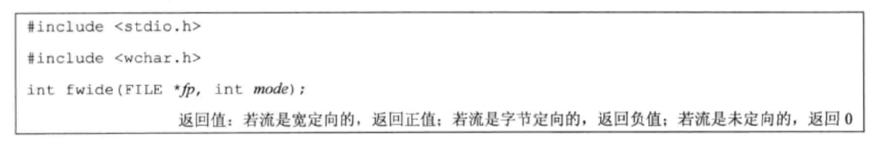

* mode 参数为负，fwide 将试图使指定的流是字节定向的。
* mode 参数为正，fwide 将试图将指定的流是宽定向的。
* mode 参数值为0，fwide 将不试图设置流的定向，但返回标识该流定向的值。

### 缓冲

标准I/O库提供缓冲的目的是尽可能减少使用 read 和 write 调用的次数。

1. 全缓冲。填满标准I/O缓冲区后才进行实际I/O操作。术语冲洗（flush）说明标准I/O缓冲区的写操作。
2. 行缓冲。当输入和输出中遇到换行符时，标准I/O库执行I/O操作。
3. 不带缓冲。

可以调用下列两个函数中的一个来更改缓冲类型。

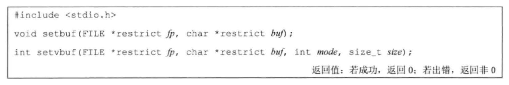

setbuf 函数打开或者关闭缓冲机制。

使用 setvbuf，可以精确地说明所需的缓冲类型，由 mode 参数实现：

* _IOFBF   全缓冲
* _IOLBF   行缓冲
* _IONBF   不带缓冲

### 打开流

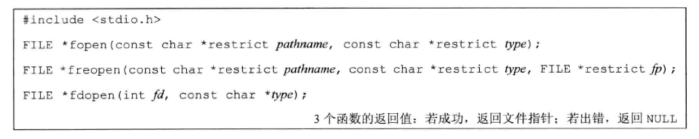

1. fopen 函数打开路径名未 pathname 的一个指定的文件
2. freopen 函数在一个指定的流上打开一个指定的文件，如若该流已经打开，则先关闭该流。若该流已经定向，则使用 freopen 清除该定向。该函数一般用于将一个指定的文件打开为一个预定义的流：标准输入、标准输出或标准错误。
3. fdopen 函数取一个已有的文件描述符，并使一个标准的I/O流与该描述符相结合。

type 参数指定对该 I/O 流的读、写方式

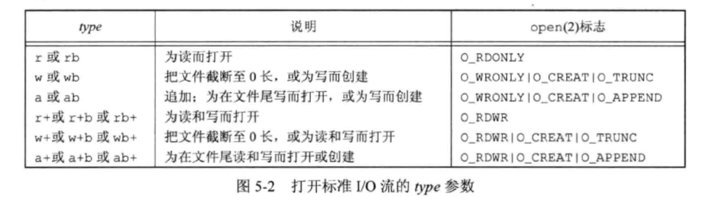

fclose 关闭一个打开的流

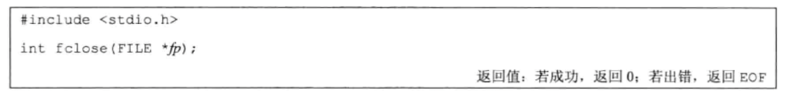

### 读和写流

一旦打开了流，则可在3种不同类型的非格式化 I/O 中进行选择，对其进行读、写操作。

1. 每次一个字符的 I/O。一次读或写一个字符，如果流是带缓冲的，则标准I/O函数处理所有缓冲。
2. 每次一行的 I/O。如果想要一次读或写一行，则使用 fgets 和 fputs 。
3. 直接 I/O .fread 和 fwrite 函数支持这种类型的 I/O .

#### 输入函数

以下3个函数可用于一次读取一个字符。

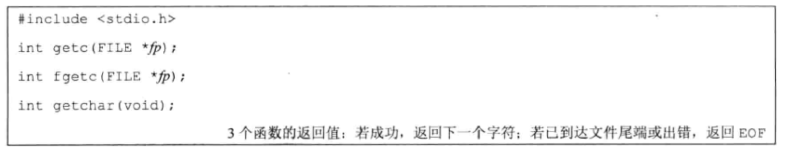

#### 输出函数

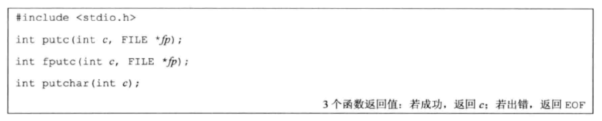

### 每次一行 I/O

下面两个函数提供了每次输入一行的功能：

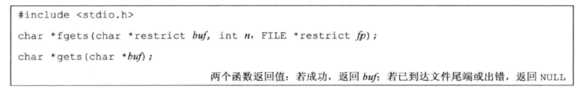

这两个函数都指定了缓冲区的地址，读入的行将送入其中。gets 从标准输入读，而 fgets 则从指定的流读。

fputs 和 puts 提供每次输出一行的功能

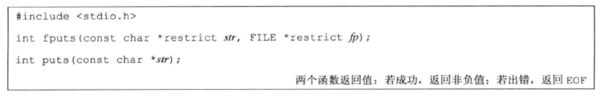

### 二进制 I/O

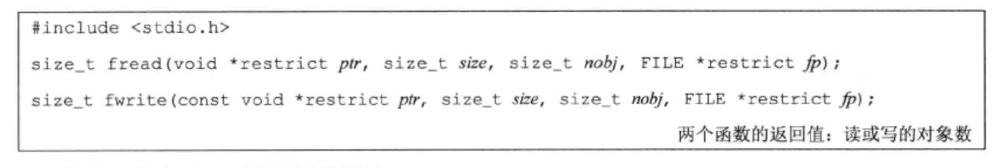

这些函数有以下两种常见的用法：

1. 读或写一个二进制数组。
2. 读或写一个结构。

### 定位流

有三种方法定位标准 I/O 流

1. ftell 和 fseek 函数。
2. ftello 和 fseeko 函数。
3. fgetspos 和 fsetpos 函数。

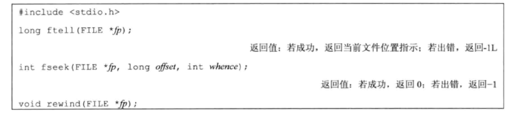

### 格式化 I/O

