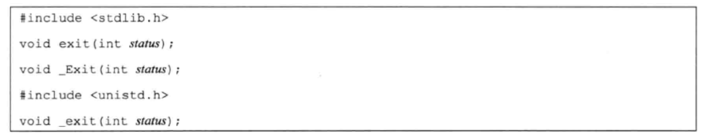
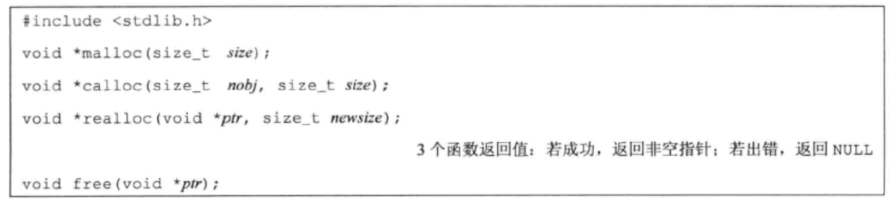
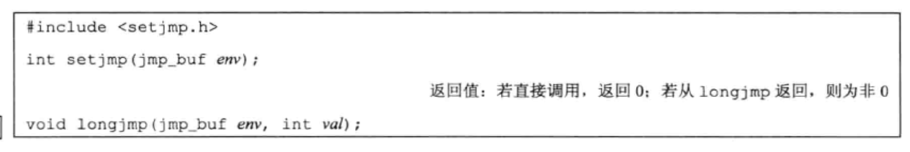

# 进程环境

### main 函数

C 程序总是从 main 函数开始执行的

```C
int main(int argc, char *argv[]);
```

argc 是命令行参数的数目，argv 是指向参数的各个指针所构成的数组。

### 进程终止

有 8 种方式使进程终止（termination），其中 5 种为正常终止：

* 从 main 返回；
* 调用 exit；
* 调用 _exit 或 _Exit；
* 最后一个线程从其启动例程返回；
* 从最后一个线程调用 pthread_exit；

异常终止有 3 种方式：

* 调用 abort；
* 接到一个信号；
* 最后一个线程对取消请求做出相应；

#### 退出函数



_exit 和 _Exit 立即进入内核，exit 则先执行一些清理处理，然后返回内核。

exit 函数总是执行一些标准I/O库的清理关闭操作：对于所有打开流调用 fclose 函数（这造成输出缓冲中的所有数据都被冲洗[写到文件上]）。

#### 函数 atexit

一个进程可以登记32个函数，这些函数将由 exit 自动调用。我们称这些函数为终止处理程序（exit handler），并调用 atexit 函数来登记这些函数。

```C
#include <stdio.h>

int atexit(void (*fun)(void));
```

exit 调用这些函数的顺序与它们登记时候的顺序相反，同一函数登记多次，也会被调用多次。

```C
#include <stdlib.h>
#include <printf.h>

static void my_exit1(void);

static void my_exit2();

int main(void) {
    if (atexit(my_exit2) != 0)
        printf("Can't register my_exit2");

    if (atexit(my_exit1) != 0)
        printf("Can't register my_exit1");


    if (atexit(my_exit1) != 0)
        printf("Can't register my_exit1");

    printf("main is done\n");
    return 0;
}

static void my_exit1(void) {
    printf("first exit handler\n");
}

static void my_exit2(void) {
    printf("second exit handler\n");
}
// main is done
// first exit handler
// first exit handler
// second exit handler
```

### 存储空间分配

1. malloc：分配指定字节数的存储区，此存储区中的初始值不确定
2. calloc：为指定数量指定长度的对象分配存储空间，该空间的每一位（bit）都初始化为 0
3. realloc：增加或减少以前分配区的长度。



函数 free 释放 ptr 指向的存储空间。

### 函数 setjmp 和 longjmp

在 C 中，goto 语句是不能跨越函数的，而要执行这种类型跳转功能的是函数 setjmp 和 longjmp。

这两个函数对于处理发生在很深层嵌套函数调用中的出错情况非常有用。



```C
#include <stdio.h>
#include <stdlib.h>
#include <setjmp.h>

#define TOK_ADD 5
#define MAXLINE 4096

jmp_buf jmpbuffer;

void do_line(char *);

void cmd_add(void);

int get_token(void);

int main(void) {
    char line[MAXLINE];

    if (setjmp(jmpbuffer) != 0)
        printf("error");
    while (fgets(line, MAXLINE, stdin) != NULL)
        do_line(line);
    exit(0);
}

char *tok_ptr; /* global pointer for get_token() */

void do_line(char *ptr) {
    int cmd;
    tok_ptr = ptr;

    while ((cmd = get_token()) > 0) {
        switch (cmd) {
            case TOK_ADD:
                cmd_add();
                break;
        }
    }
}

void cmd_add(void) {
    int token;
    token = get_token();
    if (token < 0)  // an error has accurred
        longjmp(jmpbuffer, 1);
}

int get_token(void) {
    printf("token");
}
```

当检查一个错误时，例如在 cmd_add 函数中，则以两个参数调用 longjmp 函数。

第一个就是在调用 setjmp 时所用的 env; 第二个参数是具有非0值的val。

#### 自动变量、寄存器变量和易失变量

如果有一个自动变量，不想使其值回滚，则可以定义其为具有 volatile 属性。声明为全局变量或静态变量的值在执行 longjmp 时保持不变。

> 自动变量（Automatic Variable）指的是局部作用域变量，具体来说即是在控制流进入变量作用域时系统自动为其分配存储空间，并在离开作用域时释放空间的一类变量。
> 通常情况下“自动变量”与“局部变量”是同义的。

> C语言中使用关键字register来声明局部变量为寄存器变量。寄存器变量的值会被存放在CPU的寄存器中，每当需要使用它们时，CPU就可以直接使用，而无须再通过控制器从内存中获取。由于操作寄存器的速度远高于操作内存，所以正确地使用寄存器变量能够有效地提高程序运行效率。register型变量常被用于作为循环控制变量，这能充分体现它的高速特点。

```C
#include <setjmp.h>
#include <printf.h>
#include <stdlib.h>

static void f1(int, int, int, int);

static void f2(void);

static jmp_buf jmpbuffer;
static int globval;

int main(void) {
    int autoval;
    register int regival;
    volatile int volaval;
    static int statval;

    globval = 1;
    autoval = 2;
    regival = 3;
    volaval = 4;
    statval = 5;

    if (setjmp(jmpbuffer) != 0) {
        printf("after longjmp:\n");
        printf("globval = %d, autoval = %d, regival = %d, volaval = %d, statval = %d\n",
               globval, autoval, regival, volaval, statval);
        exit(0);
    }

    globval = 95;
    autoval = 96;
    regival = 97;
    volaval = 98;

    f1(globval, regival, volaval, statval);
    exit(0);

}

static void f1(int i, int j, int k, int l) {
    printf("in f1():\n");
    printf("globval = %d, autoval = %d, regival = %d, volaval = %d, statval = %d\n",
           globval, i, j, k, l);
    f2();
}

static void f2(void) {
    longjmp(jmpbuffer, 1);
}
// in f1():
// globval = 95, autoval = 95, regival = 97, volaval = 98, statval = 5
// after longjmp:
// globval = 95, autoval = 96, regival = 97, volaval = 98, statval = 5
```

