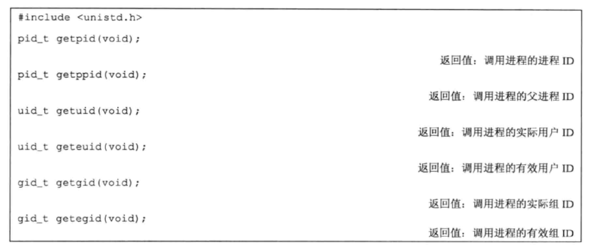
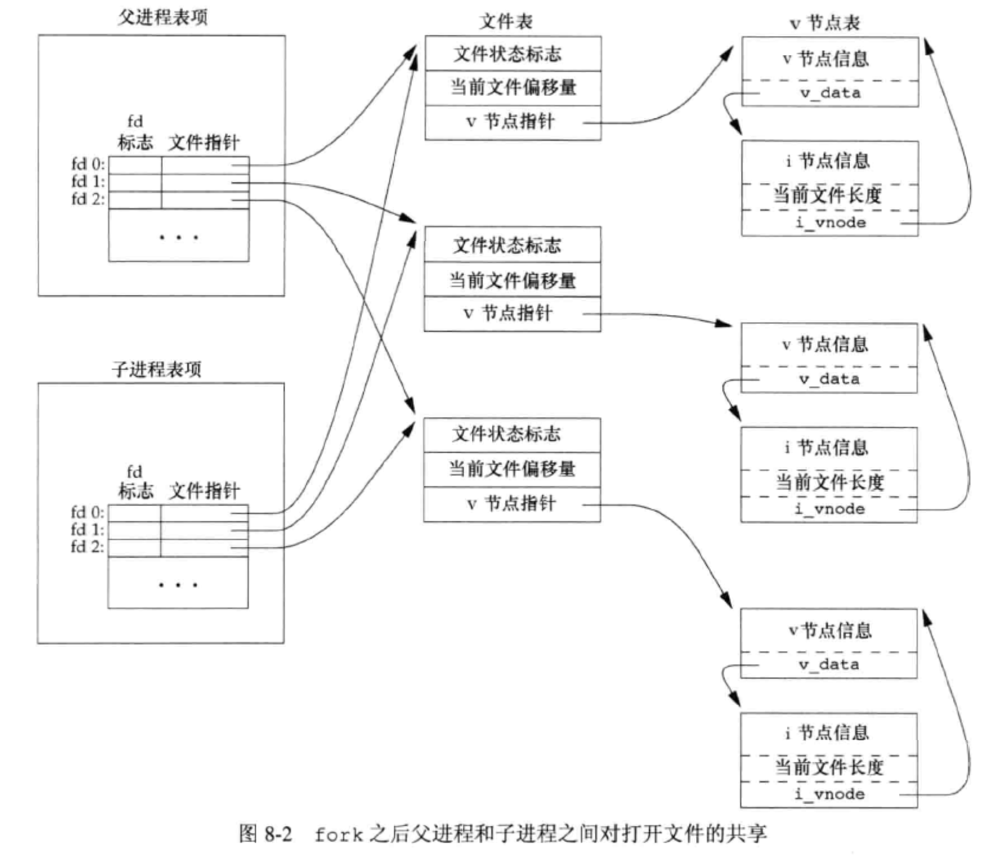
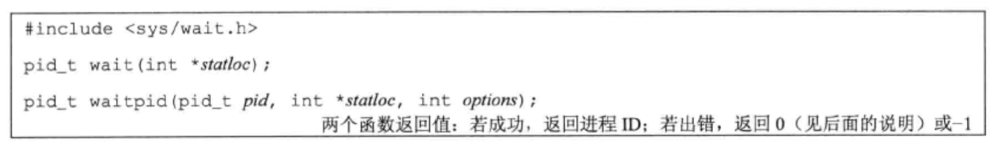
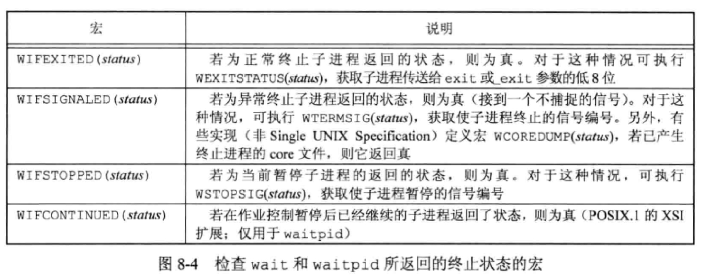
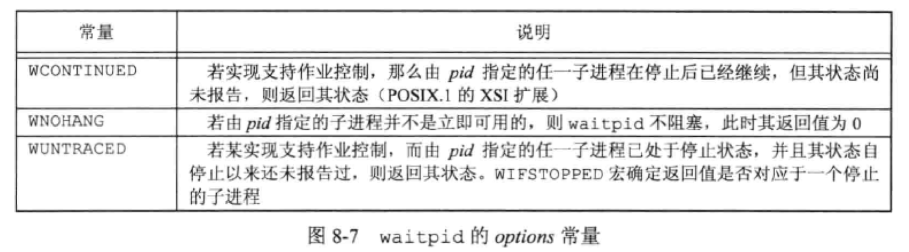
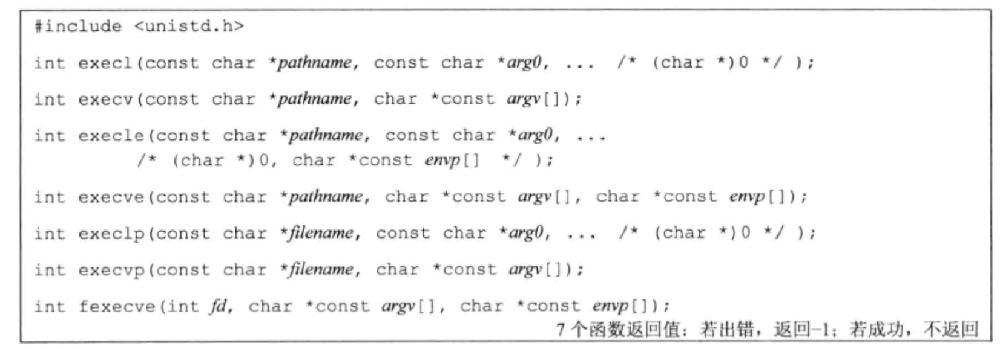

# 进程控制

### 进程标识

每个进程都有一个非负整数表示的唯一进程 ID。

进程ID为0的进程通常是调度进程，常常被称为交换进程（swapper）。该进程是内核的一部分，它并不执行任何磁盘上的程序，因此也被称为系统进程。

进程ID为1通常是 init 进程，在自举过程结束时由内核调用。init 进程通常读取与系统有关的初始化文件(rc文件)。



### 函数 fork

一个现有的进程可以调用 fork 函数创建一个新进程。

```C
#include <unistd.h>
pid_t fork(void);

返回值：
子进程返回0，父进程返回子进程 ID
若出错，返回 -1
```

由 fork 创建的新进程被称为子进程（child process）。fork 函数被调用一次，但返回两次。两次返回的区别是子进程的返回值是0，而父进程的返回值则是新建子进程的进程 ID。

子进程获得父进程数据、堆和栈的副本。父进程和子进程并不共享这些存储空间部分。

由于 fork 之后经常跟随着 exec，所以现在的很多实现并不执行一个父进程数据段、栈和堆的完全副本。作为替换，使用了写时复制技术（Copy-On-Write）。这些区域由父进程和子进程共享，而且内核将它们的刚问权限改为只读。如果父进程和子进程中的任一个试图修改这些区域，则内核只为修改区域的那块内存制作一个副本，通常是虚拟存储系统的一“页”。

> 在 Linux 系统中，调用 fork 系统调用创建子进程时，并不会把父进程所有占用的内存页复制一份，而是与父进程共用相同的内存页，而当子进程或者父进程对内存页进行修改时才会进行复制 —— 这就是著名的 写时复制 机制。

[Linux 写时复制机制原理](https://segmentfault.com/a/1190000039869422)

```C
//
// Created by YoungTr on 2022/3/16.
//

#include <unistd.h>
#include <printf.h>
#include <stdlib.h>

int globval = 6;
char buf[] = "a write to stdout\n";

int main(void) {
    int var;    // automatic variable on the stack
    pid_t pid;

    var = 88;

    if (write(STDOUT_FILENO, buf, sizeof(buf) - 1) != sizeof(buf) - 1)
        printf("write error");
    printf("before fork\n"); // we don't flush stdout

    pid = fork();
    if (pid < 0)
        printf("fork error");
    else if (pid == 0) {
        globval++;  // child process
        var++;
    } else {
        sleep(2);   // parent process
    }

    printf("pid = %ld, glob = %d, var = %d\n", (long) getpid(), globval, var);
    exit(0);
}

// a write to stdout
// before fork
// pid = 87264, glob = 7, var = 89  子进程的变量值改变了
// (2 SEC)
// pid = 87263, glob = 6, var = 88  父进程的变量值没有改变
```

一般来说，在 fork 之后是父进程先执行还是子进程先执行是不确定的，这取决于内核所使用的调度算法。

#### 文件共享

fork 的一个特性是父进程的所有打开文件描述符都被复制到子进程中，就好像是执行了 dup 函数。父进程和子进程每个相同的打开描述符共享一个文件表项。



在 fork 之后处理文件描述符有以下两种常见的情况
1. 父进程等待子进程完成。
2. 父进程和子进程各自执行不同的程序段。

使 fork 失败的两个主要原因：

1. 系统中已经有太多的进程。
2. 该实际用户 ID 的进程总数超过了系统限制。

fork 有以下两种用法：

1. 一个父进程希望复制自己，使父进程和子进程同时执行不同的代码段。
2. 一个进程要执行一个不同的程序。

### 函数 vfork

vfork 函数用于创建一个新进程，而该新进程的目的是 exec 一个新程序。

vfork 和 fork 一样都创建一个子进程，但是它并不将父进程的地址空间完全复制到子进程中，因为子进程会立即调用 exec（或 exit），于是也不会引用该地址空间。

vfork 和 fork 之间的另一个区别是：vfork 保证子进程先运行，在它调用exec或exit之后父进程才可能被调度运行。

### 函数 exit

进程终止时希望系统能够通知父进程它是如何终止的。对于三个终止函数（exit、_exit 和 _Exit），实现这一点的方法是，将其退出状态作为参数传递给函数。该终止进程的父进程都能用 wait 或 waitpid 函数取得其终止状态。

### 函数 wait 和 waitpid

当一个进程正常或者异常终止时，内核就向其父进程发送 SIGHLD 信息。父进程可以选择忽略该信息，或者提供一个该信号发生时即被调用执行的函数。（默认是忽略它）。

调用 wait 或 waitpid 进程可能会发生什么：

* 如果其所有子进程都还在运行，则阻塞。
* 如果一个子进程已终止，正等待父进程获取其终止状态，则取得该子进程的终止状态立即返回。
* 如果他没有任何子进程，则立即出错返回。



参数 `statloc` 是一个整型指针，终止状态就存放在它所指向的单元内。如果不关心终止装填，则可将该参数指定为空指针。

终止状态用定义在 <sys/wait.h> 中的各个宏来查看。



对于 waitpid 函数中 pid 参数作用：

* pid == -1 等待任一子进程，等效 wait
* pid > 0 等待进程ID与pid相等的子进程
* pid == 0 等待组ID等于调用进程组ID的任一子进程
* pid < -1 等待组ID等于pid绝对值的任一子进程

`options` 参数可以进一步控制 waitpid 的操作，此参数为0，或是常量按位或运算的结果。



[一文搞懂孤儿进程和僵尸进程](https://segmentfault.com/a/1190000038820321)

```C
#include <unistd.h>
#include <printf.h>
#include <stdlib.h>

int main(void) {
    pid_t pid;


    if ((pid = fork()) < 0) {
        printf("fork error");
    } else if (pid == 0) {   /* first child */
        if ((pid = fork()) < 0)
            printf("fork error");
        else if (pid > 0)
            exit(0);    /* parent from second fork == first child */

        sleep(5);
        printf("second child, parent pid = %ld\n", (long) getppid());
        exit(0);
    }

    if (waitpid(pid, NULL, 0) != pid)    /* wait for first child */
        printf("waitpid error");

    exit(0);

}
// second child, parent pid = 1 
```

### 函数 exec

fork 函数创建新的子进程后，子进程往往要抵用一种 exec 函数以执行另一个程序。当进程调用一种 exec 函数时，该进程执行的程序完全替换为新程序，新程序则从其 main 函数开始执行。

因为调用 exec 并不创建新进程，所以前后的进程 ID 并未改变。



前四个函数取路径名作为参数，后两个函数则取文件名作为参数，最后一个取文件描述符作为参数。

当指定 `filename` 作为参数是：

* 如果 `filename` 中包含 / ，则将其视为路径名；
* 否则就按 PATH 环境变量，在它所指定的各目录中搜寻可执行文件。

