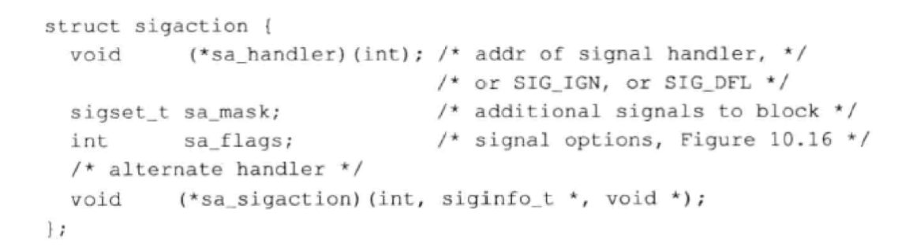
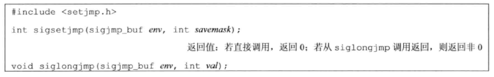

# 信号

信号是软终端。信号提供了一种处理异步事件的方法。

### 信号概念

每个信号都有一个名字，这些名字都以3个字符 SIG 开头。

很多条件可以产生信息：

* 当用户按某些终端键时，引发终端发生的信号。
* 硬件异常产生信号：除数为0、无效的内存引用等。
* 进程调用kill(2)函数可将任意信号发送给另一个进程或进程组。
* 用户可以用kill(1)命令将信号发送给其他进程。
* 当检测到某种软件条件已经发生，并应将其通知有关进程时也产生信号。

在某个信号出现时，可以告诉内核按下列3种方式之一进行处理：

* 忽略此信号。（SIGKILL 和 SIGSTOP 不能被忽略）
* 捕获信号。(SIGKILL 和 SIGSTOP 不能被捕获)
* 执行系统默认动作。


* SIGABRT：调用 abort 函数时。
* SIGALRM：当用 alarm 函数设置的定时器超时时，产生此信息。
* SIGBUS：指示一个实现定义的硬件故障。
* SIGCANCEL：这是 Solaris 线程库内部使用的信号。
* SIGCHLD：在一个进程终止或停止时，SIGCHLD 信息被送给其父进程。
* SIGCONT：此作业控制信号发送给需要继续运行，但当前处于停止状态的进程。如果此信号的进程处于停止状态，则系统默认动作是使该进程继续运行；否则默认动作是忽略此信号。
* SIGEMT：指示一个实现定义的硬件故障。
* SIGFPE：此信号表示一个算术运算符异常。如除以0、浮点溢出等。
* SIGFREEZE：它用于通知进程在冻结系统状态之前需要采取特定动作，例如系统进入休眠或挂起状态时可能需要做这种处理。
* SIGHUP：如果终端接口检测到一个连接断开，则将此信号送给与该终端相关的控制进程（回话进程）。
* SIGILL：此信号表示进程已执行一条非法硬件指令。
* SIGINFO：这是一种BSD信号，当用户按状态键（Ctrl+T）,终端驱动程序产生此信号并发送至前台进程组中的每一个进程
* SIGINT：当用户按中断键（Delete或Ctrl+C），终端驱动程序产生此信号并发送至前台进程组中的每一个进程。
* SIGIO：此信号指示一个异步I/O事件。
* SIGIOT：这指示一个实现定义的硬件故障。
...

### 函数 signal

```C
#include <signal.h>

void (*signal(int signo, void (*func)(int)))(int);
```

`signo` 是上面的信号名。

`func` 的值是常量 SIG_IGN、常量 SIG_DFL 或当接到此信号后要调用的函数的地址。

* SIG_IGN：向内核表示忽略此信号
* SIG_DFL：表示接到此信号后的动作是系统默认动作
* 当指定函数地址时，则在信号发生时，调用该函数。称这种处理为捕捉该信号（信号处理程序 signal handler 或 信号捕捉函数 signal-catching function）

```C
#include <signal.h>
#include <printf.h>
#include <unistd.h>

//
// Created by YoungTr on 2022/3/19.
//
static void sig_usr(int);

int main(void) {
    if (signal(SIGUSR1, sig_usr) == SIG_ERR)
        printf("can't catch SIGUSR1");
    if (signal(SIGUSR2, sig_usr) == SIG_ERR)
        printf("can't catch SIGUSR2");
    for (;;)
        pause();
}

static void sig_usr(int signo) {
    switch (signo) {
        case SIGUSR1:
            printf("received SIGUSR1\n");
            break;
        case SIGUSR2:
            printf("received SIGUSR2\n");
            break;
        default:
            printf("received signal %d\n", signo);
    }
}
```

#### 程序启动

当启动一个程序时，所有信号的状态都是系统默认或忽略。exec 函数可以将原先设置为捕捉的信号都更改为默认状态，其他信号的状态则不变。

#### 进程创建

当一个进程调用 fork 时，其子进程继承父进程的信号处理方式。因为子进程在开始时复制了父进程内存映像。

### 函数 kill 和 raise

kill 函数将信号发送给进程或进程组，raise 函数则允许进程向自身发送信号。

```C
#include <signal.h>

int kill(pid_t pid, int signo);

int raise(int signo);
```

kill 的 `pid` 参数：

* pid > 0    将该信号发送给进程ID为pid的进程
* pid == 0   将该信号发送给与发送进程属于同一进程组的所有进程
* pid < 0    将该信号发送给其进程组等于pid绝对值
* pid == -1  将该信号发送给发送进程有权限向它们发送信号的所有进程。

### 函数 alarm 和 pause

使用 alarm 函数可以设置一个定时器（闹钟时间），在将来的某个时刻该定时器会超时。当定时器超时时，产生 SIGALRM 信号。如果忽略或不捕获此信号，则其默认动作是终止调用alarm函数的进程。

```C
#include <unistd.h>

unsigned int alarm(unsigned int seconds);

参数 `seconds` 的值是产生信号 SIGALRM 需要经过的时间秒数。当这一时刻达到时，信号由内核产生。 
```

每个进程只有一个闹钟时间。如果在调用alarm时，之前已为该进程注册的闹钟时间还没有超时，则该闹钟时间的余留值作为本次alarm函数调用的值返回。以前注册的闹钟时间则被新值替代。

pause 函数使调用进程挂起直到捕捉到一个信号。

```C
#include <unistd.h>

int pause(void);
```

### 信号集

我们需要一个能表示多个信号——信号集（signal set）的数据类型。


### 函数 sigprocmask


```C
#include <signal.h>

int sigprocmask(int how, const sigset_t *restrict set, sigset_t *restrict oset);
```


### 函数 sigaction

sigaction 函数功能是检查或修改与指定信号相关联的处理动作。




signo参数指出要捕获的信号类型，act参数指定新的信号处理方式，oldact参数输出先前信号的处理方式（如果不为NULL的话）。

### 函数 sigsetjmp 和 siglongjmp



在信号处理程序中进行非局部转移时应当使用这两个函数。


```C


#include <stdio.h>
#include <unistd.h>
#include <signal.h>

static void sig_ptr(int signum) {
    printf("catch signal %d\n", signum);
    sleep(5);
    printf("catch signal done\n");

}

int main(void) {

    struct sigaction act;
    act.sa_flags = 0;
    sigfillset(&act.sa_mask);
    act.sa_handler = sig_ptr;


    sigaction(SIGUSR1, &act, NULL);
    sigaction(SIGUSR2, &act, NULL);

    printf("My PID is %d\n", getpid());

    while (1) {
        printf("Loop\n");
        sleep(5);
    }

    return 0;
}
```

[sigaction() 之 sa_mask](https://www.cnblogs.com/black-mamba/p/6876320.html)

### 函数 sigsetjmp 和 siglongjmp


sigsetjmp的能够保存被阻塞的信号而setjmp不会,由于在信号处理期间自动屏蔽了正在被处理的信号，而使用setjmp/longjmp跳出信号处理程序时又不会自动将信号屏蔽码修改会原来的屏蔽码，从而引起该信号被永久屏蔽。

如果savemask非0，则sigsetjmp在env中保存进程的当前信号屏蔽字。调用siglongjmp时，如果带非0 savemask的sigsetjmp调用已经保存了env，则siglongjmp从其中恢复保存的信号屏蔽字

```C
#include <stdio.h>
#include <signal.h>
#include <setjmp.h>
#include <unistd.h>

static void sigdel(int signo) {
    printf("catch signal number: %d", signo);
}

int main(void) {
    jmp_buf buf;
    sigset_t newmask, oldmask, pendmask;
    sigemptyset(&newmask);
    sigaddset(&newmask, SIGQUIT);
    signal(SIGQUIT, sigdel);
    //阻塞SIGQUIT
    sigprocmask(SIG_BLOCK, &newmask, &oldmask);
    if (sigsetjmp(buf, 1) != 0) {
        sigpending(&pendmask);
        if (sigismember(&pendmask, SIGQUIT)) {
            puts("block signal exist");
        } else {
            puts("block signal not exist");
        }
    }
    sleep(8);//这期间 ctrl+\ 发送SIGQUIT
    siglongjmp(buf, 1);
    return 0;
}
```

### 函数 sigsuspend

如果在等待信号发生时希望去休眠，则使用sigsuspend函数是非常合适的。

[函数 sigsuspend](https://blog.csdn.net/big_bit/article/details/51346309)


