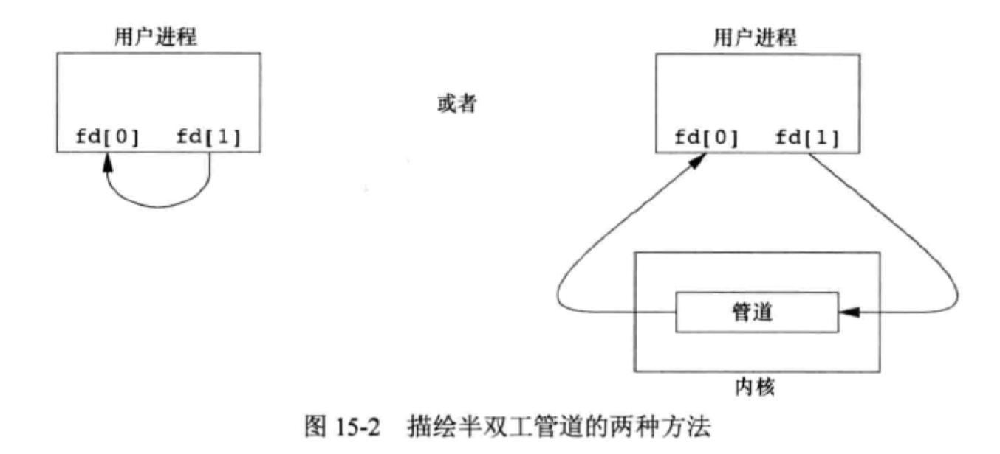
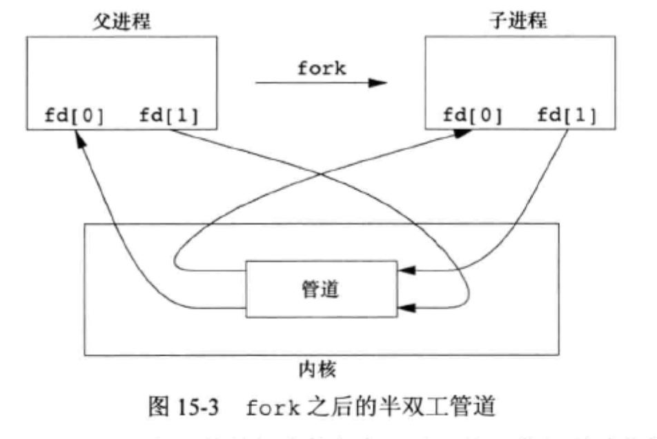
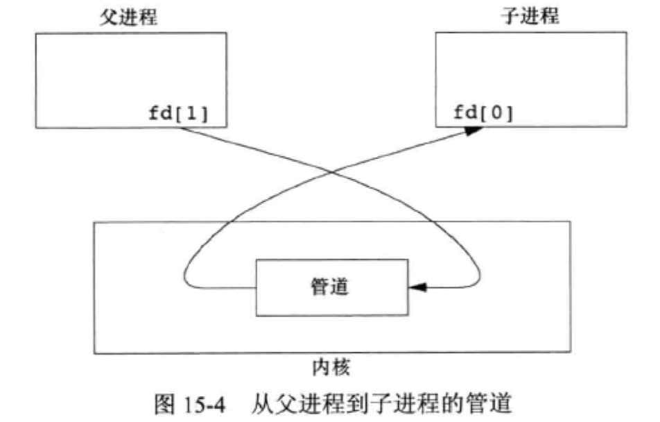
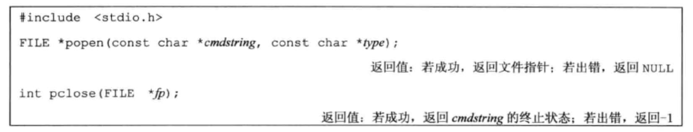
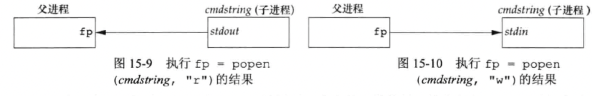
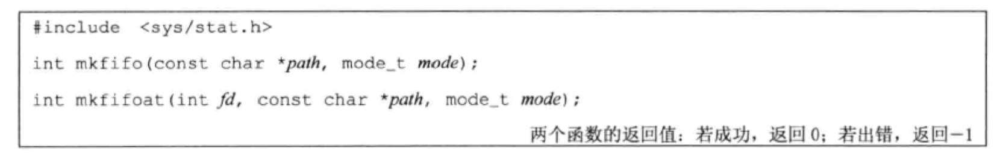
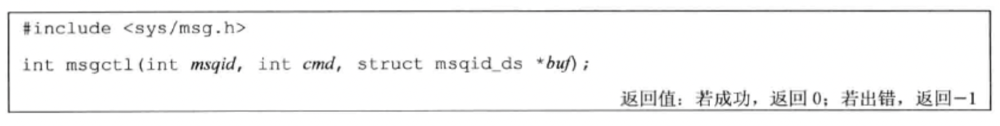

# 进程间通信(InterProcess Communication, IPC)

### 管道

管道有以下两种局限性：

1. 它们是半双工的（即数据智能在一个方向上流动）
2. 管道只能在具有公共祖先的两个进程之间使用。

```c
#include <unistd.h>

int pipe(int fdp[2]);
```

经由参数 fd 返回两个文件描述符：fd[0]为读，f[1]为写。fd[1] 的输出是 fd[0] 的输入。



通常进程先调用 pipe，接着调用 fork，从而创建从父进程到子进程的 IPC 通道，反之亦然。



fork 之后做什么取决于想要的数据流的方向。对于从父进程到子进程的管道，父进程关闭管道的读端（fd[0]），子进程关闭写端（fd[1]）。




当管道的一端被关闭后，下列两个规则起作用：

1. 当读(read)一个写端已被关闭的管道时，在所有数据都被读取后，read 返回 0，表示文件结束。
2. 如果写(write)一个读端已被关闭的管道，则产生信号 SIGPIPE。

```c
#include <stdio.h>
#include <stdlib.h>
#include <unistd.h>

int main(void) {
    int n;
    int fd[2];

    pid_t pid;
    char line[2048];

    if (pipe(fd) < 0)
        printf("pipe error\n");
    if ((pid = fork()) < 0)
        printf("fork error\n");
    else if (pid > 0) {
        // parent
        close(fd[0]);   // close read
        write(fd[1], "hello world\n", 12);
    } else {
        // child
        close(fd[1]);   // close write
        n = read(fd[0], line, 2048);
        write(STDOUT_FILENO, line, n);
    }

    exit(0);
}
// hello world
```

```c
#include <stdio.h>
#include <stdlib.h>
#include <sys/wait.h>
#include <unistd.h>
#include <string.h>

#define DEF_PAGER "bin/more";
#define MAX_LINE 2048

int main(int argc, char *argv[]) {
    int n;
    int fd[2];
    pid_t pid;
    char *pager, *argv0;
    char line[MAX_LINE];
    FILE *fp;

    if (argc != 2) {
        printf("usage: a.out <pathname>\n");
        exit(1);
    }

    if ((fp = fopen(argv[1], 'r')) == NULL) {
        printf("can't open %s\n", argv[1]);
        exit(1);
    }

    if (pipe(fd) < 0) {
        printf("pipe error\n");
        exit(0);
    }

    if ((pid = fork()) < 0) {
        printf("fork error\n");
        exit(1);
    } else if (pid > 0) {  // parent
        close(fd[0]);   // close read end

        // parent copies argv[1] to pipe
        while (fgets(line, MAX_LINE, fp) != NULL) {
            n = strlen(line);
            if (write(fd[1], line, n) != n) {
                printf("write error to pipe\n");
            }
        }
        if (ferror(fp)) {
            printf("fgets error\n");
        }

        close(fd[1]);   // close write end of pipe for reader
        if (waitpid(pid, NULL, 0) < 0) {
            printf("waitpid error");
        }
        exit(0);
    } else {    // child
        close(fd[1]);   // close write end
        if (fd[0] != STDIN_FILENO) {
            if (dup2(fd[0], STDIN_FILENO) != STDIN_FILENO) {
                printf("dup2 error to stdin\n");
                exit(1);
            }
            close(fd[0]);   // don't need this after dup2
        }
        if ((pager = getenv("PAGER")) == NULL) {
            pager = DEF_PAGER;
        }
        if ((argv0 = strrchr(pager, "/")) == NULL) {
            argv0++;
        } else {
            argv0 = pager;
        }
        

        if (execl(pager, argv0, (char *) 0) < 0) {
            printf("execl error for %s\n", pager);
        }
    }
    exit(0);
}
```

### 函数 popen 和 pclose

创建一个管道，fork 一个子进程，关闭未使用的管道端，执行一个 shell 运行命令，然后等待命令终止。



函数 popen 先执行 fork，然后调用 exec 执行 cmdstring，并返回一个标准 I/O 文件指针。



plose 函数关闭标准I\O流，等待命令终止，然后返回shell的终止状态。

### FIFO

FIFO 有时被称为命名管道。未命名的管道智能在两个相关的进程之间使用，而且这两个相关的进程还要有一个共同的创建他们的祖先进程。通过 FIFO 不相关的进程也能交换数据。




FIFO 有两种用途：

1. shell 命令使用 FIFO 将数据从一条管道传送到另一条时，无需创建中间临时文件。
2. 客户进程——服务器进程应用程序中，FIFO 用作汇聚点，在客户进程和服务进程二者之间传递数据。

[Linux进程间通信——使用命名管道
](https://blog.csdn.net/ljianhui/article/details/10202699)

```c
// fifowrite.c

#include <unistd.h>
#include <stdlib.h>
#include <fcntl.h>
#include <limits.h>
#include <sys/types.h>
#include <sys/stat.h>
#include <stdio.h>
#include <string.h>


int main(void) {
    const char *fifo_name = "/tmp/my_fifo";
    int pipe_fd;
    int data_fd;

    int res = 0;
    int byte_sent = 0;
    char buffer[PIPE_BUF + 1];

    if (access(fifo_name, F_OK) == -1) {
        // 管道文件不存在
        // 创建命名管道;
        res = mkfifo(fifo_name, 0777);
        if (res != 0) {
            fprintf(stderr, "Could not create fifo %s\n", fifo_name);
            exit(EXIT_FAILURE);
        }
    }

    printf("Process %d opening FIFO O_WRONLY\n", getpid());

    pipe_fd = open(fifo_name, O_WRONLY);
    data_fd = open("Data.txt", O_RDWR);

    printf("Process %d result %d\n", getpid(), pipe_fd);

    if (pipe_fd != -1) {
        int byte_read = 0;
        // 向数据文件读取数据
        byte_read = read(data_fd, buffer, PIPE_BUF);
        buffer[byte_read] = '\0';
        while (byte_read > 0) {
            // 向FIFO文件写数据
            res = write(pipe_fd, buffer, byte_read);
            if (res == -1) {
                fprintf(stderr, "Write error on pipe\n");
                exit(EXIT_FAILURE);
            }
            // 累加写的字节数，并继续读取数据
            byte_sent += res;
            byte_read = read(data_fd, buffer, PIPE_BUF);
            buffer[byte_read] = '\0';
        }
        close(pipe_fd);
        close(data_fd);

    } else {
        exit(EXIT_FAILURE);
    }
    printf("Process %d finished\n", getpid());
    exit(EXIT_SUCCESS);
}

```

```c
// fiforead.c

#include <unistd.h>
#include <stdlib.h>
#include <stdio.h>
#include <fcntl.h>
#include <sys/types.h>
#include <sys/stat.h>
#include <limits.h>
#include <string.h>

int main() {
    const char *fifo_name = "/tmp/my_fifo";
    int pipe_fd;
    int data_fd;
    int res;
    char buffer[PIPE_BUF + 1];
    int byte_read;
    int byte_write;

    // 清空缓冲数组
    memset(buffer, '\0', sizeof(buffer));
    printf("Process %d opening FIFO O_RDONLY\n", getpid());
    //以只读阻塞方式打开管道文件，注意与fifowrite.c文件中的FIFO同名
    pipe_fd = open(fifo_name, O_RDONLY);
    // 以只写的方式创建保存数据的文件
    data_fd = open("DataFromFIFO.txt", O_WRONLY | O_CREAT, 0644);
    printf("Process %d result %d\n", getpid(), pipe_fd);

    if (pipe_fd != -1) {
        do {
            res = read(pipe_fd, buffer, PIPE_BUF);
            byte_write = write(data_fd, buffer, res);
            byte_read += res;
        } while (res > 0);
        close(pipe_fd);
        close(data_fd);
    } else {
        exit(EXIT_FAILURE);
    }

    printf("Process %d finished, %d bytes read\n", getpid(), byte_read);
    exit(EXIT_SUCCESS);

}
```

### 消息队列

消息队列是消息的链接表，存储在内核中，由消息队列标识符标识。

msgget 用于创建一个新队列或打开一个现有队列。msgsend 将新消息添加到队列尾端。每个消息包含一个正的长整型的字段、一个非负的长度以及实际数据字节数（对应于长度），所有的信息都在将消息添加到队列时，传送给 msgsend。msgrcv 用于从队列中取消息。



### 信号量

它是一个计数器，用于为多个进程提供对共享数据对象的访问。

[信号量 semget()](https://www.cnblogs.com/52php/p/5851570.html)

### 共享存储

共享存储允许