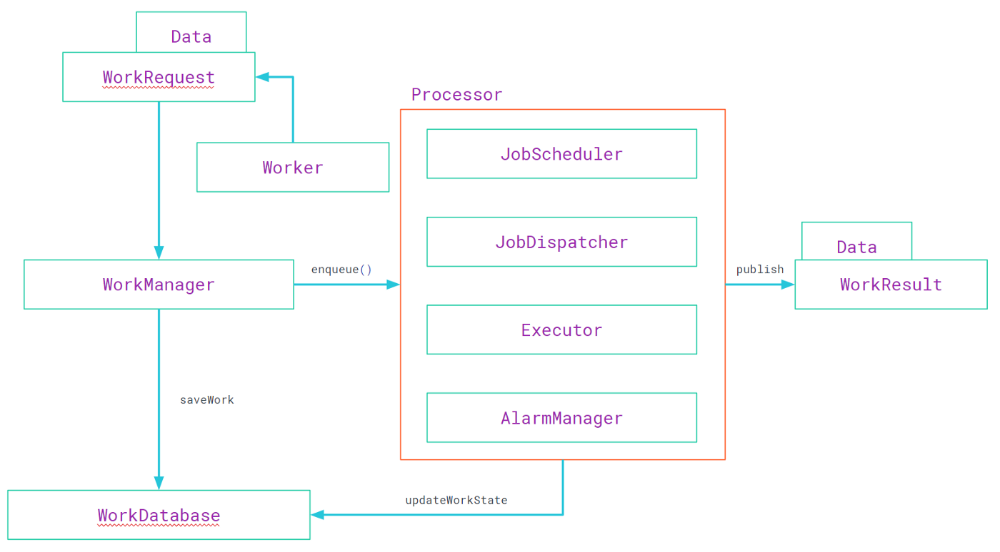

# WorkManager

为什么需要 WorkManager ？

Android 没有 “Swap space”，当系统的内存耗尽时，它会使用 OOM Killer 机制杀死进程。

每个进程都由 Activity Manager 给出其 oom_adj 分数。它是应用程序状态的组合（例如前台、后台、后台服务等）。

```Java
# Define the oom_adj values for the classes of processes that can be
# killed by the kernel.  These are used in ActivityManagerService.
    setprop ro.FOREGROUND_APP_ADJ 0
    setprop ro.VISIBLE_APP_ADJ 1
    setprop ro.SECONDARY_SERVER_ADJ 2
    setprop ro.BACKUP_APP_ADJ 2
    setprop ro.HOME_APP_ADJ 4
    setprop ro.HIDDEN_APP_MIN_ADJ 7
    setprop ro.CONTENT_PROVIDER_ADJ 14
    setprop ro.EMPTY_APP_ADJ 15
```

oom_adj 的值越高，就越有可能被内核的 oom killer 杀死。

当应用程序进入后台，仍需要执行任务时，就必须使用 “Service”:

1. 告诉系统任然需要长时间的操作，并相应地获得进程的 oom_adj 分数
2. Android 的4大组件之一
3. 在独立的进程中运行服务

当然无限制的使用Service会导致手机电量消耗的很快。

`中间还有 JobScheduler，这里不再赘述`

### WorkManager

WorkManager 有几个不同的组件：

* `WorkManager`：接收参数和约束条件的 work，并将其入队
* `Worker`：只有一个 doWork() 方法需要实现，它会在后台线程执行。这是所有后台任务执行的地方，尽量保持简单。
* `WorkRequest`：指定 Worker 以什么参数排队，以及它的限制条件是什么
* `WorkResult`：Sucess、Failure、Retry
* `Data`：可持续的键值对集合，它们会在 Worker 中间传递

1. 创建一个新类继承 `Worker` 并实现 `doWork()` 方法

```Java
public class LocationUploadWorker extends Worker {
    ...
     //Upload last passed location to the server
    public WorkerResult doWork() {
        ServerReport serverReport = new ServerReport(getInputData().getDouble(LOCATION_LONG, 0),
                getInputData().getDouble(LOCATION_LAT, 0), getInputData().getLong(LOCATION_TIME,
                0));
        FirebaseDatabase database = FirebaseDatabase.getInstance();
        DatabaseReference myRef =
                database.getReference("WorkerReport v" + android.os.Build.VERSION.SDK_INT);
        myRef.push().setValue(serverReport);
        return WorkerResult.SUCCESS;
    }
}
```

2. 调用 `WorkManager` 去执行这个 work

```Java
Constraints constraints = new Constraints.Builder().setRequiredNetworkType(NetworkType
            .CONNECTED).build();
Data inputData = new Data.Builder()
            .putDouble(LocationUploadWorker.LOCATION_LAT, location.getLatitude())
            .putDouble(LocationUploadWorker.LOCATION_LONG, location.getLongitude())
            .putLong(LocationUploadWorker.LOCATION_TIME, location.getTime())
            .build();
OneTimeWorkRequest uploadWork = new OneTimeWorkRequest.Builder(LocationUploadWorker.class)
            .setConstraints(constraints).setInputData(inputData).build();
WorkManager.getInstance().enqueue(uploadWork);
```

WorkManager 将会负责其余的工作：

```Java
WorkManager.getInstance().getStatusById(locationWork.getId()).observe(this,
        workStatus -> {
    if(workStatus!=null && workStatus.getState().isFinished()){
         ...
    }
});
```




[Services. The life with/without. And WorkManager.](https://medium.com/google-developer-experts/services-the-life-with-without-and-worker-6933111d62a6) 
